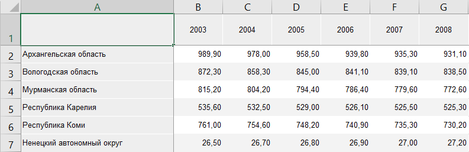

# Работа с таблицей данных: Режим OLAP, Foresight Add-in for Excel

Работа с таблицей данных: Режим OLAP, Foresight Add-in for Excel
-

# Работа с таблицей данных

Таблица данных представляет
 собой электронную таблицу, построенную на основе источника данных.

Для начала работы с таблицей выполните [получение
 данных](../../Excel_Work.htm).

Пример таблицы:

На основе данных таблицы можно создать:

	- [диаграмму](../Chart.htm);

	- [пузырьковую диаграмму](../BubbleChart.htm);

	- [пузырьковое дерево](../BubbleTree.htm);

	- [плоское дерево](../TreeMap.htm).

## Операции с таблицей данных

	- [Редактирование](DataEdit.htm)
	 и [сохранение](DataEdit.htm) данных;

	- [Поворот
	 таблицы](../../Excel_Work.htm#rotatetable). Позволяет поменять местами заголовки строк и столбцов;

	- [Фильтрация
	 данных](Data_Filtering.htm). Позволяет отобразить в таблице только те данные,
	 которые соответствуют заданным условиям;

	- [Преобразование
	 данных](Convert_Data.htm). Позволяет представить данные таблицы в различных
	 представлениях;

	- [Ранжирование
	 данных](Ranking.htm). Позволяет определить порядок значений в таблице
	 по их значениям;

	- [Распределение](Pareto.htm).
	 Позволяет оставить в таблице набор значений, которые составят определённый
	 процент (или число) от общей суммы всех значений выбранного столбца;

	- [Расчет итоговых
	 значений](Totals.htm). Позволяет получить итоговые значения, рассчитанные для
	 данных в строках/столбцах;

	- [Настройка
	 оформления таблицы и её элементов](Formatting.htm). Позволяет настроить
	 таблицу в целом и/или отдельные элементы таблицы.

См. также:

[Работа
 с аналитическими запросами (OLAP)](../Olap_Mode.htm)

		Справочная
		 система на версию 10.9
		 от 18/08/2025,
		 © ООО «ФОРСАЙТ»,
