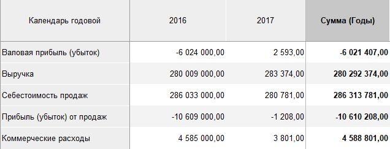
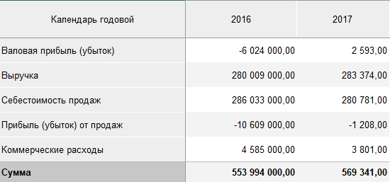
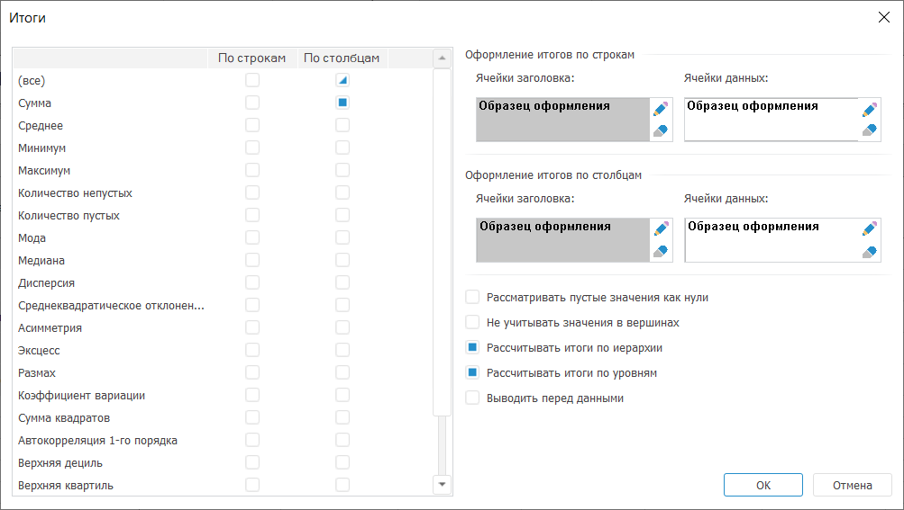
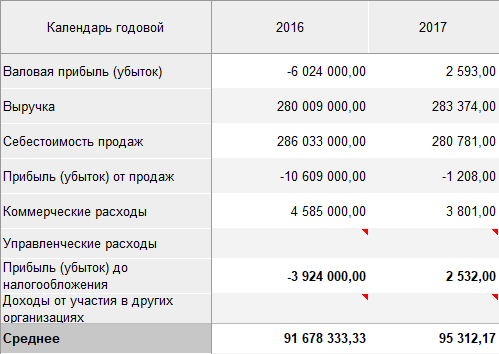
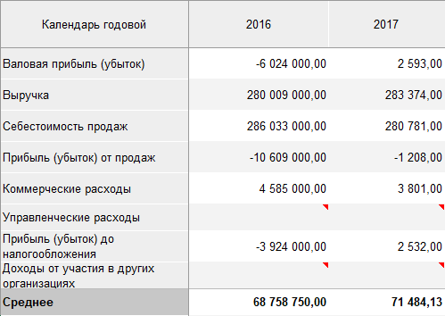
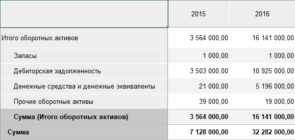
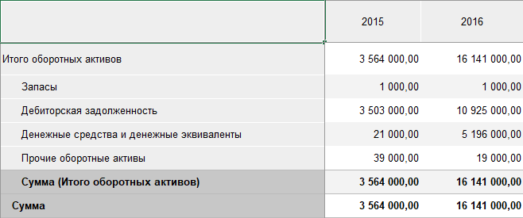
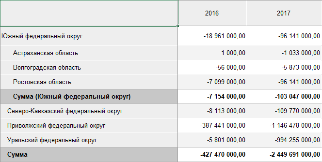
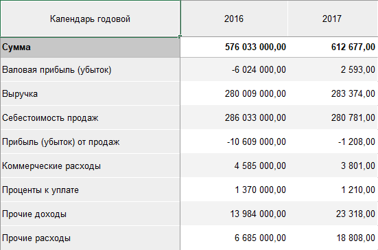

# Расчёт итоговых значений: Foresight Add-in for Excel

Расчёт итоговых значений: Foresight Add-in for Excel
-

# Расчёт итоговых значений

Для строк и столбцов таблицы можно настроить отображение итоговых значений.
 Например, выводить сумму значений в столбцах.

Примечание.
 Если используется [ранжирование](Ranking.htm), то итоги могут
 содержать некорректные значения. Перед расчётом итогов будет предложено
 выключить ранжирование.

Для настройки расчёта итогов:

	- Нажмите нижнюю часть кнопки 
	 «Итоги по строкам» и/или  «Итоги
	 по столбцам», расположенные в группе «Итоги»
	 на вкладке «Таблица» ленты
	 инструментов.

	- В раскрывающемся меню кнопок выберите необходимые методы расчёта
	 итогов:

		- Сумма;

		- Среднее;

		- Минимум;

		- Максимум;

		- Количество непустых;

		- Количество пустых;

		- Мода;

		- Медиана;

		- Дисперсия;

		- Среднеквадратическое отклонение;

		- Асимметрия;

		- Эксцесс;

		- Размах;

		- Коэффициент вариации;

		- Сумма квадратов;

		- Автокорреляция 1-го порядка;

		- Верхняя дециль;

		- Верхняя квартиль;

		- Нижняя квартиль;

		- Нижняя дециль;

		- Общий итог.

Совет. Итоговые
 значения можно рассчитывать несколькими методами одновременно. Например,
 выводить сумму и среднее значений в столбцах.

Для скрытия итогов:

	- Нажмите кнопку  «Итоги по строкам» и/или 
	 «Итоги по столбцам».

	- В раскрывающемся меню кнопки выберите вариант «Нет».

## Примеры итогов по строкам и столбцам

Пример итогов по строкам:

Пример итогов по столбцам:

## Настройка дополнительных параметров итогов

Для настройки дополнительных параметров итоговых значений используйте
 окно «Итоги».

Совет. Для быстрой
 настройки итоговых значений используйте вкладку «[Итоги](UiAnalyticalArea.chm::/Totals/Calculate_totals.htm)»
 на панели свойств.

[Для открытия
 окна](javascript:TextPopup(this))

		- Нажмите кнопку 
		 «Итоги по строкам» и/или «Итоги
		 по столбцам».

		- В раскрывающемся меню кнопки выберите вариант «Параметры».

Задайте в окне параметры:

[Таблица методов
 расчёта итогов](javascript:TextPopup(this))

	Таблица содержит названия методов расчёта, расположенные в строках,
	 и столбцы «По строкам» и «По столбцам». На пересечении строк и столбцов
	 расположены флажки, определяющие рассчитывать ли итоги.

	Если установить флажок в строке «(все)», то итоги будут рассчитаны
	 всеми доступными методами.

	Например, если строке «Сумма» установить флажок в столбце «По строкам»,
	 то итоги по строкам будут рассчитаны путём суммирования значений.

[Оформление итогов
 по строкам/столбцам](javascript:TextPopup(this))

	Задайте параметры оформления для ячеек заголовка и данных при расчёте
	 итогов по строкам/столбцам.

	Для редактирования параметров оформления:

		- нажмите кнопку ;

		- выполните команду «Редактировать
		 оформление» в контекстном меню образца оформления.

	Будет отображен диалог «[Форматирование](uinav.chm::/GUI/format.htm)».

	Для сброса параметров оформления:

		- нажмите кнопку ;

		- выполните команду «Очистить»
		 в контекстном меню образца оформления.

	Будут установлены параметры оформления, используемые по умолчанию.

	Параметры оформления одного элемента можно скопировать и применить
	 для оформления другого элемента. Для копирования/вставки используйте
	 одноименные команды в контекстном меню образца оформления.

[Рассматривать
 пустые значения как нули](javascript:TextPopup(this))

	По умолчанию флажок снят. Если флажок установлен, то пустые значения
	 в ячейках будут рассматриваться как нули. Это влияет на расчёт итогов,
	 например, при вычислении средних значений.

	Пример без установленного флажка:

	

	Пример с установленным флажком:

	

[Не учитывать
 значения в вершинах](javascript:TextPopup(this))

	Если флажок «Не учитывать значения
	 в вершинах» установлен, то при вычислении итогов не будут учитываться
	 значения родительских элементов иерархии.

	По умолчанию флажок не установлен и при расчете итогов не учитываются
	 данные, полученные в результате [агрегации](uinavobj.chm::/cube/createcube/master_standart/uimd_cube_createcube_master_standart_7.htm).

	Пример без установленного флажка:

	

	Пример с установленным флажком:

	

[Рассчитывать
 итоги по иерархии/уровням](javascript:TextPopup(this))

	По умолчанию флажок установлен и итоги рассчитываются по [иерархии
	 измерений](uinavobj.chm::/reference_book/master_table_reference_book/uimd_reference_book_master_table_page3.htm) и [уровням
	 измерений](uinavobj.chm::/reference_book/master_table_reference_book/uimd_reference_book_master_table_page4.htm), расположенных по строкам/столбцам.

	Совет. Если
	 общий итог совпадает с промежуточным итогом по иерархии/уровням, выключите
	 общий итог для избежания дублирования информации.

	Пример расчёта общего итога с итогами по иерархии:

	

	Пример расчёта общего итога с итогами по уровням:

	

[Выводить перед
 данными](javascript:TextPopup(this))

	Если флажок «Выводить перед данными»
	 установлен, то итоги будут отображаться перед ячейками с данными.

	Пример:

	

См. также:

[Работа
 с таблицей данных](Table_Work.htm)

		Справочная
		 система на версию 10.9
		 от 18/08/2025,
		 © ООО «ФОРСАЙТ»,
