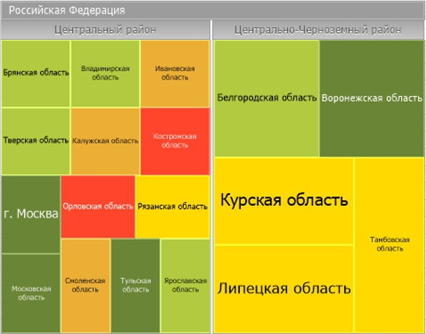

# Работа с плоским деревом: Foresight Add-in for Excel

Работа с плоским деревом: Foresight Add-in for Excel
-

# Работа с плоским деревом

Плоское дерево - способ отображения
 иерархических данных в виде набора вложенных прямоугольников. Каждой ветке
 иерархии соответствует прямоугольник, который состоит из меньших прямоугольников,
 являющихся подветками. Площадь каждого прямоугольника пропорциональна
 значению соответствующего элемента иерархии. Цвет прямоугольника также
 определяется значением элемента иерархии.

Плоское дерево позволяет отобразить для иерархических данных наборы
 из двух значений:

	- 1-е значение определяет цвет прямоугольника;

	- 2-е значение определяет площадь прямоугольника.

Преимущества плоского дерева:

	- позволяет выявить взаимосвязь между двумя показателями в иерархической
	 структуре данных;

	- позволяет эффективно использовать пространство;

	- позволяет четко отображать на экране много элементов одновременно.

Для начала работы с плоским деревом:

	- [Получите данные](../Excel_Work.htm).

	- Нажмите кнопку  «Плоское
	 дерево», расположенную в группе «Вставка»
 на вкладке «FORESIGHT»
 ленты инструментов.

Плоское дерево создается на отдельном листе в книге Microsoft Excel. Лист с
 плоским деревом вставляется после активного листа рабочей книги Microsoft Excel.

Примечание.
 Одна [таблица](Table_Work/Table_Work.htm) может служить источником
 данных только для одного плоского дерева.

Пример плоского дерева:

С помощью группы вкладок «Формат»
 на панели свойств задайте
 настройки плоского дерева:

	- [легенда
	 цвета и размера](UiVisualizators.chm::/BubbleTree/Legend.htm);

	- заливка прямоугольников;

Примечание.
 Настройка выполняется аналогично настройке [заливки](UiMaps.chm::/Configure/Color.htm)
 представления данных «Карта».

	- [шкала
	 размера](UiVisualizators.chm::/BubbleTree/Size.htm);

	- [всплывающие
	 подсказки](UiVisualizators.chm::/BubbleChart/Tooltip.htm).

См. также:

[Режим экспресс-анализа
 данных](Olap_Mode.htm)

		Справочная
		 система на версию 10.9
		 от 18/08/2025,
		 © ООО «ФОРСАЙТ»,
