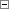

# Настройка отображения измерения: Foresight Add-in for Excel

Настройка отображения измерения: Foresight Add-in for Excel
-

# Настройка отображения измерения

Для каждого измерения, отображаемого в группе вкладок «Отметка»
 на панели свойств и в
 рабочей области отчета, можно настроить его внешний вид с помощью:

	- задания вида отображения [наименования
	 элементов](#element_names);

	- отображения [группы
	 элементов](#reflection_of_group_of_elements);

	- использования [альтернативной
	 иерархии](#reflection_of_alternative_hierarchy);

	- использования [сортировки элементов](#sorting_of_elements).

[Настройка
 наименования элемента](javascript:TextPopup(this))

	Для измерения можно определить один или несколько атрибутов справочника,
	 которые будут использоваться для отображения наименований элемента:

		- Откройте вкладку с измерением на панели
		 свойств.

		- Выберите атрибуты наименований элементов в раскрывающемся
		 списке:

			- кнопки «Наименования»,
			 расположенной в группе «Вид»
			 на вкладке «Иерархия»
			 ленты инструментов;

			- команды «Наименования»
			 в контекстном меню элемента измерения на панели свойств;

			- команды «Наименования»
			 в меню измерения 
			 на панели свойств.

	По умолчанию используется атрибут, содержащий наименования элементов.

	Подробное описание настройки наименования элемента приведено в разделе
	 «[Наименование элементов](UiSelection.chm::/Selection/Element_Names.htm)».

[Отображение
 группы элементов](javascript:TextPopup(this))

	Операция доступна, если для справочника, на основе которого был
	 построен источник данных отчета, создана хотя бы одна [группа
	 элементов](UiNavObj.chm::/reference_book/look-and-feel_Reference_book/UiMd_reference_book_look-and-feel_Group.htm).

	Группа элементов - объект
	 репозитория, используемый в справочниках для ограничения списка доступных
	 элементов.

	Для отображения группы элементов:

		- Перейдите на вкладку с измерением на панели
		 свойств.

		- Выберите группу элементов в раскрывающемся меню:

			- кнопки «Группа элементов»,
			 расположенной в группе «Вид»
			 на вкладке «Иерархия»
			 ленты инструментов;

			- «Группа элементов»
			 в контекстном меню элемента измерения на панели свойств;

			- «Группа элементов»
			 в меню измерения 
			 на панели свойств.

	Для отображения всех элементов измерения выберите пункт «Сбросить».

	При работе с элементами измерения доступно [создание
	 группы по отмеченным элементам](Olap_Mode/SelectionDimensionElements.htm#group).

	Примечание.
	 Если в измерении присутствует вычислимый элемент, задана альтернативная
	 либо пользовательская иерархия, то создание группы элементов недоступно.

[Использование
 альтернативной иерархии](javascript:TextPopup(this))

	Операция доступна, если для справочника, на основе которого был
	 построен источник данных отчета, создана хотя бы одна [альтернативная
	 иерархия](UiNavObj.chm::/reference_book/UiMd_reference_book_Hierarchy.htm).

	Альтернативная иерархия
	 - иерархия любого другого справочника, связанная с иерархией основного
	 справочника для сопоставления элементов, или пользовательская иерархия,
	 созданная при [редактировании измерений](#edit_dim) или
	 [добавлении нового вычисляемого элемента](#add_newelement).

	Для использования альтернативной иерархии:

		- Перейдите на вкладку с измерением на панели
		 свойств.

		- Выберите альтернативную иерархию в раскрывающемся меню:

			- кнопки «Альтернативная
			 иерархия», расположенной в группе «Вид»
			 на вкладке «Иерархия»
			 ленты инструментов;

			- «Альтернативная иерархия»
			 в контекстном меню элемента измерения на панели свойств;

			- «Альтернативная иерархия»
			 в меню измерения 
			 на панели свойств.

	Для отображения основной иерархии измерения выберите пункт «Сбросить».

[Сортировка
 элементов](javascript:TextPopup(this))

	Для сортировки элементов измерения, отображающихся на вкладках измерений
	 в группе «Отметка» на панели
	 свойств, выберите метод сортировки в раскрывающемся списке:

		- кнопки «Сортировка»,
		 расположенной в группе «Вид»
		 на вкладке «Иерархия»
		 ленты инструментов;

		- «Сортировка» в контекстном
		 меню элемента измерения на панели свойств;

		- «Сортировка» меню
		 измерения  на панели свойств.

	Возможные способы сортировки:

		- по возрастанию;

		- по убыванию;

		- по атрибуту. Из раскрывающегося списка выберите атрибут
		 измерения, по которому будет производиться сортировка.

	Заданный порядок элементов измерений применяется только к иерархии
	 измерения, отображаемого на панели
	 свойств, и не сохраняется с отчетом.

	Важно.
	 Порядок элементов измерения в таблице не синхронизируется с порядком
	 элементов измерений на панели свойств. Подробное описание настройки
	 порядка элементов измерения в таблице приведено в разделе «[Сортировка](UiAnalyticalArea.chm::/Working_with_table_data/Sorting_table_data.htm)».

	Для отображения элементов измерения с сортировкой по умолчанию выберите
	 пункт «Сбросить».

[Сворачивание/разворачивание
 иерархии](javascript:TextPopup(this))

	Если иерархия элементов измерения свернута, то напротив элементов
	 отображается значок ,
	 если иерархия элементов измерения развернута - .

	Для сворачивания иерархии измерения откройте вкладку с измерением на
	 панели
	 свойств, затем:

		- нажмите кнопку «Свернуть
		 все», расположенную в группе «Вид» на
 вкладке «Иерархия» ленты инструментов;

		- выполните команду «Свернуть
		 все» в контекстном меню элемента измерения на панели свойств;

		- выполните команду «Свернуть
		 все» в меню измерения  на панели свойств.

	Если элементы иерархии имеют развернутые подэлементы, то они будут
	 свернуты.

	Для разворачивания иерархии измерения откройте вкладку с измерением на
	 панели
	 свойств, затем:

		- нажмите кнопку «Развернуть
		 все», расположенную в группе «Вид» на
 вкладке «Иерархия» ленты инструментов;

		- выполните команду «Развернуть
		 все» в контекстном меню элемента измерения на панели свойств;

		- выполните команду «Развернуть
		 все» в меню измерения  на панели свойств.

	Если элементы иерархии имеют свернутые подэлементы, то они будут
	 развернуты.

## Работа с измерениями

При работе с измерениями доступны следующие операции:

[Редактирование
 измерения](javascript:TextPopup(this))

	Для задания пользовательских настроек измерения откройте вкладку
	 с измерением на панели
	 свойств, затем:

		- нажмите кнопку «Редактировать
		 измерение», расположенную в группе «Измерение»
 на вкладке «Иерархия» ленты инструментов;

		- выполните команду «Измерение
		 > Редактировать» в контекстном меню измерения на панели
		 свойств;

		- выполните команду «Измерение
		 > Редактировать» в меню измерения 
		 на панели свойств.

	После выполнения действия будет открыто окно «[Редактирование
	 измерения](UiSelection.chm::/Selection/Dimension_edit.htm)». Задайте в нем настройки измерения.

[Восстановление
 измерения](javascript:TextPopup(this))

	Для восстановления всех измененных и удаленных элементов измерения
	 откройте вкладку с измерением на панели
	 свойств, затем:

		- нажмите кнопку «Восстановить»,
		 расположенную в группе «Измерение»
 на вкладке «Иерархия» ленты инструментов;

		- выполните команду «Измерение
		 > Восстановить» в контекстном меню измерения на панели
		 свойств;

		- выполните команду «Измерение
		 > Восстановить» в меню измерения 
		 на панели свойств.

	Добавленные пользователем элементы измерения будут удалены.

## Работа с элементами

При работе с элементами изменения доступны следующие операции:

[Добавление
 нового вычисляемого элемента](javascript:TextPopup(this))

	Для добавления в измерение нового вычисляемого элемента откройте
	 вкладку с измерением на панели
	 свойств, затем:

		- нажмите кнопку «Новый элемент»,
		 расположенную в группе «Элемент»
 на вкладке «Иерархия» ленты инструментов;

		- выполните команду «Элемент
		 > Добавить новый»
		 в контекстном меню измерения или элемента измерения на вкладке
		 измерения;

		- выполните команду «Элемент
		 > Добавить новый» в меню измерения 
		 на панели свойств.

	Для настройки элемента измерения будет открыто окно [редактора
	 выражения](UiNav.Chm::/GUI/ExpressionEditor.htm).

	Новый элемент измерения будет добавлен в измерение, вкладка которого
	 открыта в группе вкладок «Отметка»
	 на панели свойств.

[Редактирование
 формулы элемента](javascript:TextPopup(this))

	Для редактирования формулы элемента в измерении откройте вкладку
	 с измерением на панели
	 свойств, затем:

		- нажмите кнопку «Редактировать
		 формулу», расположенную в группе «Элемент»
 на вкладке «Иерархия» ленты инструментов;

		- выполните команду «Редактировать
		 формулу» контекстного меню элемента на панели свойств.

	Для настройки выражения вычисляемого элемента измерения будет открыто
	 окно [редактора выражения](UiNav.Chm::/GUI/ExpressionEditor.htm).

[Переименование
 элемента](javascript:TextPopup(this))

	Для переименования элемента выделите его на панели
	 свойств, затем:

		- нажмите кнопку «Переименовать»,
		 расположенную в группе «Элемент»
 на вкладке «Иерархия» ленты инструментов;

		- выполните команду «Элемент
		 > Переименовать» в контекстном меню элемента на панели
		 свойств.

	После выполнения действия введите новое наименование элемента и:

		- нажмите клавишу ENTER на клавиатуре;

		- щёлкните на свободной области отчёта.

	Наименование элемента будет изменено в списке измерения на панели
	 свойств и на других объектах отчета, в которых он отображается.

[Удаление элемента](javascript:TextPopup(this))

	Для удаления элемента из измерения откройте вкладку с измерением на
	 панели свойств, затем:

		- нажмите кнопку «Удалить»,
		 расположенную в группе «Элемент»
 на вкладке «Иерархия» ленты инструментов;

		- выполните команду «Элемент
		 > Удалить» в контекстном меню элемента на панели
		 свойств.

	После выполнения действия элемент будет удален из измерения, таблицы
	 и других объектов отчета, в которых он отображался.

Подробное описание работы с измерениями и элементами измерений приведено
 в разделе «[Редактирование измерения](UiSelection.chm::/Selection/Dimension_edit.htm)».

См. также:

[Режим
 экспресс-анализа данных](Olap_Mode/Olap_Mode.htm)

		Справочная
		 система на версию 10.9
		 от 18/08/2025,
		 © ООО «ФОРСАЙТ»,
