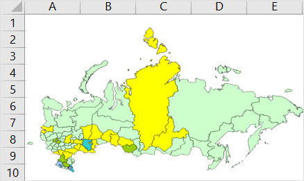

# Работа с картой: Режим АВР, Foresight Add-in for Excel

Работа с картой: Режим АВР, Foresight Add-in for Excel
-

# Работа с картой

Карта предназначена для
 картографического представления данных, содержащихся в [таблице](Table_Work.htm).

Для начала работы с картой:

	- [Получите данные](../Excel_Work.htm).

	- Нажмите кнопку  «Карта», расположенную в группе «Вставка»
 на вкладке «FORESIGHT»
 ленты инструментов.

Карта создается на отдельном листе в книге Microsoft Excel. Лист с картой
 вставляется после активного листа рабочей книги Microsoft Excel.

Примечание.
 Одна [таблица](Table_Work.htm) может служить источником данных
 только для одной карты.

Пример карты:

С помощью группы вкладок «Формат»
 на панели свойств задайте
 настройки карты:

	- [легенды
	 цвета и объёма](UiMaps.chm::/Legend/SetupLegend.htm);

	- [заливка
	 карты](UiMaps.chm::/Configure/Color.htm);

	- [объем
	 карты](UiMaps.chm::/Configure/Panel_Height.htm);

	- [подписи
	 и всплывающие подсказки](UiMaps.chm::/Configure/Tooltips.htm).

Более подробное описание возможностей
 приведено в разделе «[Настройка
 карты](UiMaps.chm::/Configure/MapConfigure.htm)».

См. также:

[Режим
 анализа данных временных рядов](TimeSeries_Mode.htm)

		Справочная
		 система на версию 10.9
		 от 18/08/2025,
		 © ООО «ФОРСАЙТ»,
