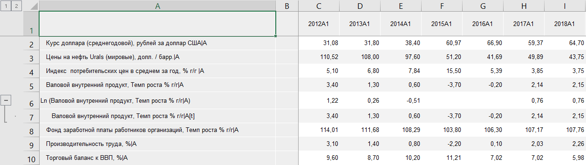
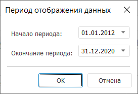

# Работа с таблицей данных: Режим АВР, Foresight Add-in for Excel

Работа с таблицей данных: Режим АВР, Foresight Add-in for Excel
-

# Работа с таблицей данных

Таблица данных предназначена
 для отображения и работы с данными временных рядов. Для каждого ряда отображается
 наименование, цветовое обозначение в диаграмме и данные.

Для начала работы с таблицей выполните [получение
 данных](../Excel_Work.htm).

Пример таблицы:

Примечание.
 Если данные получены из базы данных временных рядов, то таблица изначально
 пустая. Для отображения данных добавьте в таблицу [временные
 ряды](TimeSeries_Work/TimeSeries_Work.htm).

На основе данных таблицы можно создать:

	- [карту](Map.htm);

	- [диаграмму](TimeSeries_Work/Chart_work.htm).

## Операции с таблицей данных

### Работа с данными таблицы

[Поворот таблицы](javascript:TextPopup(this))

	Поворот таблицы позволяет
	 поменять местами заголовки строк и столбцов.

	Для выполнения поворота нажмите кнопку  «Поворот таблицы», расположенную в группе «Вид» на
 вкладке «Таблица» ленты инструментов.

	При повороте таблицы:

		- фиксированные измерения остаются на прежнем месте;

		- измерения, расположенные по строкам и столбцам, меняются
		 местами.

	Порядок измерений внутри каждой группы остается неизменным.

[Фильтрация данных](javascript:TextPopup(this))

	Фильтрация позволяет выделить
	 подмножество данных из таблицы и отобразить только те данные, которые
	 соответствуют заданным условиям.

	Для настройки фильтрации данных:

		- Нажмите на нижнюю часть кнопки
		  «Фильтр»,
		 расположенной в группе «Вид»
		 на вкладке «Таблица» ленты
		 инструментов.

		- В раскрывающемся меню кнопки
		 установите флажок напротив условия фильтрации (фильтров):

			- Не фильтровать.
			 Установка флажка отключает фильтрацию данных;

			- Скрыть пустые столбцы.
			 Будут скрыты столбцы и строки, не содержащие данных;

			- Скрыть пустые столбцы
			 на границах. Будут скрыты все пустые столбцы только
			 справа и слева от временного ряда.

	Совет. Для быстрой
	 настройки фильтрации используйте группу «[Фильтрация](UiDw.chm::/Workbook/SidePanel/UiDw_sp_Data.htm)
	 » на
	 вкладке «Вид» панели
	 свойств.

[Изменение периода
 отображения данных](javascript:TextPopup(this))

	Для изменения периода отображения данных щёлкните по дате начала или окончания в группе «Период
	 отображения» на вкладке «Таблица».
	 Будет открыт диалог «Период отображения
	 данных»:

	

	Дата окончания периода должна быть больше начала периода. Если введенная
	 дата начала периода больше даты окончания периода, то значение окончания
	 периода устанавливается равным дате начала периода.

### Анализ данных в таблице

[Условное форматирование
 данных](javascript:TextPopup(this))

	Для настройки условного форматирования данных используйте вкладку
	 «Условное форматирование»,
	 расположенную в группе вкладок «Формат»
	 на панели свойств.

	Подробнее см. раздел: «[Условное форматирования](UiAnalyticalArea.chm::/Analysis/Conditional_formatting.htm)».

[Работа с расширенной
 аналитикой](javascript:TextPopup(this))

	При работе с данными, размещенными в таблицах, доступны операции
	 [расширенной
	 аналитики](uidw.chm::/Workbook/AdvancedAnalytics.htm).

### Настройка внешнего вида таблицы

[Настройка оформления
 таблицы](javascript:TextPopup(this))

	Для настройки оформления таблицы используйте вкладки, расположенные
	 в группе вкладок «Формат»
	 на панели свойств:

		- [Вид](uidw.chm::/Workbook/SidePanel/UiDw_sp_view.htm). Настройка
		 общих параметров оформления;

		- [Область данных](uidw.chm::/Workbook/SidePanel/Panel_DataArea.htm).
		 Настройка оформления данных в таблице;

		- [Заголовки](uidw.chm::/Workbook/SidePanel/Caption.htm).
		 Настройка оформления шапки, боковика и уголка таблицы.

[Настройка формата
 отображаемых значений](javascript:TextPopup(this))

	Для табличных данных доступна настройка формата отображаемых значений.
	 Для настройки формата используйте кнопки, расположенные в группе «Формат числа» на вкладке «Таблица» ленты инструментов.

[Изменение порядка
 календаря](javascript:TextPopup(this))

	Для отображения календаря в обратном порядке, т.е. от более
	 поздних дат к более ранним, нажмите кнопку  «Обратный календарь», расположенную
	 в группе «Период отображения»
	 на вкладке «Таблица».

См. также:

[Режим
 анализа данных временных рядов](TimeSeries_Mode.htm)

		Справочная
		 система на версию 10.9
		 от 18/08/2025,
		 © ООО «ФОРСАЙТ»,
