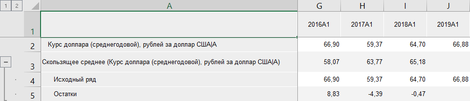
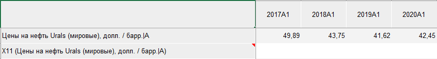

# Работа с вычисляемыми рядами: Foresight Add-in for Excel

Работа с вычисляемыми рядами: Foresight Add-in for Excel
-

# Работа с вычисляемыми рядами

В режиме [анализа данных временных рядов](../TimeSeries_Mode.htm)
 надстройка Foresight Add-in
 for Excel позволяет создавать ряды, вычисляемые заданным [методом](Methods/Calculation_Methods.htm).

Для применения вычисления:

	- В [таблице данных](../Table_Work.htm) выделите ряд,
	 для которого необходимо выполнить вычисление.

	- На вкладке «Вычисления»
	 ленты инструментов выберите метод расчёта.

	- Задайте параметры метода расчёта вычисляемого ряда.

В таблицу будет добавлен вычисляемый ряд с результатами расчёта.

[Особенности
 применения методов расчёта с учётом календарной динамики](javascript:TextPopup(this))

	Если метод расчёта требует одинаковых динамик у рядов, то проверяется
	 соответствие:

		- динамик рядов;

		- начальных дат рядов;

		- длин рядов;

		- дней начала недели (для недельной и дневной динамик);

		- выходных дней (для дневной динамики).

	Расчёт производится, если динамики рядов совпадают, иначе отображается
	 сообщение об ошибке.

В зависимости от выполненного преобразования, вычисляемый ряд может
 содержать различный набор дочерних рядов: факторы, модельный ряд с прогнозными
 значениями, остатки, доверительные границы и т.д. Например:

## Операции с вычисляемыми рядами

[Просмотр сообщений
 об ошибках](javascript:TextPopup(this))

	Если при вычислении ряда возникли ошибки, расчет будет прерван.
	 Вычисляемый ряд будет заполнен пустыми значениями, в ячейке с заголовком
	 вычисляемого ряда будет отображен красный уголок:

	

	Для прочтения сообщения об ошибке наведите мышь на заголовок ряда.
	 Сообщение отображается в виде всплывающей подсказки.

[Просмотр статистических
 характеристик](javascript:TextPopup(this))

	Для просмотра статистических характеристик:

		- Выделите вычисляемый ряд в таблице данных.

		- Перейдите на панель
		 результатов.

[Настройка параметров
 нескольких вычисляемых рядов](javascript:TextPopup(this))

	Для настройки параметров нескольких вычисляемых рядов:

		- Выделите в таблице данных вычисляемые ряды, для которых
		 требуется задать настройки параметров.

		- Перейдите в группу вкладок «Ряд»
		 на панели свойств.

	В данной группе вкладок будут отображаться вкладка «Основные»
	 панели свойств и вкладки, содержащие общие настройки рядов.

	Значения параметров на вкладках будут устанавливаться следующим
	 образом:

		- в поле «Наименование»
		 будет отображаться значение «Несколько
		 рядов». Наименование нескольких рядов недоступно для редактирования;

		- если для выделенных вычисляемых рядов были заданы разные
		 настройки, для которых предполагается установка флажка, например,
		 «[Изменить единицу измерения](uinavobj.chm::/Units/Units_dbts.htm)» и «Применить
		 преобразование», флажок сменит вид на ,
		 в полях будут отображаться значения «Разные
		 единицы» и «Разные преобразования»
		 соответственно. При нажатии на флажок значение параметра будет
		 сброшено.

		Для задания одинаковых параметров установите флажок и определите
		 необходимое значение параметра. Если для выделенных рядов не были
		 заданы параметры, то флажки напротив наименований параметров будут
		 сняты;

		- если для задания параметров не требуется устанавливать флажки,
		 то при несовпадении значений будет отображаться «Несколько
		 значений».

		Подобные значения могу отображаться на вкладке «Атрибуты
		 ряда» панели свойств напротив атрибутов рядов;

		- если наличие параметров для различных вычисляемых рядов
		 отличается, то при выделении данных рядов вкладки с настройками
		 таких параметров не отображаются. Например, для рядов, вычисленных
		 различными методами, не будет отображаться вкладка «Параметры»;

		- если для вычисляемых рядов разных типов не настроен период
		 прогнозирования или настроен одинаковый период прогнозирования,
		 то будет отображаться вкладка «Периоды
		 расчета».

См. также:

[Режим
 анализа данных временных рядов](../TimeSeries_Mode.htm)

		Справочная
		 система на версию 10.9
		 от 18/08/2025,
		 © ООО «ФОРСАЙТ»,
