# Работа с диаграммой: Режим АВР, Foresight Add-in for Excel

Работа с диаграммой: Режим АВР, Foresight Add-in for Excel
-

# Работа с диаграммой

Диаграмма предназначена
 для графического представления данных, содержащихся в [таблице](../Table_Work.htm),
 и располагается на панели результатов.
 Например:

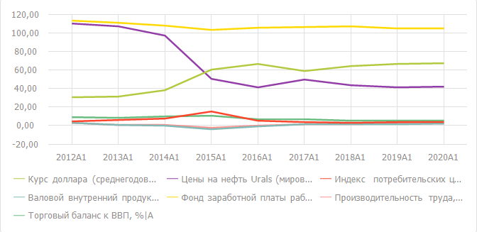

## Особенности построения диаграммы

	- Если в таблице выделено несколько значений [временного
	 ряда](TimeSeries_Work.htm), то на диаграмме будут отображены графики только для выделенных
	 значений.

	- Если выделен [вычисляемый
	 ряд](Calculated_Series_work.htm) или его дочерние ряды, то диаграмма будет построена по рядам,
	 отмеченным в раскрывающемся меню кнопки 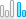 «Показать ряды», расположенной в
	 группе «Данные» на вкладке
	 «Диаграмма» ленты инструментов.

## Операции с диаграммой

[Выбор данных
 для построения диаграммы](javascript:TextPopup(this))

	Для выбора области таблицы данных, по которой строится диаграмма:

		- Нажмите кнопку  «Выбрать
		 данные», расположенную в группе «Данные»
		 на вкладке «Диаграмма»
		 ленты инструментов.

		- В раскрывающемся меню кнопки выберите один из вариантов:

			- Вся таблица.
			 Диаграмма строится по всей таблице данных;

			- Выделенная область.
			 Диаграмма строится по данным, выделенным в таблице.

[Выбор рядов,
 отображаемых на диаграмме](javascript:TextPopup(this))

	Операция доступна, если в таблице данных выделен [вычисляемый
	 ряд](Calculated_Series_work.htm).

	Для выбора отображаемых рядов:

		- Нажмите кнопку 
		 «Показать ряды», расположенную
		 в группе «Данные» на вкладке
		 «Диаграмма» ленты инструментов.

		- В раскрывающемся меню кнопки отметьте флажками необходимые
		 ряды. В зависимости от [метода
		 расчёта](Methods/Calculation_Methods.htm) возможны следующие ряды:

			- Исходный ряд.
			 Исходные данные выходной переменной;

			- Модельный ряд.
			 Смоделированные значения;

			- Остатки. Разница
			 между исходными и смоделированными данными;

			- Прогноз. Прогнозные
			 значения, рассчитанные уравнением;

			- Верхняя доверительная
			 граница. Значения верхней доверительной границы для
			 прогнозных значений;

			- Нижняя доверительная
			 граница. Значения нижней доверительной границы для
			 прогнозных значений.

			- Верхняя дин. доверительная
			 граница. Значения верхней динамической доверительной
			 границы для прогнозных значений;

			- Нижняя дин. доверительная
			 граница. Значения нижней динамической доверительной
			 границы для прогнозных значений.

[Скрытие/отображение
 ряда](javascript:TextPopup(this))

	Для скрытия/отображения ряда щелкните по его наименованию в легенде.

[Поворот источника
 данных](javascript:TextPopup(this))

	Для поворота источника данных, по которому строится диаграмма, нажмите
	 кнопку 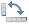 «Повернуть
	 строки/столбцы», расположенную в группе «Данные»
	 на вкладке «Диаграмма» ленты
	 инструментов.

	При повороте источника данных фиксированные измерения остаются на
	 прежнем месте, а измерения, расположенные по строкам и столбцам, меняются
	 местами.

	Примечание.
	 При повороте источника данных диаграммы исходная [таблица](../Table_Work.htm)
	 не будет повернута. Для выполнения поворота таблицы нажмите кнопку
	 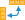
	 «Поворот таблицы», расположенную в группе «Вид» на
 вкладке «Таблица» ленты инструментов.
	 Диаграмма будет перестроена.

[Изменение типа
 диаграммы](javascript:TextPopup(this))

	Для изменения типа диаграммы:

		- Нажмите кнопку 
		 «Тип», расположенную в
		 группе «Вид» на вкладке
		 «Диаграмма» ленты инструментов.

		- В раскрывающемся меню кнопки выберите [тип
		 диаграммы](uidiagrams.chm::/type_diagrams/uidiagrams_type_diagrams.htm).

[Настройка расположения
 легенды](javascript:TextPopup(this))

	Для настройки расположения легенды:

		- Нажмите кнопку 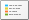 «Легенда»,
		 расположенную в группе «Вид»
		 на вкладке «Диаграмма»
		 ленты инструментов.

		- В раскрывающемся меню кнопки выберите вариант расположения
		 легенды:

			- 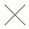. Легенда
			 не отображается;

			- 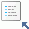. В левом
			 верхнем углу;

			- 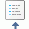. По центру
			 верхней границы;

			- 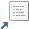. В правом
			 верхнем углу;

			- 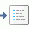. По центру
			 правой границы;

			- 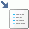. В правом
			 нижнем углу;

			- 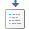. По центру
			 нижней границы;

			- 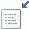. В левом
			 нижнем углу;

			- 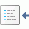. По центру
			 левой границы.

	Совет. Для быстрой
	 настройки расположения легенды диаграммы используйте вкладку «[Легенда](UiDiagrams.chm::/Property_diagramm/UiDiagrams_PropertyDiagramm_legend.htm)» на панели
	 свойств.

[Настройка расположения
 подписей данных](javascript:TextPopup(this))

	Подписи данных содержат
	 сведения о рядах или отдельных точках данных и упрощают понимание
	 диаграммы.

	Для настройки расположения подписей данных:

		- Нажмите кнопку 
		 «Подписи данных», расположенную
		 в группе «Вид» на вкладке
		 «Диаграмма» ленты инструментов.

		- Выберите вариант расположения подписи относительно точки
		 ряда данных:

			- нет;

			- в центре;

			- слева;

			- справа;

			- сверху;

			- снизу.

	При выборе варианта «Дополнительные
	 параметры» будет открыто окно «Параметры
	 диаграммы». Задайте на вкладке «Подписи
	 данных» [дополнительные
	 параметры](uidiagrams.chm::/Params_diagram/UiDiagrams__DataTitle.htm).

[Настройка формата
 компонента диаграммы](javascript:TextPopup(this))

	Для настройки формата компонента диаграммы дважды щелкните по нему
	 мышью. Будет отображен диалог настройки формата, соответствующий компоненту.

	Подробное описание параметров формата компонентов диаграммы приведено
	 в разделе «[Настройка
	 компонентов диаграмм](UiDiagrams.chm::/UiDiagrams_basic_concept.htm)».

[Нормализация
 отображаемых данных](javascript:TextPopup(this))

	Нормализация данных используется
	 для оценки нормы ряда.

	Для выполнения нормализации данных нажмите кнопку  «Нормализация»,
	 расположенную в группе «Данные»
	 на вкладке «Диаграмма» ленты
	 инструментов. Диаграмма будет перестроена.

	Для отображения исходных данных переведите кнопку  «Нормализация»
	 в ненажатое состояние.

Более
 подробное описание возможностей приведено в разделе «[Настройка
 компонентов диаграммы](UiDiagrams.chm::/UiDiagrams_basic_concept.htm)».

См. также:

[Режим
 анализа данных временных рядов](../TimeSeries_Mode.htm)

		Справочная
		 система на версию 10.9
		 от 18/08/2025,
		 © ООО «ФОРСАЙТ»,
