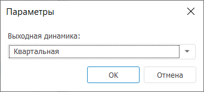
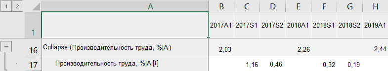
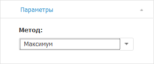

# Агрегация (по времени): Foresight Add-in for Excel

Агрегация (по времени): Foresight Add-in for Excel
-

# Агрегация (по времени)

Агрегация - расчёт данных верхнего
 уровня на основе данных нижнего уровня. Например, данные, рассчитанные
 по месяцам, суммируются для получения квартальных данных.

Доступные методы агрегации:

	- Агрегация (Сумма). Агрегирует
	 данные путём суммирования значений элементов динамики;

	- Агрегация (Среднее).
	 Агрегирует данные путём нахождения среднего значения элементов динамики;

	- Агрегация (Минимум).
	 Агрегирует данные путём нахождения минимального значения элементов
	 динамики;

	- Агрегация (Максимум).
	 Агрегирует данные путём нахождения максимального значения элементов
	 динамики;

	- Агрегация (Первый элемент).
	 Агрегирует данные путём нахождения первого имеющегося значения элементов
	 динамики;

	- Агрегация (Последний элемент).
	 Агрегирует данные путём нахождения последнего имеющегося значения
	 элементов динамики;

	- Агрегация (Стандартное отклонение).
	 Агрегирует данные путём нахождения стандартного отклонения по динамике.
	 Стандартное отклонение - это мера того, насколько широко разбросаны
	 значения элементов относительно их среднего.

Методы входят в группу «[Агрегация](Aggregation.htm)».

[Для применения
 метода](javascript:TextPopup(this))

		- В таблице данных выделите один или несколько рядов.

		- Нажмите кнопку  «Агрегация»,
		 расположенную на вкладке «Вычисления» ленты
		 инструментов.

		- В раскрывающемся списке кнопки выберите метод агрегации.

После применения метода будет отображено окно «Параметры»:

В раскрывающемся списке «Выходная динамика»
 укажите выходную динамику ряда. Доступны только динамики, которые больше
 динамики ряда, для которого применяется метод. Например, если агрегация
 рассчитывается для ряда с квартальной динамикой, то в раскрывающемся списке
 «Выходная динамика» будут доступны
 варианты «Годовая» и «Полугодовая».

Если не существует динамик, которые могут быть выходными, будет отображено
 соответствующее сообщение.

В таблицу данных для каждого выделенного ряда будет добавлен ряд с наименованием
 вида «Collapse(<Имя_Ряда>)»,
 содержащий результаты расчета. Например:

## Настройка параметров расчёта

Для изменения метода расчёта агрегации используйте вкладку «Параметры»
 на панели свойств.

[Для отображения
 вкладки](javascript:TextPopup(this))

		- Убедитесь, что панель
		 свойств отображается.

		- Выделите в таблице данных ряд, рассчитанный методом «Агрегация (по времени)».

		- На панели свойств установите переключатель «Ряд».

		- Перейдите на вкладку «Параметры».

В раскрывающемся списке «Метод»
 выберите требуемый метод расчёта агрегации по времени.

См. также:

[Методы
 расчёта](../Calculation_Methods.htm) | [Агрегация](Aggregation.htm)

		Справочная
		 система на версию 10.9
		 от 18/08/2025,
		 © ООО «ФОРСАЙТ»,
