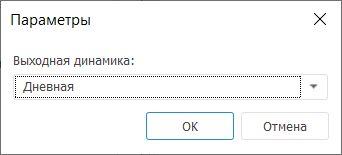
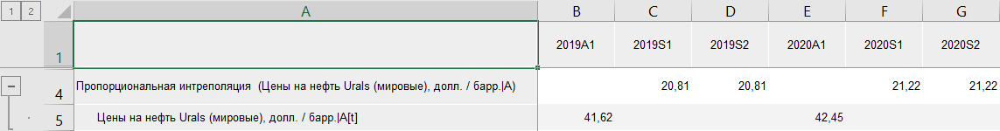

# Интерполяция: Foresight Add-in for Excel

Интерполяция: Foresight Add-in for Excel
-

# Интерполяция

Интерполяция - расчёт данных
 нижнего уровня на основе данных верхнего уровня. Например, квартальные
 данные необходимо распределить по месяцам.

Доступные методы интерполяции:

	- Интерполяция (пропорциональная).
	 Дезагрегирует данные с применением пропорциональной интерполяции.

	- Интерполяция (повторная).
	 Дезагрегирует данные путем повторения значений динамики исходного
	 ряда.

Методы входят в группу «[Агрегация](Aggregation.htm)».

[Для применения
 метода](javascript:TextPopup(this))

		- В таблице данных выделите один или несколько рядов.

		- Нажмите кнопку  «Агрегация»,
		 расположенную на вкладке «Вычисления» ленты
		 инструментов.

		- В раскрывающемся списке кнопки выберите метод интерполяции.

После применения метода будет отображено окно «Параметры»:

В раскрывающемся списке «Выходная динамика»
 укажите выходную динамику ряда. Доступны только динамики, которые меньше
 динамики ряда, для которого применяется метод. Например, интерполяция
 рассчитывается для ряда с квартальной динамикой. Таким образом, в раскрывающемся
 списке «Выходная динамика» будут
 доступны варианты «Дневная» и
 «Месячная».

Если не существует динамик, которые могут быть выходными, то будет отображено
 соответствующее сообщение.

В таблицу данных для каждого выделенного ряда будет добавлен ряд с наименованием
 вида «<Наименование_метода>(<Имя_Ряда>)»,
 содержащий результаты расчета. Например:

## Настройка параметров расчёта

Для изменения метода расчёта интерполяции используйте вкладку «Параметры» на панели
 свойств.

[Для отображения
 вкладки](javascript:TextPopup(this))

		- Убедитесь, что панель
		 свойств отображается.

		- Выделите в таблице данных ряд, рассчитанный методом «Интерполяция».

		- На панели свойств установите переключатель «Ряд».

		- Перейдите на вкладку «Параметры».

В раскрывающемся списке «Метод»
 выберите требуемый метод расчёта интерполяции.

См. также:

[Методы
 расчёта](../Calculation_Methods.htm) | [Агрегация](Aggregation.htm) | [Методы
 интерполяции](lib.chm::/03_transformations/uimodelling_interpolation.htm)

		Справочная
		 система на версию 10.9
		 от 18/08/2025,
		 © ООО «ФОРСАЙТ»,
