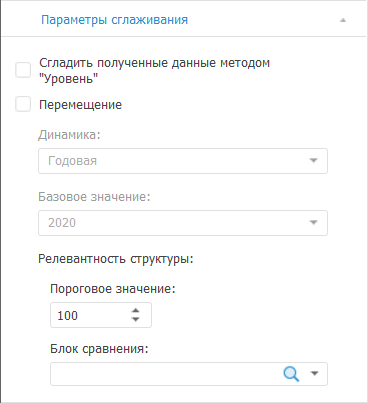

# Настройка параметров сглаживания данных: Foresight Add-in for Excel

Настройка параметров сглаживания данных: Foresight Add-in for Excel
-

# Настройка параметров сглаживания данных

Для настройки параметров сглаживания данных, выполняемого при расчёте
 [агрегации по рядам](Aggregation_series.htm), используйте вкладку
 «Параметры сглаживания» на панели свойств:

[Для отображения
 вкладки](javascript:TextPopup(this))

		- Убедитесь, что панель
		 свойств отображается.

		- Выделите в таблице данных ряд, рассчитанный методом «Агрегация».

		- На панели свойств установите переключатель «Ряд».

		- Перейдите на вкладку «Параметры
		 сглаживания».

Параметры на вкладке соответствуют параметрам окна «[Агрегация](Aggregation_series.htm)»,
 отображаемого при создании вычисляемого ряда.

См. также:

[Работа
 с вычисляемыми рядами](../../Calculated_Series_work.htm) | [Методы
 расчёта](../Calculation_Methods.htm) | [Агрегация](Aggregation.htm) | [Агрегация
 (по рядам)](Aggregation_series.htm)

		Справочная
		 система на версию 10.9
		 от 18/08/2025,
		 © ООО «ФОРСАЙТ»,
