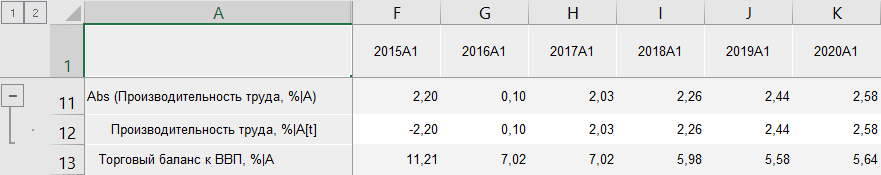

# Абсолютное значение: Foresight Add-in for Excel

Абсолютное значение: Foresight Add-in for Excel
-

# Абсолютное значение

Функция «Абсолютное значение»
 возвращает абсолютные значения ряда. Входит в группу [арифметических
 функций](Arithmetic.htm).

[Для применения
 функции](javascript:TextPopup(this))

		- В таблице данных выделите один или несколько рядов.

		- Нажмите кнопку  «Арифметика»,
		 расположенную на вкладке «Вычисления» ленты
		 инструментов.

		- В раскрывающемся списке кнопки выберите вариант «Абсолютное
		 значение».

После применения функции в таблицу данных для каждого выделенного ряда
 будет добавлен ряд с наименованием вида «Abs(<Имя_Ряда>)»,
 содержащий результаты расчета. Например:

См. также:

[Методы
 расчёта](../Calculation_Methods.htm) | [Арифметика](Arithmetic.htm)

		Справочная
		 система на версию 10.9
		 от 18/08/2025,
		 © ООО «ФОРСАЙТ»,
