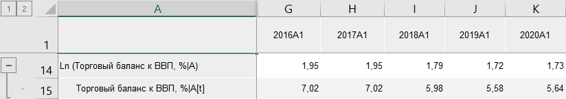

# Ln: Foresight Add-in for Excel

Ln: Foresight Add-in for Excel
-

# Ln

Функция «Ln» возвращает натуральный
 логарифм ряда: Ln(X[t]). Входит
 в группу [арифметических функций](Arithmetic.htm).

Примечание.
 Натуральный логарифм может быть рассчитан только для значений ряда, находящихся
 в диапазоне (0,∞).

[Для применения
 функции](javascript:TextPopup(this))

		- В таблице данных выделите один или несколько рядов.

		- Нажмите кнопку  «Арифметика»,
		 расположенную на вкладке «Вычисления» ленты
		 инструментов.

		- В раскрывающемся списке кнопки выберите вариант «Ln».

После применения функции в таблицу данных для каждого выделенного ряда
 будет добавлен ряд с наименованием вида «Ln(<Имя_Ряда>)»,
 содержащий результаты расчета. Например:

См. также:

[Методы
 расчёта](../Calculation_Methods.htm) | [Арифметика](Arithmetic.htm)

		Справочная
		 система на версию 10.9
		 от 18/08/2025,
		 © ООО «ФОРСАЙТ»,
