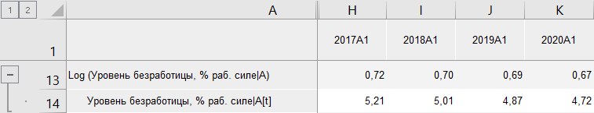

# Log: Foresight Add-in for Excel

Log: Foresight Add-in for Excel
-

# Log

Функция «Log» возвращает логарифм
 ряда по заданному основанию, например: Log10(X[t]).
 Входит в группу [арифметических функций](Arithmetic.htm).

Примечание.
 Логарифм может быть рассчитан только для значений ряда, находящихся в
 диапазоне (0,∞).

[Для применения
 функции](javascript:TextPopup(this))

		- В таблице данных выделите один или несколько рядов.

		- Нажмите кнопку  «Арифметика»,
		 расположенную на вкладке «Вычисления» ленты
		 инструментов.

		- В раскрывающемся списке кнопки выберите вариант «Log».

После применения функции в таблицу данных для каждого выделенного ряда
 будет добавлен ряд с наименованием вида «Log(<Имя_Ряда>)»,
 содержащий результаты расчета. Например:

## Настройка параметров расчёта

Для настройки параметров расчёта используйте вкладку «Параметры»
 на панели свойств.

[Для отображения
 вкладки](javascript:TextPopup(this))

		- Убедитесь, что панель свойств отображается.

		- Выделите в таблице данных ряд, рассчитанный методом «Log».

		- На панели свойств установите переключатель «Ряд».

		- Перейдите на вкладку «Параметры».

В редакторе чисел «Основание логарифма»
 укажите значение основания логарифма. Основание логарифма может принимать
 только положительные значения. По умолчанию основание логарифма равняется
 десяти.

См. также:

[Методы
 расчёта](../Calculation_Methods.htm) | [Арифметика](Arithmetic.htm)

		Справочная
		 система на версию 10.9
		 от 18/08/2025,
		 © ООО «ФОРСАЙТ»,
