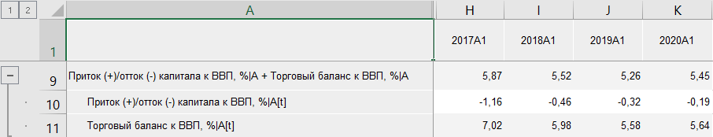

# Сложение: Foresight Add-in for Excel

Сложение: Foresight Add-in for Excel
-

# Сложение

Функция «Сложение» возвращает
 результат сложения двух и более рядов. Входит в группу [арифметических
 функций](Arithmetic.htm).

[Для применения
 функции](javascript:TextPopup(this))

		- В таблице данных выделите несколько рядов, значения которых
		 необходимо сложить.

		- Нажмите кнопку  «Арифметика»,
		 расположенную на вкладке «Вычисления» ленты
		 инструментов.

		- В раскрывающемся списке кнопки выберите вариант «Сложение».

После применения функции в таблицу данных после последнего выделенного
 ряда будет добавлен ряд с наименованием вида «<Имя_Ряда_1>+<Имя_Ряда_2>+...+<Имя_Ряда_n>»,
 содержащий результаты расчета. Например:

См. также:

[Методы
 расчёта](../Calculation_Methods.htm) | [Арифметика](Arithmetic.htm)

		Справочная
		 система на версию 10.9
		 от 18/08/2025,
		 © ООО «ФОРСАЙТ»,
