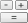

# Методы расчёта: Foresight Add-in for Excel

Методы расчёта: Foresight Add-in for Excel
-

# Методы расчёта

Для настройки параметров расчёта вычисляемого ряда используйте группу
 вкладок «Ряд» на панели
 свойств.

[Для отображения
 группы вкладок](javascript:TextPopup(this))

		- Убедитесь, что панель
		 свойств отображается.

		- Выделите в таблице данных вычисляемый ряд.

		- На панели свойств установите переключатель «Ряд».

В зависимости от метода расчёта ряда панель свойств может содержать
 вкладки:

	- [Параметры
	 оценки ARMA](ARMA.htm). Предназначена для настройки параметров оценки
	 коэффициентов авторегрессии/скользящего среднего (ARMA);

	- [Периоды
	 расчёта](Calculation_period.htm). Предназначена для настройки периода расчёта вычисляемого
	 ряда;

	- [Обработка
	 пропусков](Missing_data_Methods.htm). Предназначена для настройки параметров метода расчёта
	 вычисляемого ряда и метода обработки пропусков.

## Доступные методы расчёта

Для выбора метода расчёта используйте кнопки на вкладке «Вычисления»
 ленты инструментов:

	-  «[Калькулятор](Calculator.htm)».
	 Применяется для составления собственной формулы, по которой будет
	 рассчитываться вычисляемый ряд;

	-  «[Арифметика](Arithmetic/Arithmetic.htm)». Применяется
	 для составления формулы расчёта вычисляемого ряда с использованием
	 арифметических функций;

	-  «[Агрегация](Aggregation/Aggregation.htm)». Применяется
	 для составления формулы расчёта вычисляемого ряда с использованием
	 методов агрегации;

	-  «[Сглаживание](Smoothing/Smoothing.htm)». Применяется
	 для составления формулы расчёта вычисляемого ряда с использованием
	 методов сглаживания;

	-  «[Преобразования](Series_Transformations/Transformations.htm)». Применяется
	 для составления формулы расчёта вычисляемого ряда с использованием
	 методов преобразования;

	-  «[Регрессия](Regression/Regression.htm)». Применяется
	 для составления формулы расчёта вычисляемого ряда с использованием
	 методов регрессии;

	-  «[Прогноз](Forecast/Forecast.htm)». Применяется
	 для составления формулы расчёта вычисляемого ряда с использованием
	 методов прогнозирования.

См. также:

[Работа
 с вычисляемыми рядами](../Calculated_Series_work.htm)

		Справочная
		 система на версию 10.9
		 от 18/08/2025,
		 © ООО «ФОРСАЙТ»,
