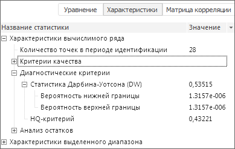
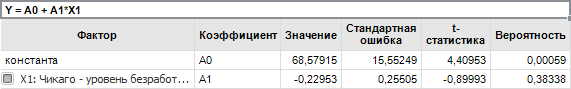
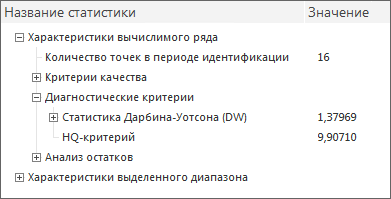
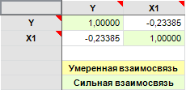
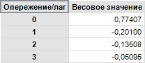

# Просмотр результатов вычислений: Foresight Add-in for Excel

Просмотр результатов вычислений: Foresight Add-in for Excel
-

# Просмотр результатов вычислений

Для просмотра характеристик [вычисляемого](../Calculated_Series_work.htm)
 ряда, выделенного в [таблице данных](../../Table_Work.htm),
 используйте панель
 результатов.

[Для отображения
 панели результатов](javascript:TextPopup(this))

	Нажмите кнопку  «Панель
	 результатов», расположенную в группе «Вид»
	 на вкладке «FORESIGHT» ленты инструментов.

В зависимости от диапазона выделенных данных область просмотра результатов
 может содержать различный набор вкладок. Переключение между вкладками
 выполняется с помощью соответствующих переключателей:

[Уравнение](javascript:TextPopup(this))

	Вкладка доступна только для [вычисляемых
	 рядов](../Calculated_Series_work.htm), рассчитанных с помощью методов, моделирующих значения (сглаживание,
	 прогноз, регрессия).

	

	На вкладке содержится идентифицированное уравнение с оцененными
	 коэффициентами и таблица коэффициентов, содержащая:

		- Фактор. Наименование
		 фактора, при котором оценивался коэффициент. Отображается только
		 для факторных методов моделирования;

		- Коэффициент. Наименование
		 ряда, при котором оценивался коэффициент;

	Примечание.
	 Если для метода [ARIMA](Forecast/ARIMA.htm) на вкладке
	 «Параметры» на панели
	 свойств включены опции учёта порядка несезонной/сезонной авторегрессии
	 и/или несезонного/сезонного скользящего среднего, то для данного метода
	 будут отображаться коэффициенты при AR/MA и/или SAR/SMA соответственно.

		- Значение. Оцененное
		 значение коэффициента;

		- Стандартная ошибка.
		 Приближённая величина отклонения (вызванного случайностью выборки)
		 оценки коэффициента от истинного значения. Чем больше значение
		 [стандартной
		 ошибки](lib.chm::/05_statistics/uimodelling_stderror.htm), тем менее достоверной является оценка
		 коэффициента;

		- t-статистика. Вычисляется
		 как отношение оценки коэффициента к его стандартной ошибке. Используется
		 для проверки нулевой гипотезы о том, что коэффициент равен нулю,
		 то есть не значим в рассматриваемой модели регрессии. Гипотеза
		 проверяется в предположении, что остатки имеют нормальное распределение.
		 Проводить интерпретацию значения [t-статистики](Lib.chm::/05_Statistics/UiModelling_t_stat.htm)
		 легче с помощью значения вероятности, которое приводится рядом;

		- Вероятность. Значение
		 вероятности для [t-статистики](Lib.chm::/05_Statistics/UiModelling_t_stat.htm).
		 Нулевая гипотеза о равенстве нулю оценки коэффициента отклоняется
		 на выбранном уровне значимости (как правило, 0.1, 0.05, 0.01),
		 если вероятность меньше, чем уровень значимости.

	Для методов прогнозирования на вкладке дополнительно отображается
	 наименование [вида зависимости](Forecast/Trend.htm). Например:

	

[Характеристики](javascript:TextPopup(this))

	Вкладка отображает статистические характеристики вычисляемого ряда.
	 Набор характеристик зависит от используемого [метода
	 расчёта](Calculation_Methods.htm).

	Если вычисляемый ряд получен с помощью метода, моделирующего значения
	 ряда (сглаживание, прогноз, регрессия), то набор характеристик подобен
	 [статистическим
	 характеристикам](uimodelling.chm::/2_container_of_modeling/2_3_work_object/2_3_2_model/standart_model/statistical_features.htm), отображаемым в контейнере моделирования:

	

	Характеристики, рассчитываемые, если вычисляемый ряд получен с помощью
	 метода, преобразовывающего значения ряда (без расчёта прогнозных значений):

		- Минимум;

		- Максимум;

		- Среднее;

		- Медиана;

		- Мода;

		- Стандартное отклонение;

		- Дисперсия;

		- Количество наблюдений;

		- Количество пустых значений.

	Характеристики, рассчитываемые для диапазона данных, содержащего
	 наблюдения нескольких рядов:

		- Самая ранняя дата начала;

		- Самая поздняя дата начала;

		- Самая ранняя дата окончания;

		- Самая поздняя дата окончания.

	Характеристики, рассчитываемые для диапазона данных, содержащего
	 наблюдения одного ряда:

		- Дата начала;

		- Дата окончания;

		- Асимметрия;

		- Эксцесс.

	Характеристики, рассчитываемые для целого ряда:

		- Масштаб.

	Более подробное описание статистических характеристик приведено
	 в разделе «[Библиотека
	 методов и моделей](lib.chm::/uimodelling_lib_common.htm)».

[Матрица корреляции](javascript:TextPopup(this))

	Вкладка доступна только для [вычисляемых
	 рядов](../Calculated_Series_work.htm), рассчитанных с помощью метода «[Линейная регрессия](Regression/Linear_Regression.htm)».

	

	Таблица содержит значения коэффициентов корреляции объясняющих рядов.
	 Ячейки закрашены соответствующими цветами:

		- Желтый. Умеренная
		 взаимосвязь. Абсолютное значение коэффициента корреляции находится
		 в диапазоне от 0,5 до 0,75;

		- Зеленый. Сильная
		 взаимосвязь. Абсолютное значение коэффициента корреляции находится
		 в диапазоне от 0,75 и выше.

[Матрица весов](javascript:TextPopup(this))

	Вкладка доступна только для [вычисляемых
	 рядов](../Calculated_Series_work.htm), рассчитанных с помощью метода «[Фильтр Бакстера-Кинга](Smoothing/Bpf.htm)».

	

	Вкладка содержит матрицу весов, используемую фильтром Бакстера-Кинга.
	 В столбцах расположены рассчитанные значения коэффициентов. Размерность
	 матрицы: 1×(q+1), где q - значение параметра «Опережение/лаг»,
	 заданного на вкладке «[Параметры](Smoothing/Bpf.htm)»
	 на панели свойств.

Для копирования данных, выделенных на вкладках, выполните команды «Копировать», «Копировать
 все» в контекстном меню выделенных данных.

См. также:

[Работа
 с вычисляемыми рядами](../Calculated_Series_work.htm)

		Справочная
		 система на версию 10.9
		 от 18/08/2025,
		 © ООО «ФОРСАЙТ»,
