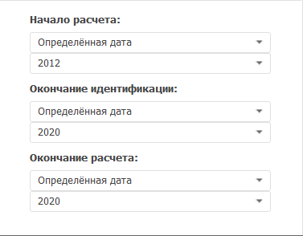

# Настройка периода расчёта метода: Foresight Add-in for Excel

Настройка периода расчёта метода: Foresight Add-in for Excel
-

# Настройка периода расчёта метода

Для настройки периода расчёта метода используйте вкладку «Периоды
 расчёта» на панели
 свойств. Набор параметров, определяющих период расчёта вычисляемого
 ряда, зависит от используемого [метода
 расчёта](Calculation_Methods.htm).

[Для отображения
 вкладки](javascript:TextPopup(this))

		- Убедитесь, что панель
		 свойств отображается.

		- Выделите в таблице данных вычисляемый ряд.

		- На панели свойств установите переключатель «Ряд».

		- Перейдите на вкладку «Периоды
		 расчёта».

Задайте на вкладке параметры периода расчёта:

[Начало расчета](javascript:TextPopup(this))

	Задайте способ вычисления начальной точки расчёта:

		- Начало данных +/-.
		 Дата равна первой фактической дате входного ряда плюс число периодов,
		 указанных в соответствующем редакторе чисел;

		- Определённая дата.
		 Дата указывается в соответствующем редакторе дат;

		- Сегодня +/-. Дата
		 равна текущей дате плюс число периодов, указанных в соответствующем
		 редакторе чисел;

		- От конца периода идентификации.
		 Дата начала периода идентификации равна дате окончания периода
		 идентификации минус число периодов, указанных в соответствующем
		 редакторе чисел;

		- От окончания расчёта.
		 Дата начала периода идентификации равна дате окончания периода
		 расчёта минус число периодов, указанных в соответствующем редакторе
		 чисел;

	Примечание.
	 Способ «От конца периода идентификации»
	 доступен, если вычисляемый ряд рассчитан [регрессионным](Regression/Regression.htm)
	 или [прогнозным](Forecast/Forecast.htm) методом. В остальных
	 случаях доступен способ «От окончания
	 расчёта».

[Окончание идентификации](javascript:TextPopup(this))

	Задайте способ вычисления конечной точки периода идентификации.

		- Начало данных +/-.
		 Дата равна первой фактической дате входного ряда плюс число периодов,
		 указанных в соответствующем редакторе чисел;

		- Окончание данных +/-.
		 Дата равна последней фактической дате входного ряда плюс число
		 периодов, указанных в соответствующем редакторе чисел;

		- Определённая дата.
		 Дата указывается в соответствующем редакторе дат;

		- Сегодня +/-. Дата
		 равна текущей дате плюс число периодов, указанных в соответствующем
		 редакторе чисел;

		- От начала расчёта.
		 Дата окончания периода идентификации равна дате начала периода
		 идентификации плюс число периодов, указанных в соответствующем
		 редакторе чисел.

	Примечание.
	 Настройка конечной точки периода идентификации доступна, если вычисляемый
	 ряд рассчитан [регрессионным](Regression/Regression.htm)
	 или [прогнозным](Forecast/Forecast.htm) методом.

	По умолчанию используется способ «Окончание
	 данных +/-» и конечная точка идентификации совпадает с последней
	 фактической датой входного ряда.

[Окончание расчета](javascript:TextPopup(this))

	Задайте способ вычисления конечной точки расчёта:

		- Конец периода отображения.
		 Дата равна дате окончания периода отображения данных в рабочей
		 книге;

		- Определённая дата.
		 Дата указывается в соответствующем редакторе дат;

		- Окончание данных +/-.
		 Дата равна последней фактической дате входного ряда плюс число
		 периодов, указанных в соответствующем редакторе чисел;

		- Сегодня +/-. Дата
		 равна текущей дате плюс число периодов, указанных в соответствующем
		 редакторе чисел;

		- От конца периода идентификации.
		 Дата окончания расчёта равна дате окончания периода идентификации
		 плюс число периодов, указанных в соответствующем редакторе чисел;

		- От начала расчёта.
		 Дата окончания расчёта равна дате начала расчёта плюс число периодов,
		 указанных в соответствующем редакторе чисел.

	Примечание.
	 Способ «От конца периода идентификации»
	 доступен, если вычисляемый ряд рассчитан [регрессионным](Regression/Regression.htm)
	 или [прогнозным](Forecast/Forecast.htm) методом. В остальных
	 случаях доступен способ «От начала
	 расчёта».

После изменения границ периода расчёта вычисляемый ряд должен быть рассчитан
 заново.

## Особенности задания периода расчёта

	- При установленном начале расчёта «От
	 конца периода идентификации» нет возможности установить окончание
	 идентификации в значение «От начала
	 расчёта».

	- Если используется способ «Сегодня
	 +/-», то даты окончания идентификации и прогнозирования смещаются
	 на конец периода расчёта. Актуально для динамик от месячной и выше.
	 Например, дата окончания идентификации - апрель 2012, а дата
	 окончания расчёта равняется дате окончания идентификации. Таким образом,
	 при вычислении ряда дата окончания расчёта - 30.04.2012.

См. также:

[Методы
 расчёта](Calculation_Methods.htm)

		Справочная
		 система на версию 10.9
		 от 18/08/2025,
		 © ООО «ФОРСАЙТ»,
