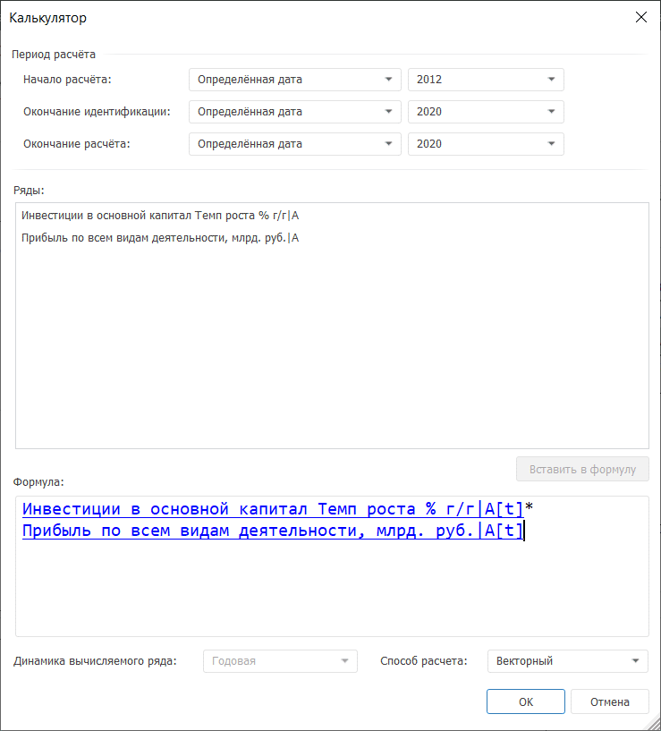
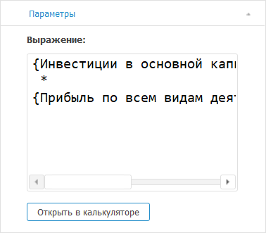

# Калькулятор: Foresight Add-in for Excel

Калькулятор: Foresight Add-in for Excel
-

# Калькулятор

Калькулятор применяется для
 составления собственной формулы, по которой будет рассчитываться вычисляемый
 ряд.

Для применения метода:

	- В таблице данных выделите ряды, которые должны входить в формулу
	 расчёта.

	- Нажмите кнопку  «Калькулятор», расположенную на вкладке
	 «Вычисления» ленты инструментов.

Будет отображено окно «Калькулятор»,
 предназначенное для формирования формулы расчёта вычисляемого ряда:

Процесс формирования формулы состоит из нескольких этапов:

[Задание периода
 расчета формулы](javascript:TextPopup(this))

	В области «Период расчёта»
	 задайте параметры:

		- Начало расчёта.
		 Задайте значение начала идентификации выражения:

			- начало данных +/-.
			 Дата равна первой фактической дате входного ряда плюс число
			 периодов, указанных в соответствующем редакторе чисел;

			- определенная дата.
			 Установите дату начала расчета в формате «месяц
			 год». Параметр зависит от динамики вычисляемого ряда;

			- сегодня +/-.
			 Установите количество периодов вперед/назад. Сдвиг будет осуществляться
			 по динамике вычисляемого ряда;

			- от конца периода идентификации.
			 Установите количество периодов назад. Сдвиг будет осуществляться
			 по динамике вычисляемого ряда;

		- Окончание идентификации.
		 Задайте значение окончания идентификации выражения:

			- начало данных +/-.
			 Дата равна первой фактической дате входного ряда плюс число
			 периодов, указанных в соответствующем редакторе чисел;

			- окончание данных +/-.
			 Дата равна последней фактической дате входного ряда плюс число
			 периодов, указанных в соответствующем редакторе чисел;

			- определенная дата.
			 Установите дату окончания идентификации в формате «месяц
			 год». Параметр зависит от динамики вычисляемого ряда;

			- сегодня +/-.
			 Установите количество периодов вперед/назад. Сдвиг будет осуществляться
			 по динамике вычисляемого ряда;

			- от начала расчета.
			 Установите количество периодов вперед. Сдвиг будет осуществляться
			 по динамике вычисляемого ряда;

		- Окончание расчёта.
		 Задайте значение окончания периода прогнозирования:

			- конец периода отображения.
			 Дата равна дате окончания периода отображения данных в [таблице данных](../../Table_Work.htm);

			- определенная дата.
			 Установите дату окончания расчета в формате «месяц
			 год». Параметр зависит от динамики вычисляемого ряда;

			- окончание данных +/-.
			 Дата равна последней фактической дате входного ряда плюс число
			 периодов, указанных в соответствующем редакторе чисел;

			- сегодня +/-.
			 Установите количество периодов вперед/назад. Сдвиг будет осуществляться
			 по динамике вычисляемого ряда;

			- от конца периода идентификации.
			 Установите количество периодов вперед. Сдвиг будет осуществляться
			 по динамике вычисляемого ряда.

#### Особенности задания периода расчёта

		- При установленном начале расчёта «От
		 конца периода идентификации» нет возможности установить
		 окончание идентификации в значение «От
		 начала расчёта».

		- Если используется способ «Сегодня
		 +/-», то даты окончания идентификации и прогнозирования
		 смещаются на конец периода расчёта. Актуально для динамик от месячной
		 и выше. Например, дата окончания идентификации - апрель 2012,
		 а дата окончания расчёта равняется дате окончания идентификации.
		 Таким образом, при вычислении ряда дата окончания расчёта - 30.04.2012.

[Формирование
 формулы расчёта](javascript:TextPopup(this))

	При формировании формулы расчёта допускается использование функций,
	 арифметических операций, цифр, знаков сравнения, круглых скобок.

	Для вставки функции в формулу:

		- в области «Формула»
		 наберите необходимую функцию с помощью клавиатуры;

		- используйте технологию IntelliSense:

			- Установите курсор в область «Формула».

			- Нажмите сочетание клавиш CTRL+ПРОБЕЛ.

	Будет отображен список доступных функций
	 и данных. Функции в данном списке отмечены пиктограммой f(x). Щёлкните
	 по названию функции в списке.

	Функция будет вставлена в место расположения курсора.

	Доступные категории функций:

		- [агрегация](uinav.chm::/GUI/Expression_editor_func.htm#aggregation);

		- [арифметические
		 функции](uinav.chm::/GUI/Expression_editor_func.htm#arithmetic);

		- [итоги](uinav.chm::/GUI/Expression_editor_func.htm#totals);

		- [логические
		 функции](uinav.chm::/GUI/Expression_editor_func.htm#logic);

		- [методы
		 R](uinav.chm::/GUI/Expression_editor_func.htm#r);

		- [преобразования](uinav.chm::/GUI/Expression_editor_func.htm#transformations);

		- [прогнозирование](uinav.chm::/GUI/Expression_editor_func.htm#forecasting);

		- [регрессия](uinav.chm::/GUI/Expression_editor_func.htm#regression);

		- [сглаживание](uinav.chm::/GUI/Expression_editor_func.htm#smoothing);

		- [текстовые](uinav.chm::/GUI/Expression_editor_func.htm#text);

		- [пользовательские](uinav.chm::/GUI/ExpressionEditor_UserFunc.htm);

		- [прочие](uinav.chm::/GUI/Expression_editor_func.htm#other).

	Для вставки данных в формулу:

		- дважды щелкните по необходимому элементу данных в области
		 «Ряды»;

		- выделите необходимый элемент данных в области «Ряды»
		 и нажмите кнопку «Вставить в
		 формулу»;

		- используйте технологию IntelliSense:

			- Установите курсор в область
			 «Формула».

			- Нажмите сочетание клавиш
			 CTRL+ПРОБЕЛ.

	Будет отображен список доступных данных
	 и функций. Данные в списке отмечены пиктограммой .
	 Щёлкните по элементу данных в списке.

	Данные будут вставлены в место расположения курсора.

	Для вставки числа в формулу:

		- Установите курсор в необходимую позицию.

		- Наберите необходимое число с помощью клавиатуры.

	Число будет вставлено в место расположения курсора.

	Также при работе с числами доступны стандартные операции [буфера
	 обмена](uinav.chm::/02_Navigator/UiNav_ObjectsOperations.htm): копирование, перенос и вставка.

	Доступные операторы:

		- арифметические операции: +, -, *, /, Mod, Div;

		- знаки сравнения: =, <>, >, <, >=, <=;

		- логические: And, Or, Not;

		- скобки: (, ).

[Задание динамики
 вычисляемого ряда](javascript:TextPopup(this))

	В раскрывающемся списке «Динамика
	 вычисляемого ряда» выберите необходимую динамику. Список содержит
	 все доступные динамики входных рядов.

[Задание способа
 расчёта формулы](javascript:TextPopup(this))

	Задайте способ расчёта формулы:

		- векторный. Используется
		 по умолчанию. Формула рассчитывается одновременно по всем точкам
		 данных;

		- поточечный (вперед).
		 Расчёт ведется последовательно в каждой точке ряда данных: сначала
		 формула рассчитывается по первой точке данных, затем - по второй
		 точке и т.д.;

		- поточечный (назад).
		 Расчёт ведется последовательно в каждой точке ряда данных: сначала
		 формула рассчитывается по последней точке, затем - по предпоследней
		 точке и т.д.

Если формула задана верно, то при нажатии кнопки «OK»
 калькулятор будет закрыт, в таблицу данных будет добавлен вычисляемый
 ряд с наименованием «Deterministic»,
 содержащий результаты расчёта. Дочерними рядами данного ряда будут являться
 ряды, входящие в формулу расчёта.

## Настройка параметров расчёта

Для настройки параметров расчёта используйте вкладку «Параметры»
 на панели свойств. На вкладке содержится формула, по которой рассчитан
 вычисляемый ряд.

[Для отображения
 вкладки](javascript:TextPopup(this))

		- Убедитесь, что панель свойств отображается.

		- Выделите в таблице данных ряд, рассчитанный методом «Калькулятор».

		- На панели свойств установите переключатель «Ряд».

		- Перейдите на вкладку «Параметры».

Для редактирования формулы расчёта:

	- используйте поле «Выражение»;

	- нажмите кнопку «Открыть в калькуляторе».
	 Будет открыто окно [редактора выражения](UiNav.Chm::/GUI/ExpressionEditor.htm).

См. также:

[Методы
 расчёта](Calculation_Methods.htm)

		Справочная
		 система на версию 10.9
		 от 18/08/2025,
		 © ООО «ФОРСАЙТ»,
