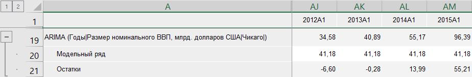
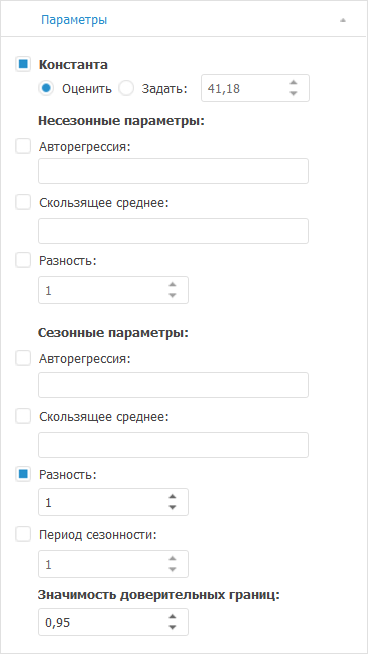

# ARIMA: Foresight Add-in for Excel

ARIMA: Foresight Add-in for Excel
-

# ARIMA

Моделирует значения ряда методом «ARIMA».
 Входит в группу «[Прогноз](Forecast.htm)».

«ARIMA» - одна из наиболее
 популярных моделей для построения краткосрочных прогнозов.

[Для применения
 метода](javascript:TextPopup(this))

		- В таблице данных выделите один или несколько рядов.

		- Нажмите кнопку  «Прогнозирование»,
		 расположенную на вкладке «Вычисления» ленты
		 инструментов.

		- В раскрывающемся списке кнопки выберите вариант «ARIMA».

После применения метода в таблицу данных для каждого выделенного ряда
 будет добавлен ряд с наименованием вида «ARIMA(<Имя_Ряда>)»,
 содержащий результаты расчета. Например:

## Настройка параметров расчёта

Для настройки параметров расчёта используйте вкладку «Параметры»
 на панели свойств:

[Для отображения
 вкладки](javascript:TextPopup(this))

		- Убедитесь, что панель
		 свойств отображается.

		- Выделите в таблице данных ряд, рассчитанный методом «ARIMA».

		- На панели свойств установите переключатель «Ряд».

		- Перейдите на вкладку «Параметры».

Задайте параметры метода:

[Константа](javascript:TextPopup(this))

	Для использования в модели константы:

		- Установите флажок «Константа».

		- Выберите метод расчёта константы:

			- Оценить. Значение
			 константы оценивается автоматически при расчете метода. Полученное
			 значение будет отображено в поле ввода справа;

			- Задать. Значение
			 константы задается пользователем в соответствующем поле.

[Сезонные/несезонные
 параметры](javascript:TextPopup(this))

	Задайте несезонные/сезонные параметры метода:

		- Авторегрессия. По
		 умолчанию флажок снят. Если флажок установлен, то учитывается
		 указанный порядок несезонной/сезонной авторегрессии;

		- Скользящее среднее.
		 Если флажок установлен, то учитывается указанный порядок несезонного/сезонного
		 скользящего среднего;

	Совет.
	 Введите номера или диапазоны порядка сезонной/несезонной авторегрессии
	 и сезонного/несезонного скользящего среднего, разделенные запятыми.
	 Диапазон порядка указывайте через знак «-». Например: 1-3,5,7-9.

		- Разность. Если флажок
		 установлен, то учитывается указанный порядок дифференцирования
		 несезонной/сезонной составляющей ряда.

[Период сезонности](javascript:TextPopup(this))

	Если флажок «Период сезонности»
	 установлен, то учитывается указанная продолжительность периода сезонности
	 (например, четыре квартала или двенадцать месяцев).

[Значимость доверительных
 границ](javascript:TextPopup(this))

	Задайте уровень значимости доверительных границ прогнозного ряда.
	 Диапазон допустимых значений: (0, 1). Значение по умолчанию - «0,95».

См. также:

[Методы
 расчёта](../Calculation_Methods.htm) | [Прогноз](Forecast.htm) | Метод «[ARIMA](lib.chm::/02_time_series_analysis/uimodelling_arima.htm)»

		Справочная
		 система на версию 10.9
		 от 18/08/2025,
		 © ООО «ФОРСАЙТ»,
