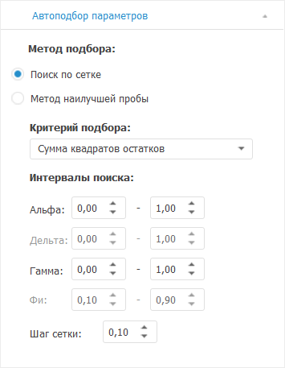
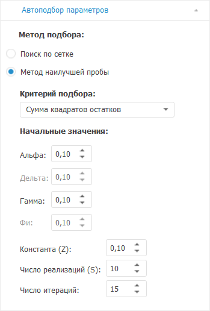

# Настройка автоподбора значений параметров: Foresight Add-in for Excel

Настройка автоподбора значений параметров: Foresight Add-in for Excel
-

# Настройка автоподбора значений параметров

Для настройки параметров автоматического подбора [значений
 коэффициентов](ExpSmooth_Param.htm#coeff) в модели [экспоненциального
 сглаживания](Exponential_smoothing.htm) используйте вкладку «Автоподбор
 параметров»

[Для отображения
 вкладки](javascript:TextPopup(this))

		- Убедитесь, что панель
		 свойств отображается.

		- Выделите в таблице данных ряд, рассчитанный методом «Экспоненциальное сглаживание».

		- На панели свойств установите переключатель «Ряд».

		- Перейдите на вкладку «Автоподбор
		 параметров».

Вкладка всегда содержит группы:

	- Метод подбора. Задайте
	 метод подбора значений коэффициентов;

	- Критерий подбора. Укажите
	 критерий, по которому подбираются значения коэффициентов.

Остальной набор параметров зависит от выбранного метода подбора значений
 коэффициентов.

## Поиск по сетке

Вид вкладки, если выбран метод подбора «Поиск
 по сетке»:

Задайте параметр:

[Интервалы поиска](javascript:TextPopup(this))

	Группа «Интервалы поиска»
	 определяет, в каких пределах искать значения коэффициентов «Альфа», «Дельта»,
	 «Гамма», «Фи».
	 В соответствующих редакторах чисел задайте интервал поиска, учитывая
	 ограничения:

		- для нижней границы (первый редактор чисел) минимальное значение
		 - «0,00», максимальное - «1,00»;

		- для верхней границы (второй редактор чисел) минимальное
		 значение - значение нижней границы, максимальное - «1,00».

	Доступность интервалов поиска значений коэффициентов зависит от
	 [сезонного эффекта](ExpSmooth_Param.htm#seas_effect) и
	 модели [роста](ExpSmooth_Param.htm#growth).

	Если значение коэффициента было установлено [вручную](ExpSmooth_Param.htm#coeff),
	 то редактирование интервала недоступно.

	Параметр «Шаг сетки» определяет
	 величину интервала, с которым выполняется поиск по сетке.

## Метод наилучшей пробы

Вид вкладки, если выбран метод подбора «Метод
 наилучшей пробы»:

Задайте параметр:

[Начальные значения](javascript:TextPopup(this))

	Группа «Начальные значения»
	 определяет:

		- Альфа. Дельта.
		 Гамма. Фи.
		 В соответствующих редакторах чисел задайте начальные значения
		 для поиска значений коэффициентов. Доступность редакторов зависит
		 от [сезонного эффекта](ExpSmooth_Param.htm#seas_effect)
		 и модели [роста](ExpSmooth_Param.htm#growth). Если
		 значение коэффициента было задано [вручную](ExpSmooth_Param.htm#coeff),
		 то редактирование значений недоступно;

		- Константа (Z). Вещественное
		 значение константы, используемое для метода наилучшей пробы;

		- Число реализаций (S).
		 Число реализаций коэффициента;

		- Число итераций.
		 Максимальное число итераций, за которое должно быть получено значение.

См. также:

[Работа с вычисляемыми рядами](../../Calculated_Series_work.htm) |
 [Методы
 расчёта](../Calculation_Methods.htm) |
 [Прогноз](Forecast.htm) |
 [Экспоненциальное
 сглаживание](Exponential_smoothing.htm)

		Справочная
		 система на версию 10.9
		 от 18/08/2025,
		 © ООО «ФОРСАЙТ»,
