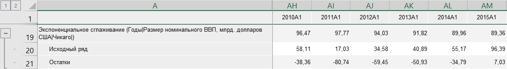

# Экспоненциальное сглаживание: Foresight Add-in for Excel

Экспоненциальное сглаживание: Foresight Add-in for Excel
-

# Экспоненциальное сглаживание

Моделирует значения ряда методом «Экспоненциального
 сглаживания». Входит в группу «[Прогноз](Forecast.htm)».

Метод «Экспоненциального сглаживания»
 является способом усреднения значений временного ряда. В отличие от метода
 скользящего среднего, в определении экспоненциальной средней участвуют
 все наблюдения исходного временного ряда, но с разными весовыми коэффициентами.
 Для экспоненциального сглаживания момент времени, в который наблюдалось
 значение временного ряда, играет решающую роль. Здесь более старым наблюдениям
 приписываются экспоненциально убывающие веса, при этом учитываются все
 предшествующие наблюдения ряда.

[Для применения
 метода](javascript:TextPopup(this))

		- В таблице данных выделите один или несколько рядов.

		- Нажмите кнопку  «Прогнозирование»,
		 расположенную на вкладке «Вычисления» ленты
		 инструментов.

		- В раскрывающемся списке кнопки выберите вариант «Экспоненциальное
		 сглаживание».

После применения метода в таблицу данных для каждого выделенного ряда
 будет добавлен ряд с наименованием вида «Экспоненциальное
 сглаживание(<Имя_Ряда>)», содержащий результаты расчета.
 Например:

## Настройка параметров расчёта

Для настройки специфических параметров расчёта используйте вкладки на
 панели свойств:

	- [Параметры](ExpSmooth_Param.htm).
	 Позволяет изменить базовые параметры расчёта: модели сезонности и
	 роста;

	- [Параметры
	 автоподбора](ExpSmooth_Autofit.htm). Позволяет настроить параметры автоматического
	 подбора значений коэффициентов, используемых при расчёте метода.

См. также:

[Методы
 расчёта](../Calculation_Methods.htm) | [Прогноз](Forecast.htm) | [Метод
 экспоненциального сглаживания](lib.chm::/02_time_series_analysis/uimodelling_expsmooth.htm)

		Справочная
		 система на версию 10.9
		 от 18/08/2025,
		 © ООО «ФОРСАЙТ»,
