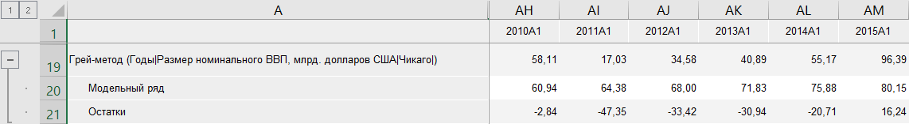

# Грей-метод: Foresight Add-in for Excel

Грей-метод: Foresight Add-in for Excel
-

# Грей-метод

Моделирует значения ряда «Грей-методом».
 Входит в группу «[Прогноз](Forecast.htm)».

В отличие от традиционных статистических методов анализа временных рядов,
 которые накладывают достаточно жесткое ограничение к линейности ряда,
 Грей-метод подходит для прогнозирования поведения нелинейных временных
 рядов. Данный метод относится к нестатистическим методам прогнозирования
 и особенно эффективен в условиях недостаточного числа наблюдений.

[Для применения
 метода](javascript:TextPopup(this))

		- В таблице данных выделите один или несколько рядов.

		- Нажмите кнопку  «Прогнозирование»,
		 расположенную на вкладке «Вычисления» ленты
		 инструментов.

		- В раскрывающемся списке кнопки выберите вариант «Грей-метод».

После применения метода в таблицу данных для каждого выделенного ряда
 будет добавлен ряд с наименованием вида «Грей-метод(<Имя_Ряда>)»,
 содержащий результаты расчета. Например:

См. также:

[Методы
 расчёта](../Calculation_Methods.htm) | [Прогноз](Forecast.htm) | [Модель GM(1,1) (Грей-метод)](Lib.chm::/02_Time_series_analysis/Grey.htm)

		Справочная
		 система на версию 10.9
		 от 18/08/2025,
		 © ООО «ФОРСАЙТ»,
