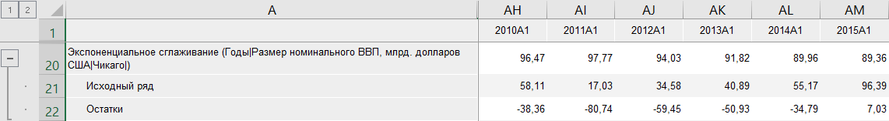

# Тренд: Foresight Add-in for Excel

Тренд: Foresight Add-in for Excel
-

# Тренд

Метод позволяет исключить из временного ряда сезонную составляющую и
 построить теоретический временной ряд, в основе которого лежит математически-выраженная
 закономерность изменения.

Доступные модели тренда:

	- Экспоненциальный тренд.
	 Осуществляет моделирование значений ряда методом «Экспоненциального
	 тренда»;

	- Обратный тренд. Осуществляет
	 моделирование значений ряда методом «Обратного
	 тренда»;

	- Линейный тренд. Осуществляет
	 моделирование значений ряда методом «Линейного
	 тренда»;

	- Логарифмический параболический
	 тренд. Осуществляет моделирование значений ряда методом «Логарифмического параболического
	 тренда»;

	- Параболический тренд.
	 Осуществляет моделирование значений ряда методом «Параболического
	 тренда»;

	- Геометрический тренд.
	 Осуществляет моделирование значений ряда методом «Геометрического
	 тренда».

Методы входят в группу «[Прогноз](Forecast.htm)».

[Для применения
 метода](javascript:TextPopup(this))

		- В таблице данных выделите один или несколько рядов.

		- Нажмите кнопку  «Прогнозирование»,
		 расположенную на вкладке «Вычисления» ленты
		 инструментов.

		- В раскрывающемся списке кнопки выберите модель тренда.

После применения метода в таблицу данных для каждого выделенного ряда
 будет добавлен ряд с наименованием вида «<Наименование_модели_тренда>(<Имя_Ряда>)»,
 содержащий результаты расчета. Например:

## Настройка параметров расчёта

Для настройки параметров расчёта используйте вкладку «Параметры»
 на панели свойств.

[Для отображения
 вкладки](javascript:TextPopup(this))

		- Убедитесь, что панель
		 свойств отображается.

		- Выделите в таблице данных ряд, рассчитанный с помощью тренда.

		- На панели свойств установите переключатель «Ряд».

		- Перейдите на вкладку «Параметры».

Задайте на вкладке параметры метода:

[Сезонный эффект](javascript:TextPopup(this))

	Для учёта при расчёте сезонного эффекта:

		- Установите флажок «Сезонный
		 эффект».

		- Укажите метод, применяемый для выделения сезонной составляющей
		 исходного ряда:

			- Аддитивный.
			 Используется по умолчанию. Ряд рассматривается как сумма систематической
			 и нерегулярной составляющих;

			- Мультипликативный.
			 Ряд рассматривается как произведение систематической и нерегулярной
			 составляющих.

	Если сезонность отсутствует, то на основе исходного ряда осуществляется
	 оценка коэффициентов уравнения методом наименьших квадратов.

	Если ряд содержит сезонную составляющую, то вначале выполняются
	 вычисления, связанные с исключением этой периодически повторяющейся
	 компоненты из исходного ряда. После того как сезонная составляющая
	 вычислена и исключена из исходного ряда, осуществляется оценка коэффициентов
	 уравнения. Для оценки используется линейный метод наименьших квадратов.

[Период сезонности](javascript:TextPopup(this))

	С помощью редактора чисел или клавиатуры определите длину периода
	 сезонности.

	Параметр используется, если задан какой-либо сезонный эффект.

См. также:

[Методы
 расчёта](../Calculation_Methods.htm) | [Прогноз](Forecast.htm) | [Тренд
 с подбором функциональной зависимости](lib.chm::/02_time_series_analysis/uimodelling_trendcurveestimation.htm)

		Справочная
		 система на версию 10.9
		 от 18/08/2025,
		 © ООО «ФОРСАЙТ»,
