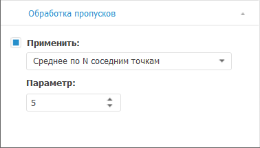

# Выбор метода обработки пропусков: Foresight Add-in for Excel

Выбор метода обработки пропусков: Foresight Add-in for Excel
-

# Выбор метода обработки пропусков

Для выбора метода обработки пропусков используйте вкладку «Обработка
 пропусков» на панели
 свойств. Набор параметров на вкладке зависит от используемого [метода
 расчёта](Calculation_Methods.htm).

[Для отображения
 вкладки](javascript:TextPopup(this))

		- Убедитесь, что панель
		 свойств отображается.

		- Выделите в таблице данных вычисляемый ряд.

		- На панели свойств установите переключатель «Ряд».

		- Перейдите на вкладку «Обработка
		 пропусков».

Если требуется обработка пропусков, установите флажок «Применить»
 и выберите один из методов:

	- Casewise. Используется
	 по умолчанию. Пустые значения исключаются из ряда. Расчеты ведутся
	 без их учета;

	- Геометрическая интерполяция.
	 Для вычисления пустых значений ряда используется геометрическая интерполяция;

	- Интерполяция кубическим сплайном.
	 Для вычисления пустых значений ряда используется интерполяция кубическими
	 сплайнами;

	- Линейная интерполяция.
	 Для вычисления пустых значений ряда используется линейная интерполяция
	 по двум соседним точкам;

	- Линейный тренд. Для
	 вычисления пустых значений ряда используется линейный тренд;

	- Предыдущее значение.
	 Пустые значения ряда заменяются предыдущим непустым значением;

	- Произвольное значение.
	 Пустые значения ряда заменяются произвольным числом из интервала
	 [минимальное значение ряда;
	 максимальное значение ряда];

	- Следующее значение.
	 Пустые значения ряда заменяются следующим непустым значением;

	- Среднее значение по выборке.
	 Пустые значения ряда вычисляются как среднее по выборке;

	- Среднее по N соседним
	 точкам. Пустые значения ряда вычисляются как среднее по N соседним точкам. В поле «Параметр» задайте количество соседних
	 точек (N);

	- Темп роста к предыдущему периоду.
	 Пустые значения ряда вычисляются исходя из темпа роста существующих
	 значений к предыдущему периоду. В поле «Параметр»
	 задайте количество периодов;

	- Темп роста к следующему периоду.
	 Пустые значения ряда вычисляются исходя из темпа роста существующих
	 значений к следующему периоду. В поле «Параметр»
	 задайте количество периодов;

	- Указанное значение.
	 Пустые значения ряда заменяются числом, указанным в поле «Параметр».

См. также:

[Методы
 расчёта](Calculation_Methods.htm)

		Справочная
		 система на версию 10.9
		 от 18/08/2025,
		 © ООО «ФОРСАЙТ»,
