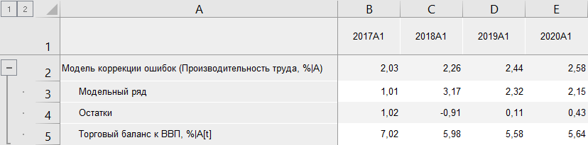
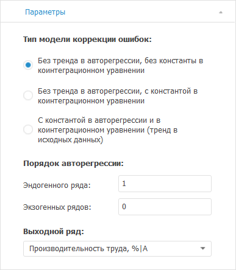

# Модель коррекции ошибок: Foresight Add-in for Excel

Модель коррекции ошибок: Foresight Add-in for Excel
-

# Модель коррекции ошибок

Осуществляет расчёт методом «Модель
 коррекции ошибок». Входит в группу «[Регрессия](Regression.htm)».

[Для применения
 метода](javascript:TextPopup(this))

		- В таблице данных выделите несколько рядов.

		- Нажмите кнопку  «Регрессия»,
		 расположенную на вкладке «Вычисления» ленты
		 инструментов.

		- В раскрывающемся списке кнопки выберите вариант «Модель
		 коррекции ошибок».

После применения метода в таблицу данных будет добавлен ряд с наименованием
 вида «Модель коррекции ошибок(<Список_Экзогенных_Переменных>)»,
 содержащий результаты расчета. Например:

## Настройка параметров метода

Для настройки параметров расчёта используйте вкладку «Параметры»
 на панели свойств.

[Для отображения
 вкладки](javascript:TextPopup(this))

		- Убедитесь, что панель
		 свойств отображается.

		- Выделите в таблице данных ряд, рассчитанный методом «Модель коррекции ошибок».

		- На панели свойств установите переключатель «Ряд».

		- Перейдите на вкладку «Параметры».

Задайте параметры метода:

	- Тип модели коррекции ошибок.
	 Укажите тип модели коррекции ошибок: выберите положение константы
	 и тренда.

	- Порядок авторегрессии эндогенных/экзогенных
	 рядов. Укажите порядок авторегрессии для эндогенных/экзогенных
	 рядов;

	- Выходной ряд. Укажите
	 результирующий ряд. Остальные ряды будут считаться экзогенными переменными.

См. также:

[Методы
 расчёта](../Calculation_Methods.htm) | [Регрессия](Regression.htm) | Метод
 расчёта [модели
 коррекции ошибок](lib.chm::/02_time_series_analysis/uimodelling_errcorrmodel.htm)

		Справочная
		 система на версию 10.9
		 от 18/08/2025,
		 © ООО «ФОРСАЙТ»,
