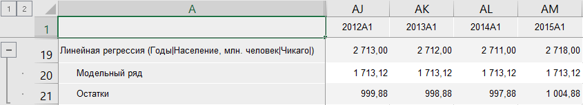
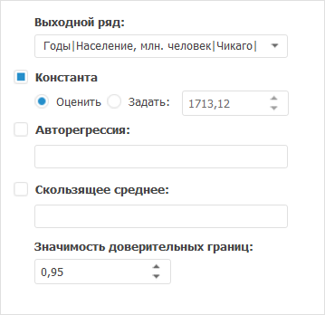

# Линейная регрессия: Foresight Add-in for Excel

Линейная регрессия: Foresight Add-in for Excel
-

# Линейная регрессия

Осуществляет расчёт методом «Линейная
 регрессия». Входит в группу «[Регрессия](Regression.htm)».

[Для применения
 метода](javascript:TextPopup(this))

		- В таблице данных выделите несколько рядов.

		- Нажмите кнопку  «Регрессия»,
		 расположенную на вкладке «Вычисления» ленты
		 инструментов.

		- В раскрывающемся списке кнопки выберите вариант «Линейная
		 регрессия».

После применения метода в таблицу данных будет добавлен ряд с наименованием
 вида «Линейная регрессия(<Список_Объясняющих_Рядов>)»,
 содержащий результаты расчета. Например:

## Настройка параметров метода

Для настройки параметров расчёта используйте вкладку «Параметры»
 на панели свойств.

[Для отображения
 вкладки](javascript:TextPopup(this))

		- Убедитесь, что панель
		 свойств отображается.

		- Выделите в таблице данных ряд, рассчитанный методом «Линейная регрессия».

		- На панели свойств установите переключатель «Ряд».

		- Перейдите на вкладку «Параметры».

Задайте параметры метода:

[Выходной ряд](javascript:TextPopup(this))

	В раскрывающемся списке выберите ряд, в который будут выгружены
	 результаты.

[Константа](javascript:TextPopup(this))

	Если в модели необходимо использование константы:

		- Установите флажок «Константа».

		- Укажите метод расчёта константы:

			- Оценить. Значение
			 константы оценивается автоматически при расчете метода. Полученное
			 значение будет отображено в поле ввода справа;

			- Задать. Значение
			 константы задается пользователем в соответствующем поле.

[Авторегрессия](javascript:TextPopup(this))

	Если в модели необходимо использование коэффициентов авторегрессии,
	 установите флажок «Авторегрессия».
	 По умолчанию флажок снят.

	После установки флажка в соответствующем поле введите номера или
	 диапазоны порядка авторегрессии, разделяя их запятыми. Диапазон порядка
	 авторегрессии указывается через знак «-». Например: 1-3,5,7-9.

[Скользящее среднее](javascript:TextPopup(this))

	Если в модели необходимо использование коэффициентов скользящего
	 среднего, установите флажок «Скользящее
	 среднее». По умолчанию флажок снят.

	После установки флажка в соответствующем поле введите номера или
	 диапазоны порядка скользящего среднего, разделяя их запятыми. Диапазон
	 порядка скользящего среднего указывается через знак «-». Например:
	 1-3,5,7-9.

[Значимость доверительных
 границ](javascript:TextPopup(this))

	В редакторе чисел «Значимость доверительных
	 границ» задайте уровень значимости доверительных границ прогнозного
	 ряда. Диапазон допустимых значений: (0, 1). Значение по умолчанию
	 - «0,95».

Для настройки параметров авторегрессии/скользящего среднего используйте
 вкладку «[Параметры
 оценки ARMA](../ARMA.htm)» на панели
 свойств.

См. также:

[Методы
 расчёта](../Calculation_Methods.htm) | [Регрессия](Regression.htm) | [Метод
 наименьших квадратов](lib.chm::/01_regression_models/uimodelling_linearregr_lsm.htm)

		Справочная
		 система на версию 10.9
		 от 18/08/2025,
		 © ООО «ФОРСАЙТ»,
