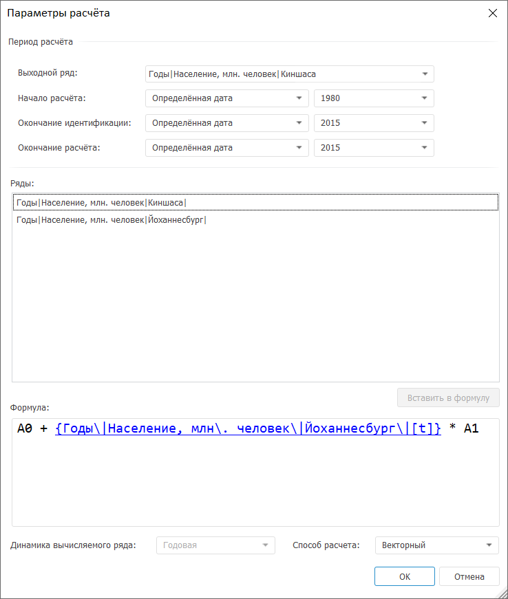
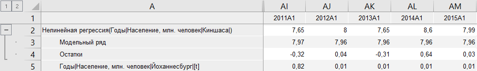
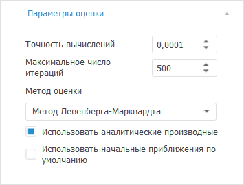

# Нелинейная регрессия: Foresight Add-in for Excel

Нелинейная регрессия: Foresight Add-in for Excel
-

# Нелинейная регрессия

Осуществляет расчёт методом «Нелинейная
 регрессия». Входит в группу «[Регрессия](Regression.htm)».

Для применения метода:

	- В таблице данных выделите несколько рядов.

	- Нажмите кнопку  «Регрессия», расположенную на вкладке
	 «Вычисления» ленты инструментов.

	- В раскрывающемся списке кнопки выберите вариант «Нелинейная
	 регрессия».

Будет отображено окно «Параметры
 расчёта»:

Настройка параметров расчёта нелинейной регрессии состоит из нескольких
 этапов:

[Задание выходного
 ряда](javascript:TextPopup(this))

	В раскрывающемся списке «Выходной
	 ряд» выберите ряд, в который будут выгружены результаты.

[Формирование
 формулы расчёта](javascript:TextPopup(this))

	При формировании формулы расчёта допускается использование арифметических
	 операций, цифр, круглых скобок. Также при редактировании формулы допускается
	 использовать различные преобразования рядов: введите наименование
	 преобразования и в круглых скобках через запятую укажите его параметры.
	 Например:

	Cumulative(Benin|Годы[t],MsCumulativeMethodType.Average)

	В формуле обязательно должен присутствовать хотя бы один коэффициент
	 и один объясняющий ряд, иначе нелинейное преобразование данных не
	 может быть произведено. Например:

	(Benin|Годы+Sudan|Годы)/2*f1

	В данной формуле присутствуют два объясняющих ряда: «Benin|Годы»,
	 «Sudan|Годы» и один коэффициент:
	 «f1».

	Для вставки функции в формулу:

		- в области формул наберите необходимую функцию с помощью
		 клавиатуры;

		- используйте технологию IntelliSense:

			- Установите курсор в область формул.

			- Нажмите сочетание клавиш CTRL+ПРОБЕЛ.

	Будет отображен список доступных функций
	 и данных. Щёлкните по названию функции в списке.

	Функция будет вставлена в место расположения курсора.

	Доступные категории функций совпадают с набором функций, доступных
	 в [редакторе
	 выражения](UiNav.Chm::/GUI/ExpressionEditor.htm), и приведены в разделе «[Функции,
	 доступные в редакторе выражения](UiNav.Chm::/GUI/Expression_editor_func.htm)».

	Для вставки данных в формулу:

		- дважды щелкните по необходимому элементу данных в области
		 рядов;

		- выделите необходимый элемент данных в области рядов и нажмите
		 кнопку «Вставить в формулу»;

		- используйте технологию IntelliSense:

			- Установите курсор в область
			 формул.

			- Нажмите сочетание клавиш
			 CTRL+ПРОБЕЛ.

	Будет отображен список доступных данных
	 и функций. Щёлкните по элементу данных в списке.

	Идентификатор ряда будет вставлен в формулу в место расположения
	 курсора.

	Для всех рядов в формуле доступно изменение лага. Лаг отвечает за
	 сдвиг ряда вперед (положительные значения) или назад (отрицательные
	 значения) на заданное количество точек во временном периоде. Щелчок
	 по ряду открывает диалог «Редактирование лага», в котором укажите
	 требуемое значение лага.

	Для вставки числа в формулу:

		- Установите курсор в необходимую позицию.

		- Наберите необходимое число с помощью клавиатуры.

	Число будет вставлено в место расположения курсора.

	Также при работе с числами доступны стандартные операции [буфера
	 обмена](uinav.chm::/02_Navigator/UiNav_ObjectsOperations.htm): копирование, перенос и вставка.

Если формула задана верно, то при нажатии кнопки «OK»
 окно «Параметры расчёта» будет
 закрыто, в таблицу данных будет добавлен вычисляемый ряд с наименованием
 «Нелинейная регрессия(<Список_Объясняющих_Рядов>)»,
 содержащий результаты расчета. Например:

## Просмотр формулы нелинейной регрессии

Для просмотра формулы нелинейной регрессии перейдите на вкладку «Уравнение»
 на панели результатов.

## Настройка параметров расчёта

Для изменения базовых параметров расчёта (выходного ряда и значимости
 доверительных границ) используйте вкладку «Параметры»
 на панели свойств:

[Для отображения
 вкладки](javascript:TextPopup(this))

		- Убедитесь, что панель
		 свойств отображается.

		- Выделите в таблице данных ряд, рассчитанный методом «Нелинейная регрессия».

		- На панели свойств установите переключатель «Ряд».

		- Перейдите на вкладку «Параметры».

Задайте параметры метода:

	- Выходной ряд. Укажите
	 ряд, в который будут выгружены результаты;

	- Значимость доверительных границ.
	 Задайте уровень значимости доверительных границ прогнозного ряда.
	 Диапазон допустимых значений: (0, 1). Значение по умолчанию «0,95».

Для настройки параметров автоматического подбора значений коэффициентов,
 используемых при расчёте метода, используйте вкладку «Параметры
 оценки» на панели
 свойств:

[Для отображения
 вкладки](javascript:TextPopup(this))

		- Убедитесь, что панель
		 свойств отображается.

		- Выделите в таблице данных ряд, рассчитанный методом «Нелинейная регрессия».

		- На панели свойств установите переключатель «Ряд».

		- Перейдите на вкладку «Параметры
		 оценки».

Задайте параметры оценки нелинейной регрессии:

	- Точность вычислений.
	 Укажите точность вычислений уравнения. Минимальное значение «0.00001».
	 Значение по умолчанию «0.0001»;

	- Максимальное число итераций.
	 Задайте максимальное число итераций, за которое должны быть получены
	 оценки коэффициентов нелинейной регрессии. При большом числе итераций
	 достигается наибольшая точность вычислений, но затрачивается больше
	 времени. Минимальное значение «1». Значение по умолчанию «500»;

	- [Метод оценки](Lib.chm::/02_Time_series_analysis/Lib_ARIMA_Coef.htm).
	 В раскрывающемся списке выберите метод оценки коэффициентов нелинейной
	 регрессии;

	- Использовать начальные приближения
	 по умолчанию. По умолчанию флажок установлен, и для расчета
	 используются начальные приближения коэффициентов уравнения, заданные
	 по умолчанию. Если флажок снят, то используются начальные приближения,
	 заданные пользователем;

	- Использовать аналитические
	 производные. Установка данного флажка повышает точность расчетов
	 путем расчета аналитических производных для уравнения нелинейной регрессии.

См. также:

[Методы
 расчёта](../Calculation_Methods.htm) | [Регрессия](Regression.htm) | Метод
 расчёта [нелинейной
 регрессии](lib.chm::/01_regression_models/uimodelling_nonlinearregr.htm)

		Справочная
		 система на версию 10.9
		 от 18/08/2025,
		 © ООО «ФОРСАЙТ»,
