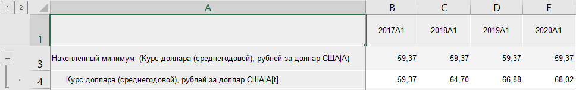

# Методы накопления: Foresight Add-in for Excel

Методы накопления: Foresight Add-in for Excel
-

# Методы накопления

Накопление - метод расчёта,
 при котором расчёт значения точки вычисляемого ряда с порядковым номером
 n происходит на диапазоне значений
 дочернего ряда: [Первый элемент ряда;
 n-ый элемент ряда]. Методы накопления входят в группу «[Преобразования](Transformations.htm)».

Доступные методы накопления:

	- Накопленный минимум.
	 Используется метод накопления «Минимум»:
	 определяется минимальное значение элементов диапазона;

	- Накопленный максимум.
	 Используется метод «Максимум»:
	 определяется максимальное значение элементов диапазона;

	- Накопленное среднее.
	 Используется метод «Среднее»:
	 определяется среднее значение элементов диапазона;

	- Накопленное стандартное отклонение.
	 Используется метод «Стандартное
	 отклонение»: определяется стандартное отклонение значений элементов
	 диапазона;

	- Накопленная сумма. Используется
	 метод «Сумма»: определяется
	 сумма значений элементов диапазона;

	- Накопленное умножение.
	 Используется метод «Произведение»:
	 определяется произведение значений элементов диапазона.

[Для применения
 метода](javascript:TextPopup(this))

		- В таблице данных выделите один или несколько рядов.

		- Нажмите кнопку  «Преобразования»,
		 расположенную на вкладке «Вычисления» ленты
		 инструментов.

		- В раскрывающемся списке кнопки выберите вариант «Методы
		 накопления».

		- Выберите метод накопления.

После применения метода в таблицу данных для каждого выделенного ряда
 будет добавлен ряд с наименованием вида «<Наименование_метода>(<Имя_Ряда>)»,
 содержащий результаты расчета. Например:

См. также:

[Методы
 расчёта](../Calculation_Methods.htm) | [Преобразования](Transformations.htm)

		Справочная
		 система на версию 10.9
		 от 18/08/2025,
		 © ООО «ФОРСАЙТ»,
