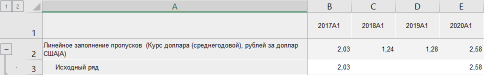

# Методы обработки пропусков: Foresight Add-in for Excel

Методы обработки пропусков: Foresight Add-in for Excel
-

# Методы обработки пропусков

Обработка пропусков заполняет пустые значения ряда с помощью различных
 методов обработки пропусков. Методы обработки пропусков входят в группу
 «[Преобразования](Transformations.htm)».

Доступны следующие методы:

	- Геометрическое заполнение пропусков.
	 Осуществляет геометрическое заполнение пропусков в значениях ряда;

	- Линейное заполнение пропусков.
	 Осуществляет линейное заполнение пропусков в значениях ряда;

	- Повторное заполнение пропусков.
	 Осуществляет заполнение пропусков в значениях ряда предыдущими непустыми
	 значениями;

	- Сплайновое заполнение пропусков.
	 Осуществляет сплайновое заполнение пропусков в значениях ряда;

	- Заполнение пропусков заданным
	 значением. Осуществляет заполнение пропусков в данных ряда
	 заданным значением;

	- Темп роста. Осуществляет
	 заполнение пропусков исходя из темпа роста существующих значений;

	- Темп роста к предыдущему периоду.
	 Осуществляет заполнение пропусков исходя из темпа роста существующих
	 значений к предыдущему периоду;

	- Следующее значение.
	 Осуществляет заполнение пропусков в данных ряда следующим непустым
	 значением;

	- Темп роста к следующему периоду.
	 Осуществляет заполнение пропусков исходя из темпа роста существующих
	 значений к следующему периоду.

[Для применения
 метода](javascript:TextPopup(this))

		- В таблице данных выделите один или несколько рядов.

		- Нажмите кнопку  «Преобразования»,
		 расположенную на вкладке «Вычисления» ленты
		 инструментов.

		- В раскрывающемся списке кнопки выберите вариант «Методы
		 обработки пропусков».

		- Выберите метод обработки пропусков.

После применения метода в таблицу данных для каждого выделенного ряда
 будет добавлен ряд с наименованием вида «<Наименование_метода>(<Имя_Ряда>)»,
 содержащий результаты расчета. Например:

## Настройка параметров расчёта

Для настройки параметров метода заполнения пропусков используйте вкладку
 «Параметры» на панели
 свойств.

[Для отображения
 вкладки](javascript:TextPopup(this))

		- Убедитесь, что панель
		 свойств отображается.

		- Выделите в таблице данных ряд, рассчитанный методом заполнения
		 пропусков.

		- На панели свойств установите переключатель «Ряд».

		- Перейдите на вкладку «Параметры».

Задайте значение параметра. Вычисляемый ряд будет заново рассчитан.

См. также:

[Методы
 расчёта](../Calculation_Methods.htm) | [Преобразования](Transformations.htm) |
 [Методы
 обработки пропусков](lib.chm::/03_transformations/uimodelling_fill_gaps.htm)

		Справочная
		 система на версию 10.9
		 от 18/08/2025,
		 © ООО «ФОРСАЙТ»,
