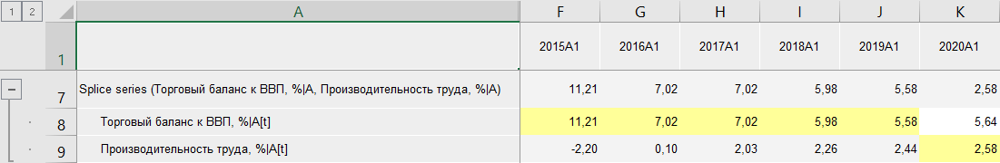
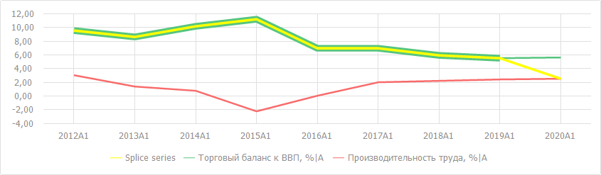
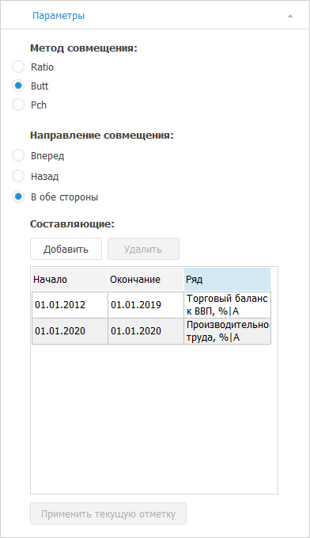

# Совмещение рядов: Foresight Add-in for Excel

Совмещение рядов: Foresight Add-in for Excel
-

# Совмещение рядов

Метод «Совмещение рядов» совмещает
 несколько рядов целиком или их частей. Входит в группу «[Преобразования](Transformations.htm)».

Результирующий ряд будет состоять из значений исходных рядов, совмещенных
 по параметрам, указанных для данной функции.

Примечание.
 Для корректного совмещения используйте ряды/части рядов с одинаковой календарной
 динамикой.

[Для применения
 метода](javascript:TextPopup(this))

		- В таблице данных выделите несколько рядов, значения которых
		 необходимо совместить.

		- Нажмите кнопку  «Преобразования»,
		 расположенную на вкладке «Вычисления» ленты
		 инструментов.

		- В раскрывающемся списке кнопки выберите вариант «Совмещение
		 рядов».

После применения метода в таблицу данных будет добавлен ряд с наименованием
 вида «Splice series(<Список_Совмещенных_Рядов>)»,
 содержащий результаты расчета. Для результирующего ряда дочерними будут
 являться совмещаемые ряды. Ячейки дочерних рядов, которые участвовали
 в совмещении, подсвечиваются. Например:

На диаграмме отображаются совмещённый ряд «Splice series» и его дочерние
 ряды:

## Настройка параметров расчёта

Для настройки параметров ряда «Splice
 series» используйте вкладку «Параметры»
 на панели свойств.

[Для отображения
 вкладки](javascript:TextPopup(this))

		- Убедитесь, что панель
		 свойств отображается.

		- Выделите в таблице данных ряд, рассчитанный методом совмещения
		 рядов.

		- На панели свойств установите переключатель «Ряд».

		- Перейдите на вкладку «Параметры».

Задайте параметры метода:

[Метод совмещения](javascript:TextPopup(this))

	Выберите метод совмещения рядов:

		- Ratio. Метод совмещения
		 данных с темпами роста. Для использования данного метода совмещаемые
		 области рядов должны пересекаться;

		- Butt. Используется
		 по умолчанию. Метод совмещения без преобразования данных. Первая
		 часть результирующего ряда будет состоять из значений первой области
		 до точки, являющейся началом второй области; вторая часть результирующего
		 ряда - из значений второй области до точки, являющейся началом
		 третей области и т.д.;

		- Pch. Метод совмещения
		 данных с темпами прироста.

[Направление
 совмещения](javascript:TextPopup(this))

	Выберите направление совмещения рядов.

	Пусть есть ряды Y=[Yt1,Yt2,Yt3,Yt4,Yt5] и X=[Xt2,Xt3,Xt4]. Сращивание Y
	 и X может быть следующих
	 типов:

		- Вперед. Прибавление
		 идет в конец ряда X.
		 Результирующий ряд Z=[Xt2,Xt3,Xt4,Yt5];

		- Назад. Прибавление
		 идет в начале ряда X.
		 Результирующий ряд Z=[Yt1,Xt2,Xt3,Xt4];

		- В обе стороны. Используется
		 по умолчанию. Прибавление идет в обе стороны ряда X.
		 Результирующий ряд Z=[Yt1,Xt2,Xt3,Xt4,Yt5].

	Примечание.
	 Направления совмещения «Вперед»
	 и «Назад» недоступны, если
	 выбран метод совмещения «Ratio».

[Составляющие](javascript:TextPopup(this))

	В области «Составляющие»
	 отображается список всех дочерних рядов.

	Для добавления дочернего ряда в совмещение:

		- Нажмите кнопку «Добавить».

		- В столбцах «Начало»
		 и «Окончание» задайте
		 период отображения данных ряда.

		- В столбце «Ряд»
		 выберите ряд данных.

	Для удаления выбранного дочернего ряда нажмите кнопку «Удалить».
	 Ряд будет удалён без запроса выполняемой операции.

[Применить текущую
 отметку](javascript:TextPopup(this))

	Возможность находится в разработке.

См. также:

[Методы
 расчёта](../Calculation_Methods.htm) | [Преобразования](Transformations.htm)

		Справочная
		 система на версию 10.9
		 от 18/08/2025,
		 © ООО «ФОРСАЙТ»,
