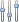
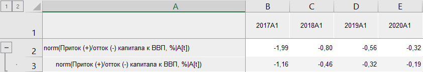

# Статистические методы: Foresight Add-in for Excel

Статистические методы: Foresight Add-in for Excel
-

# Статистические методы

Статистические методы входят в группу «[Преобразования](Transformations.htm)».

При работе с надстройкой доступны следующие функции:

	- Нормализация. Осуществляет
	 нормализацию точек ряда: X[t]/σ(X),
	 где σ -[среднеквадратическое
	 отклонение](Lib.chm::/05_Statistics/UiModelling_ArgSqDev.htm) ряда;

	- Стандартизация. Осуществляет
	 стандартизацию точек ряда: (X[t]-M(X))/σ(X),
	 где σ - [среднеквадратическое
	 отклонение](Lib.chm::/05_Statistics/UiModelling_ArgSqDev.htm) ряда, M
	 - [среднее
	 значение](Lib.chm::/05_Statistics/UiModelling_Avg.htm) ряда.

[Для применения
 метода](javascript:TextPopup(this))

		- В таблице данных выделите один или несколько рядов.

		- Нажмите кнопку  «Преобразования»,
		 расположенную на вкладке «Вычисления» ленты
		 инструментов.

		- В раскрывающемся списке кнопки выберите вариант «Статистические
		 методы».

		- Выберите статистический метод.

После применения метода в таблицу данных для каждого выделенного ряда
 будет добавлен ряд, содержащий результаты расчета, с наименованием вида:

	- для функции «Нормализация»
	 - «norm(<Имя_Ряда>[t])»;

	- для функции «Стандартизация»
	 - «std(<Имя_Ряда>[t])».

Например:

См. также:

[Методы
 расчёта](../Calculation_Methods.htm) | [Преобразования](Transformations.htm)

		Справочная
		 система на версию 10.9
		 от 18/08/2025,
		 © ООО «ФОРСАЙТ»,
