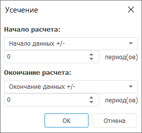

# Усечение: Foresight Add-in for Excel

Усечение: Foresight Add-in for Excel
-

# Усечение

Метод «Усечение» осуществляет
 усечение ряда по заданным параметрам. Входит в группу «[Преобразования](Transformations.htm)».

Для применения метода:

	- В таблице данных выделите один или несколько рядов.

	- Нажмите кнопку  «Преобразования»,
	 расположенную на вкладке «Вычисления» ленты
	 инструментов.

	- В раскрывающемся списке кнопки выберите вариант «Усечение».

Будет открыто окно «Усечение»:

Задайте границы усечения ряда:

[Начало расчёта](javascript:TextPopup(this))

	Задайте значение начальной точки усечения ряда:

		- Начало данных +/-.
		 Используется по умолчанию. Дата равна первой фактической дате
		 входного ряда плюс число периодов, указанных в соответствующем
		 редакторе чисел;

		- Определенная дата.
		 Установите дату начала расчета в формате «месяц
		 год». Параметр зависит от динамики вычисляемого ряда;

		- Сегодня +/-. Установите
		 количество периодов вперед/назад. Сдвиг будет осуществляться по
		 динамике вычисляемого ряда;

		- От окончания расчёта.
		 Установите количество периодов назад. Сдвиг будет осуществляться
		 по динамике вычисляемого ряда.

[Окончание расчёта](javascript:TextPopup(this))

	Задайте значение конечной точки усечения ряда:

		- Конец периода отображения.
		 Дата равна дате окончания периода отображения данных в [таблице
		 данных](../../../Table_Work.htm);

		- Определенная дата.
		 Установите дату окончания идентификации в формате «месяц
		 год». Параметр зависит от динамики вычисляемого ряда;

		- Окончание данных +/-.
		 Используется по умолчанию. Дата равна последней фактической дате
		 входного ряда плюс число периодов, указанных в соответствующем
		 редакторе чисел;

		- Сегодня +/-. Установите
		 количество периодов вперед/назад. Сдвиг будет осуществляться по
		 динамике вычисляемого ряда;

		- От начала расчёта.
		 Установите количество периодов вперед. Сдвиг будет осуществляться
		 по динамике вычисляемого ряда.

	Примечание.
	 При установленном начале расчета «От
	 окончания расчёта» нет возможности установить окончание расчёта
	 в значение «От начала расчёта»
	 и наоборот.

После применения метода в таблицу данных для каждого выделенного ряда
 будет добавлен ряд, содержащий результаты расчета, с наименованием вида
 «Truncate(<Имя_Ряда>)»,
 содержащий результаты усечения. Например:

См. также:

[Методы
 расчёта](../Calculation_Methods.htm) | [Преобразования](Transformations.htm)

		Справочная
		 система на версию 10.9
		 от 18/08/2025,
		 © ООО «ФОРСАЙТ»,
