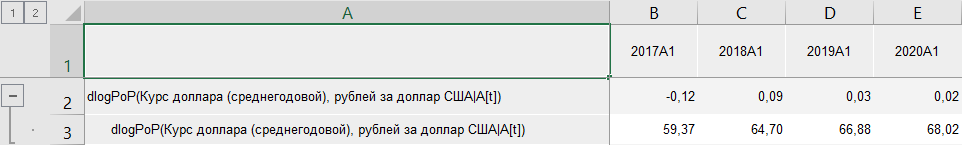

# Разность логарифмов: Foresight Add-in for Excel

Разность логарифмов: Foresight Add-in for Excel
-

# Разность логарифмов

Функция «Разность логарифмов»
 осуществляет расчёт разности логарифмов соседних точек ряда за определенный
 период (ln(x[t]/X[t-N])):

	- dlog PoP. Предыдущий
	 период;

	- dlog YoY. Соответствующий
	 период предыдущего года;

	- dlog YTD. Конец предыдущего
	 года.

Входит в группу функций, осуществляющих [математические
 преобразования](Mathematical_transformations.htm) над рядами.

[Для применения
 функции](javascript:TextPopup(this))

		- В таблице данных выделите один или несколько рядов.

		- Нажмите кнопку  «Преобразования»,
		 расположенную на вкладке «Вычисления» ленты
		 инструментов.

		- В раскрывающемся списке кнопки выберите вариант «Математические
		 преобразования > Разность логарифмов (dlog <Период>)».

После применения функции в таблицу данных для каждого выделенного ряда
 будет добавлен ряд с наименованием вида «dlog<Период>(<Имя_Ряда>[t])(<Имя_Ряда>)»,
 содержащий результаты расчета. Например:

См. также:

[Методы
 расчёта](../Calculation_Methods.htm) | [Преобразования](Transformations.htm) |
 [Математические преобразования](Mathematical_transformations.htm)

		Справочная
		 система на версию 10.9
		 от 18/08/2025,
		 © ООО «ФОРСАЙТ»,
