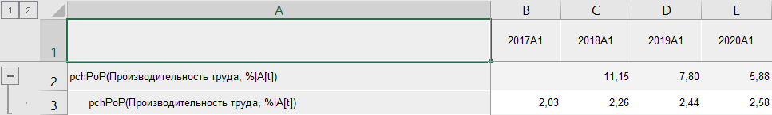

# Темп прироста: Foresight Add-in for Excel

Темп прироста: Foresight Add-in for Excel
-

# Темп прироста

Функция «Темп прироста» осуществляет
 расчёт темпа прироста в процентах значений ряда к значениям выбранного
 периода (X[t]/X[t-N]-1)*100:

	- pch PoP. Предыдущий
	 период;

	- pch YoY. Соответствующий
	 период предыдущего года;

	- pch YTD. Конец предыдущего
	 года.

Входит в группу функций, осуществляющих [математические
 преобразования](Mathematical_transformations.htm) над рядами.

[Для применения
 функции](javascript:TextPopup(this))

		- В таблице данных выделите один или несколько рядов.

		- Нажмите кнопку  «Преобразования»,
		 расположенную на вкладке «Вычисления» ленты
		 инструментов.

		- В раскрывающемся списке кнопки выберите вариант «Математические
		 преобразования > Прирост (pch <Период>)».

После применения функции в таблицу данных для каждого выделенного ряда
 будет добавлен ряд с наименованием вида «pch<Период>(<Имя_Ряда>[t])(<Имя_Ряда>)»,
 содержащий результаты расчета. Например:

См. также:

[Методы
 расчёта](../Calculation_Methods.htm) | [Преобразования](Transformations.htm) |
 [Математические преобразования](Mathematical_transformations.htm)

		Справочная
		 система на версию 10.9
		 от 18/08/2025,
		 © ООО «ФОРСАЙТ»,
