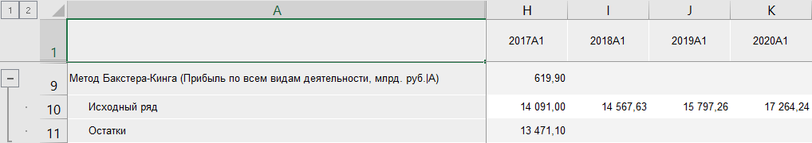
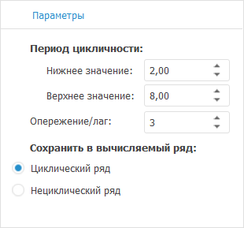

# Фильтр Бакстера-Кинга: Foresight Add-in for Excel

Фильтр Бакстера-Кинга: Foresight Add-in for Excel
-

# Фильтр Бакстера-Кинга

Осуществляет сглаживание ряда методом «Фильтр
 Бакстера-Кинга». Входит в группу «[Сглаживание](Smoothing.htm)».

Фильтр Бакстера-Кинга -
 метод сглаживания временного ряда, который является модификацией [фильтра
 Ходрика-Прескотта](Hpf.htm), с более широкими возможностями исключения циклической
 составляющей из временного ряда.

[Для применения
 метода](javascript:TextPopup(this))

		- Выделите в таблице один или несколько рядов.

		- Выберите метод «Фильтр
		 Бакстера-Кинга» в раскрывающемся меню кнопки 
		 «Сглаживание», расположенной
		 на вкладке «Вычисления» ленты
		 инструментов.

После применения метода в таблицу данных для каждого выделенного ряда
 будет добавлен ряд с наименованием вида «Метод
 Бакстера-Кинга(<Имя_Ряда>)», содержащий результаты расчета.
 Например:

## Настройка параметров расчёта

Для настройки параметров расчёта используйте вкладку «Параметры»
 на панели свойств.

[Для отображения
 вкладки](javascript:TextPopup(this))

		- Убедитесь, что панель
		 свойств отображается.

		- Выделите в таблице данных ряд, рассчитанный методом «Фильтр Бакстера-Кинга».

		- Установите переключатель «Ряд»
		 на панели свойств.

		- Перейдите на вкладку «Параметры».

Задайте параметры метода:

	- Период цикличности.
	 Укажите значения верхней и нижней границ периода цикличности;

	- Опережение/лаг. Задайте
	 размер интервала, на котором рассчитывается скользящее среднее;

	- Сохранить в вычисляемый ряд.
	 Установите переключатель напротив наименования ряда, значения которого
	 будут содержаться в результирующем ряде данных.

Значения опережения/лага и границ периода цикличности устанавливаются
 в зависимости от календарной динамики ряда. Значения по умолчанию:

		 Динамика
		 Опережение/лаг
		 Нижнее значение
		 Верхнее значение

		 Годовая
		 3
		 2
		 8

		 Полугодовая
		 6
		 3
		 16

		 Квартальная
		 12
		 6
		 32

		 Месячная
		 36
		 18
		 96

		 Недельная
		 156
		 78
		 416

		 Дневная (в неделе 5 дней)
		 783
		 391,5
		 2088

		 Дневная (в неделе 7 дней)
		 1095
		 547,5
		 2920

См. также:

[Методы
 расчёта](../Calculation_Methods.htm) | [Сглаживание](Smoothing.htm) | Метод
 «[Фильтр
 Бакстера-Кинга](lib.chm::/02_time_series_analysis/uimodelling_baxterkingfilter.htm)»

		Справочная
		 система на версию 10.9
		 от 18/08/2025,
		 © ООО «ФОРСАЙТ»,
