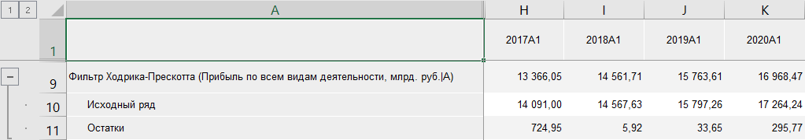
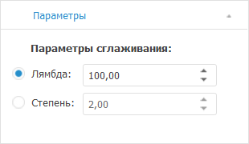

# Фильтр Ходрика-Прескотта: Foresight Add-in for Excel

Фильтр Ходрика-Прескотта: Foresight Add-in for Excel
-

# Фильтр Ходрика-Прескотта

Осуществляет сглаживание ряда методом «Фильтр
 Ходрика-Прескотта». Входит в группу «[Сглаживание](Smoothing.htm)».

Фильтр Ходрика-Прескотта - метод
 сглаживания временного ряда, который используется для выделения длительных
 тенденций.

[Для применения
 метода](javascript:TextPopup(this))

		- Выделите в таблице один или несколько рядов.

		- Выберите метод «Фильтр
		 Ходрика-Прескотта» в раскрывающемся меню кнопки  «Сглаживание»,
		 расположенной на вкладке «Вычисления» ленты
		 инструментов.

После применения метода в таблицу данных для каждого выделенного ряда
 будет добавлен ряд с наименованием вида «Фильтр
 Ходрика-Прескотта(<Имя_Ряда>)», содержащий результаты расчета.
 Например:

## Настройка параметров расчёта

Для настройки параметров расчёта используйте вкладку «Параметры»
 на панели свойств.

[Для отображения
 вкладки](javascript:TextPopup(this))

		- Убедитесь, что панель
		 свойств отображается.

		- Выделите в таблице данных ряд, рассчитанный методом «Фильтр Ходрика-Прескотта».

		- Установите переключатель «Ряд»
		 на панели свойств.

		- Перейдите на вкладку «Параметры».

Задайте параметры метода:

	- Параметр сглаживания.
	 Управляет мерой гладкости ряда. Чем больше значение параметра, тем
	 более «гладким» получается ряд. Если значение параметра сглаживания
	 стремится к бесконечности, то ряд превращается в линейный тренд. Переключатели
	 определяют способ задания параметра сглаживания:

	-

		- Лямбда. Параметр
		 сглаживания определяется значением лямбды. По умолчанию используется
		 значение 100,00;

		- Степень. Параметр
		 сглаживания определяется значением степени, которое должно быть
		 больше нуля. По умолчанию используется значение 2,00.

См. также:

[Методы
 расчёта](../Calculation_Methods.htm) | [Сглаживание](Smoothing.htm) | Метод
 «[Фильтр
 Ходрика-Прескотта](lib.chm::/02_time_series_analysis/uimodelling_hodrickprescottfilter.htm)»

		Справочная
		 система на версию 10.9
		 от 18/08/2025,
		 © ООО «ФОРСАЙТ»,
