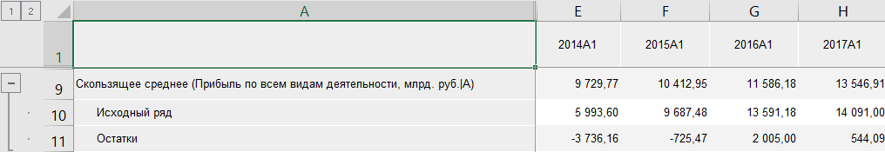

# Скользящее среднее: Foresight Add-in for Excel

Скользящее среднее: Foresight Add-in for Excel
-

# Скользящее среднее

Осуществляет сглаживание ряда методом «Скользящего
 среднего». Входит в группу «[Сглаживание](Smoothing.htm)».

Метод скользящего среднего основан
 на представлении ряда в виде суммы достаточно гладкого тренда и случайной
 компоненты. В основе метода лежит идея локального приближения тренда полиномом
 не очень высокой степени.

[Для применения
 метода](javascript:TextPopup(this))

		- Выделите в таблице один или несколько рядов.

		- Выберите метод «Скользящее
		 среднее» в раскрывающемся меню кнопки 
		 «Сглаживание», расположенной
		 на вкладке «Вычисления» ленты
		 инструментов.

После применения метода в таблицу данных для каждого выделенного ряда
 будет добавлен ряд с наименованием вида «Скользящее
 среднее(<Имя_Ряда>)», содержащий результаты расчета. Например:

## Настройка параметров расчёта

Для настройки параметров расчёта используйте вкладку «Параметры»
 на панели свойств.

[Для отображения
 вкладки](javascript:TextPopup(this))

		- Убедитесь, что панель
		 свойств отображается.

		- Выделите в таблице данных ряд, рассчитанный методом «Скользящее среднее».

		- Установите переключатель «Ряд»
		 на панели свойств.

		- Перейдите на вкладку «Параметры».

Задайте параметры метода:

	- Размер окна. Интервал
	 времени, на котором рассчитывается среднее значение элементов. Чем
	 больше размер окна, тем более «гладкий» получается ряд. По умолчанию
	 для размера окна используется значение 5.

	Размер окна сглаживания должен быть не больше числа наблюдений. Если
	 размер окна больше числа наблюдений ряда, то расчет прерывается. Вычисляемый
	 ряд будет заполнен пустыми значениями;

	- Центрировать скользящее среднее.
	 Если флажок установлен, то для расчёта сглаженных значений применяется
	 метод центрирования. Метод актуально использовать при чётном размере
	 окна.

См. также:

[Методы
 расчёта](../Calculation_Methods.htm) | [Сглаживание](Smoothing.htm) | [Метод
 скользящего среднего](lib.chm::/02_time_series_analysis/uimodelling_slidesmooth.htm)

		Справочная
		 система на версию 10.9
		 от 18/08/2025,
		 © ООО «ФОРСАЙТ»,
