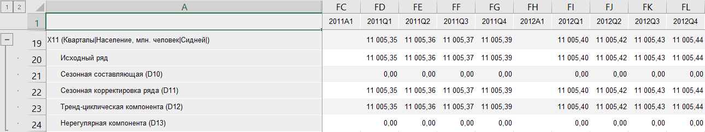

# Выделение сезонности (X11): Foresight Add-in for Excel

Выделение сезонности (X11): Foresight Add-in for Excel
-

# Выделение сезонности (X11)

Осуществляет сезонную декомпозицию и корректировку месячных/квартальных
 данных методом «X11». Функция
 производит разложение исходного ряда на сезонную, тренд-циклическую и
 нерегулярную составляющие, выявляет сезонную корректировку. Входит в группу
 «[Сглаживание](Smoothing.htm)».

Примечание.
 Метод X11 поддерживается только в ОС Windows.

[Для применения
 метода](javascript:TextPopup(this))

		- Выделите в таблице один или несколько рядов.

		- Выберите метод «Выделение
		 сезонности (X11)» в раскрывающемся меню кнопки  «Сглаживание»,
		 расположенной на вкладке «Вычисления» ленты
		 инструментов.

После применения метода в таблицу данных для каждого выделенного ряда
 будет добавлен ряд с наименованием вида «X11(<Имя_Ряда>)»,
 содержащий результаты расчета. Например:

Если сглаживаемый ряд не имеет квартальной/месячной динамики, то расчет
 прерывается. Вычисляемый ряд будет заполнен пустыми значениями.

## Настройка параметров расчёта

Для настройки специфических параметров расчёта используйте вкладки на
 панели свойств:

	- [Параметры](X11_Parameters.htm).
	 Позволяет изменить базовые параметры расчёта: применяемую модель сезонности,
	 применяемые поправки и т.д.;

	- [Скользящее
	 среднее](X11_MovingAverage.htm). Позволяет задать метод расчёта скользящего среднего для
	 каждого элемента календарной динамики исходного ряда;

	- [Весовые
	 коэффициенты](X11_WeightCoefficients.htm). Позволяет задать весовые коэффициенты для дней недели.

См. также:

[Методы
 расчёта](../Calculation_Methods.htm) | [Сглаживание](Smoothing.htm) | Метод
 «[X11](lib.chm::/02_time_series_analysis/uimodelling_census2.htm)»

		Справочная
		 система на версию 10.9
		 от 18/08/2025,
		 © ООО «ФОРСАЙТ»,
