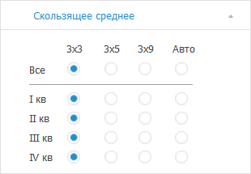
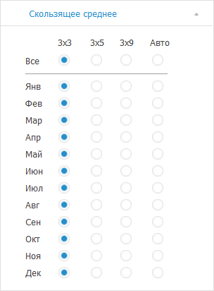

# Настройка параметров скользящего среднего: Foresight Add-in for Excel

Настройка параметров скользящего среднего: Foresight Add-in for Excel
-

# Настройка параметров скользящего среднего

Скользящее среднее применяется
 для расчета значений на основе среднего значения переменной для указанного
 числа предшествующих периодов.

Для настройки параметров скользящего среднего используйте вкладку «Скользящее среднее» на панели
 свойств.

[Для отображения
 вкладки](javascript:TextPopup(this))

		- Убедитесь, что панель
		 свойств отображается.

		- Выделите в таблице данных ряд, рассчитанный методом «Выделение сезонности (X11)».

		- На панели свойств установите переключатель «Ряд».

		- Перейдите на вкладку «Скользящее
		 среднее».

Вид вкладки зависит от календарной динамики исходного ряда:

	- квартальная динамика:

	- месячная динамика:

Независимо от календарной динамики вкладка содержит переключатели, определяющие
 метод расчёта скользящего среднего:

	- 3х3. Представляет собой
	 ряд, который получен путём двукратного применения скользящего среднего
	 по трём наблюдениям к заданному ряду. Процедура эквивалентна взвешенному
	 скользящему среднему по пяти наблюдениям;

	- 3х5. Процедура сглаживания
	 временного ряда, при которой исходный ряд сначала сглаживается по
	 пяти соседним точкам, а затем к полученному ряду применяется процедура
	 трехточечного скользящего среднего. Процедура эквивалентна сглаживанию
	 по семи точкам;

	- 3х9. Процедура сглаживания
	 временного ряда, при которой исходный ряд сначала сглаживается по
	 девяти соседним точкам, а затем к полученному ряду применяется процедура
	 трехточечного скользящего среднего;

	- Авто. Метод расчёта
	 скользящего среднего выбирается автоматически.

Установите переключатель, соответствующий методу расчёта скользящего
 среднего, для каждого элемента календарной динамики.

Совет. Для выбора
 метода расчёта сразу для всех элементов календарной динамики установите
 соответствующий переключатель в строке «Все».

См. также:

[Работа
 с вычисляемыми рядами](../../Calculated_Series_work.htm) | [Методы
 расчёта](../Calculation_Methods.htm) | [Сглаживание](Smoothing.htm) | [Выделение
 сезонности (X11)](X11.htm)

		Справочная
		 система на версию 10.9
		 от 18/08/2025,
		 © ООО «ФОРСАЙТ»,
