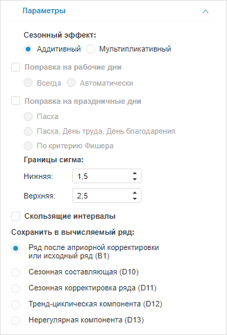

# Настройка параметров выделения сезонности (X11): Foresight Add-in for Excel

Настройка параметров выделения сезонности (X11): Foresight Add-in for Excel
-

# Настройка параметров выделения сезонности (X11)

Для настройки базовых параметров метода «X11»
 используйте вкладку «Параметры»
 на панели свойств.

[Для отображения
 вкладки](javascript:TextPopup(this))

		- Убедитесь, что панель
		 свойств отображается.

		- Выделите в таблице данных ряд, рассчитанный методом «Выделение сезонности (X11)».

		- На панели свойств установите переключатель «Ряд».

		- Перейдите на вкладку «Параметры».

Задайте параметры метода:

[Сезонный
 эффект](javascript:TextPopup(this))

	В группе параметров «Сезонный эффект»
	 выберите модель, применяемую для выделения сезонной составляющей исходного
	 ряда:

		- Аддитивная. Используется
		 по умолчанию. Ряд рассматривается как сумма систематической и
		 нерегулярной составляющих;

		- Мультипликативная.
		 Ряд рассматривается как произведение систематической и нерегулярной
		 составляющих.

[Поправка
 на рабочие дни](javascript:TextPopup(this))

	Поправка на рабочие дни применяется только для месячных данных.

	Если требуется выполнение поправки на рабочие дни:

		- Установите флажок «Поправка
		 на рабочие дни».

		- Выберите способ поправки:

			- Всегда. Делается
			 поправка на рабочие дни;

			- Автоматически.
			 Определяется автоматически: делать ли поправку на рабочие
			 дни.

[Поправка
 на праздничные дни](javascript:TextPopup(this))

	Поправка на праздничные дни позволяет повысить точность расчетов
	 и применяется только для [мультипликативной
	 модели сезонности](#seasonal_effect), рассчитываемой на месячных данных.

	Если требуется выполнение поправки на праздничные дни:

		- Установите флажок «Поправка
		 на праздничные дни».

		- Выберите способ поправки:

		-

			- Только Пасха;

			- Пасха, День труда,
			 День благодарения;

			- По [критерию
			 Фишера](Lib.chm::/05_Statistics/UiModelling_F_Test.htm).

[Границы
 сигма](javascript:TextPopup(this))

	Большинство реальных временных рядов содержит выбросы. Они могут
	 исказить оценки сезонности и тренда. Метод «X11»
	 дает возможность уменьшить влияние выбросов, исключив из рассмотрения
	 значения, выходящие за определённый диапазон, либо преобразовав такие
	 значения.

	Ширина диапазона задаётся нижней и верхней границей сигма в группе
	 параметров «Границы сигма».
	 По умолчанию нижняя граница равна «1,5», верхняя - «2,5».

[Скользящие
 интервалы](javascript:TextPopup(this))

	Если флажок «Скользящие интервалы»
	 установлен, то при расчёте используются скользящие интервалы. По умолчанию
	 флажок снят.

[Сохранить
 в вычисляемый ряд](javascript:TextPopup(this))

	В группе «Сохранить в вычисляемый
	 ряд» установите переключатель напротив наименования ряда, значения
	 которого будут содержаться в результирующем ряде данных:

		- Ряд после априорной корректировки или исходный ряд (B01).
		 Используется по умолчанию;

		- Сезонная составляющая (D10);

		- Сезонная корректировка ряда (D11);

		- Тренд-циклическая компонента (D12);

		- Нерегулярная компонента (D13).

См. также:

[Работа
 с вычисляемыми рядами](../../Calculated_Series_work.htm) | [Методы
 расчёта](../Calculation_Methods.htm) | [Сглаживание](Smoothing.htm) | [Выделение
 сезонности (X11)](X11.htm)

		Справочная
		 система на версию 10.9
		 от 18/08/2025,
		 © ООО «ФОРСАЙТ»,
