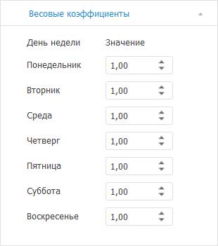

# Задание весовых коэффициентов: Foresight Add-in for Excel

Задание весовых коэффициентов: Foresight Add-in for Excel
-

# Задание весовых коэффициентов

Месяцы содержат различное число рабочих дней, это может повлиять на
 окончательный результат анализа временного ряда. Метод «X11»
 даёт возможность учесть это обстоятельство введением весовых коэффициентов
 для дней недели.

Для задания значения весовых коэффициентов для каждого дня недели используйте
 вкладку «Весовые коэффициенты»
 на панели свойств.

[Для отображения
 вкладки](javascript:TextPopup(this))

		- Убедитесь, что панель
		 свойств отображается.

		- Выделите в таблице данных ряд, рассчитанный методом «Выделение сезонности (X11)».

		- На панели свойств установите переключатель «Ряд».

		- Перейдите на вкладку «Весовые
		 коэффициенты».

Задайте значение коэффициента для каждого дня недели. По умолчанию весовые
 коэффициенты равны единице.

Если сумма всех коэффициентов не равна семи, то к коэффициентам будет
 применено нормирование по формуле:

Wi=Wi*7/S,

где:

	- Wi.
	 Вес коэффициента;

	- S.
	 Ненормированная сумма.

См. также:

[Работа
 с вычисляемыми рядами](../../Calculated_Series_work.htm) | [Методы
 расчёта](../Calculation_Methods.htm) | [Сглаживание](Smoothing.htm) | [Выделение
 сезонности (X11)](X11.htm)

		Справочная
		 система на версию 10.9
		 от 18/08/2025,
		 © ООО «ФОРСАЙТ»,
