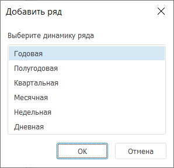

# Работа с временными рядами: Foresight Add-in for Excel

Работа с временными рядами: Foresight Add-in for Excel
-

# Работа с временными рядами

Временной ряд - совокупность
 наблюдений ряда, характеризующихся уникальным набором значений атрибутов.
 Каждое наблюдение, входящее в ряд, называется точкой ряда. Оно характеризуется
 временем наблюдения, его значением, а также рядом дополнительных характеристик.

Работа с временными рядами выполняется в [таблице
 данных](../Table_Work.htm).

## Операции над временными рядами

[Добавление ряда
 данных в таблицу](javascript:TextPopup(this))

	Для добавления ряда в [таблицу данных](../Table_Work.htm):

		- дважды щёлкните по ряду на панели «Дерево
		 рядов»;

		- перетащите ряд из дерева рядов в таблицу данных, используя
		 механизм Drag&Drop.

	Примечание.
	 Если при перетаскивании была зажата клавиша CTRL, то для ряда,
	 на который был брошен перетаскиваемый ряд, будет создана иерархия.

	Временной ряд будет добавлен в таблицу данных.

	Для добавления нескольких рядов:

		- Отметьте требуемые ряды на панели «Дерево
		 рядов», используя клавиши SHIFT или CTRL;

		- Перетащите ряд из дерева рядов в таблицу данных, используя
		 механизм Drag&Drop.

	Временные ряды будут добавлены в таблицу данных.

[Создание ряда
 данных](javascript:TextPopup(this))

	Для создания нового ряда нажмите кнопку  «Добавить ряд», расположенную в группе
	 «Ряды данных» на вкладке ленты
	 «Таблица». В таблицу будет
	 добавлен новый ряд, который не содержит данных.

	Если база данных временных рядов содержит несколько уровней календаря,
	 то будет открыт диалог для выбора динамики создаваемого ряда:

	

[Изменение отображаемых
 данных ряда](javascript:TextPopup(this))

	Для выбора [метода
	 преобразования](uidw.chm::/Workbook/UiDw_Series_Inversion.htm) значений ряда:

		- установите флажок «Применить
		 преобразование» на вкладке «Основные»,
		 расположенной в группе вкладок «Ряд»
		 на панели свойств, и в раскрывающемся списке выберите метод преобразования;

		- используйте раскрывающееся меню кнопки 
		 «Отобразить как», расположенной
		 в группе «Вид» на вкладке
		 «Таблица» ленты инструментов;

	Примечание.
	 При выборе метода «Другое»/«Другое преобразование» будет открыто
	 окно «[Редактирование
	 преобразования](uidw.chm::/Workbook/UiDw_Series_Inversion.htm#setup)», позволяющее настроить дополнительные
	 параметры преобразования.

	Результаты преобразования будут отображены в текущей рабочей книге.
	 Рассчитанные значения являются временными и недоступны для сохранения
	 в источник данных.

	Если преобразование не требуется, выберите пункт «Исходное
	 значение».

	Подробное описание методов преобразования данных приведено в разделе
	 «[Преобразование значений ряда](uidw.chm::/workbook/uidw_series_inversion.htm)».

[Отвязка ряда
 от базы данных временных рядов](javascript:TextPopup(this))

	Отвязка ряда - сброс значений
	 обязательных атрибутов и очистка всех данных ряда. После отвязки ряд
	 не будет принадлежать базе данных временных рядов и подобен новому
	 ряду.

	Для отвязки рядов, выбранных в [таблице
	 данных](../Table_Work.htm), нажмите кнопку 
	 «Отвязать», расположенную
	 в группе «Ряды данных» на
	 вкладке «Таблица» ленты инструментов.
	 Будет отображен запрос подтверждения выполняемого действия.

[Удаление ряда](javascript:TextPopup(this))

	Для удаления выделенных временных рядов из [таблицы
	 данных](../Table_Work.htm) нажмите кнопку 
	 «Удалить», расположенную в
	 группе «Ряды данных» на вкладке
	 «Таблица» ленты инструментов.
	 Будет отображен запрос подтверждения выполняемого действия.

[Группировка/разгруппировка
 рядов](javascript:TextPopup(this))

	Группировка позволяет объединить
	 несколько рядов в логическую группу.

	Для объединения в группу рядов, выделенных в таблице данных,
	 нажмите кнопку  «Группировать», расположенную
	 в группе «Ряды данных» на
	 вкладке «Таблица» ленты инструментов.
	 Выделенные ряды будут объединены в группу.

	Для изменения наименования группы переведите его в режим редактирования,
	 дважды щёлкнув по наименованию. Задайте новое название группы и нажмите
	 клавишу ENTER.

	Для разъединения выделенной группы на отдельные ряды нажмите кнопку
	  «Разгруппировать», расположенную
	 в группе «Ряды данных» на
	 вкладке «Таблица» ленты инструментов.
	 Группа будет разделена на исходные ряды.

См. также:

[Режим
 анализа данных временных рядов](../TimeSeries_Mode.htm)

		Справочная
		 система на версию 10.9
		 от 18/08/2025,
		 © ООО «ФОРСАЙТ»,
