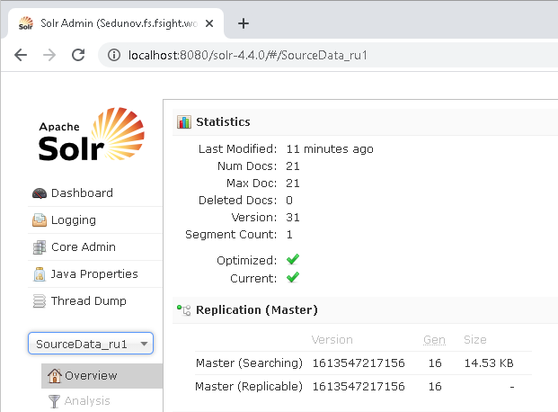

# Проблемы при работе BI-поиска

Проблемы при работе BI-поиска
-

# Проблемы при работе BI-поиска

При использовании BI-поиска в «Форсайт. Аналитическая платформа»
 в отдельных случаях могут возникать различные проблемы. Ниже описаны наиболее
 распространенные из них, а также причины их появления и пути решения:

[Ошибки
 при индексировании источников ](javascript:TextPopup(this))

	Проблема

	При индексации источников в контейнере запланированных задач появляются
	 ошибки с текстом следующего содержания: «Создание документов поискового
	 индекса завершилось ошибкой», «Удаление документов завершилось с ошибкой».

	Причина

	Не доступен экземпляр Solr или настройки Solr не соответствуют тем
	 настройкам, которые заданы в репозитории.

	Решение

	Проверьте, правильно ли сформированы пути до экземпляров Solr, которые
	 [указаны
	 в репозитории](Setup.chm::/BISearch/Desktop_application_setting.htm). Корректный путь до экземпляра Solr
	 может быть получен в строке браузера при работе в консоли администрирования
	 Apache Solr:

	

	После выбора необходимого экземпляра Solr скопируйте сформировавшийся
	 адрес, например: http://localhost:8080/solr-4.4.0/#/SourceData_ru1.
	 В адресе удалите «#/». Полученная таким образом строка «http://localhost:8080/solr-4.4.0/SourceData_ru1»
	 является корректным адресом экземпляра Solr, который должен быть указан
	 в репозитории.

	Если предполагается использование [полей](Setup.chm::/BISearch/Desktop_application_setting.htm)
	 для хранения индексируемой информации, то необходимо проверить соответствие
	 настроек в Solr и в репозитории. Первичное формирование полей осуществляется
	 в Solr. После этого настройки должны быть загружены в репозитории.

[Ошибки
 при использовании BI-поиска в инструментах «Форсайт. Аналитическая платформа»](javascript:TextPopup(this))

	Проблема

	Во время использования BI-поиска появляются ошибки с текстом следующего
	 содержания: «Сервис поиска недоступен, обратитесь к администратору
	 сети», «Не найдено ни одного поискового ядра».

	Причина

	Физическое отсутствие соединения с сервером или источники не индексированы.

	Решение

	Проверьте, доступен ли сервер Apache Tomcat и экземпляры Solr, которые
	 [указаны
	 в репозитории](Setup.chm::/BISearch/Desktop_application_setting.htm).

	Если во время BI-поиска не находятся данные, которые должны были
	 быть проиндексированы, то проверьте настройки [задачи
	 обновления поискового индекса](UiAppSrv.chm::/3_Work_Tasks/Updating_the_search_index_task.htm). Обязательно должен
	 быть выставлен язык, иначе Solr не сможет сформировать и сохранить
	 файлы с индексированными данными.

См. также:

[Решение
 возможных проблем с продуктом «Форсайт. Аналитическая платформа»](../FAQ_title.htm)

		Справочная
		 система на версию 10.9
		 от 18/08/2025,
		 © ООО «ФОРСАЙТ»,
