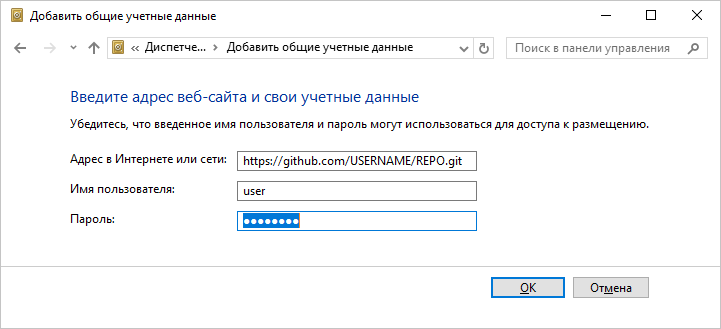

# Проблемы при работе с системой управления версиями (VCS)

Проблемы при работе с системой управления версиями (VCS)
-

# Проблемы при работе с системой
 управления версиями (VCS)

При работе с «Форсайт. Аналитическая платформа»
 в отдельных случаях могут возникать различные проблемы. Ниже описаны наиболее
 распространенные из них, а также причины их появления и пути решения:

[Ошибка
 доступа при подключении к Git-репозиторию или во время получения последней
 версии объектов ](javascript:TextPopup(this))

	Проблема

	При выборе локальной папки, в которой расположен клон репозитория,
	 или при получении последней версии объектов возникают ошибки «Access
	 denied», «Не удалось выполнить Push», «Не удалось выполнить Fetch».

	Причина

	Ошибки связаны с отсутствием прав доступа на подключение к Git-репозиторию
	 или с двухфакторной аутентификацией, если выполняется подключение
	 к учётной записи в GitHub.

	Решение

	Для решения данной проблемы могут быть использованы различные варианты.

		- Проверьте, что приложение запущено под пользователем операционной
		 системы, обладающим правами администратора. Если для подключения
		 к Git-репозиторию используются учётные данные, отличные от текущего
		 пользователя ОС, то в файле конфигурации S\.git\config, где S
		 - путь до локального клона репозитория, измените строку:

	[remote "origin"]

	url = https://<ссылка
	 до репозитория>

	на:

	[remote "origin"]

	url = https://<логин>:<пароль>@<ссылка до репозитория>

		- Если выполняется подключение к системе управления версиями,
		 в которой настроены личные маркеры доступа (PAT), то измените
		 строку на:

	[remote "origin"]

	url = https://<логин>:<маркер
	 пользователя>@<ссылка
	 до репозитория>

	Формирование личных маркеров осуществляется
	 по разному и зависит от используемой системы управления версиями.
	 Для получения дополнительной информации обратитесь к соответствующей
	 документации: [Azure DevOps](https://learn.microsoft.com/en-us/azure/devops/organizations/accounts/use-personal-access-tokens-to-authenticate?view=azure-devops&tabs=Windows), [GitHub](https://docs.github.com/en/authentication/keeping-your-account-and-data-secure/creating-a-personal-access-token), [GitLab](https://docs.gitlab.com/ee/user/project/deploy_tokens#git-clone-a-repository).

		- Если работа осуществляется в ОС Windows и, по соображениям
		 безопасности, запрещено хранить логин/пароль в открытом виде в
		 файлах, то учётные данные могут быть сохранены в диспетчере учётных
		 данных операционной системы. Для этого:

			- Откройте панель управления Windows и перейдите в раздел
			 «Учётные записи пользователей».

			- В левой части окна щёлкните ссылку «Администрирование
			 учётных записей», будет открыт диспетчер учётных данных.

			- Переключитесь на страницу со списком учётных данных
			 Windows.

			- В группе «Общие учётные
			 данные» щёлкните ссылку «Добавить
			 общие учётные данные», в качестве адреса укажите полный
			 путь к репозиторию, логин и пароль пользователя:

			

			- Нажмите кнопку ОК
			 для сохранения учётных данных.

См. также:

[Решение
 возможных проблем с продуктом «Форсайт. Аналитическая платформа»](../FAQ_title.htm)

		Справочная
		 система на версию 10.9
		 от 18/08/2025,
		 © ООО «ФОРСАЙТ»,
