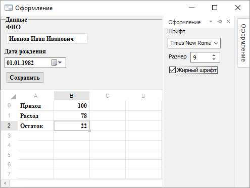

# Делегаты и события: Fore

Делегаты и события: Fore
-

# Делегаты и события

Делегат - специальный тип, который
 используется для описания пользовательских событий. Делегаты определяют
 сигнатуру методов, которые могут выступать в качестве обработчиков пользовательских
 событий.

## Пример

Для выполнения примера необходимо выполнить следующее:

	- Создать сборку, в сборке создать две формы с наименованиями
	 «StyleForm» и «MainForm».

		- На форме «StyleForm»
		 разместить компоненты ComboBox, IntegerEdit и CheckBox. В список
		 элементов компонента ComboBox добавлены наименования шрифтов.
		 Компонент IntegerEdit будет использоваться для изменения размера
		 шрифта, а компонент CheckBox будет использоваться для изменения
		 признака жирного шрифта. Для данных компонентов, в качестве обработчика
		 события OnChange необходимо установить процедуру ChangeStyle (код
		 процедуры приведён в коде формы StyleForm ниже). Данная процедура
		 будет генерировать пользовательское событие OnChangeStyle, используемое
		 для изменения оформления компонентов.

		- Форма «MainForm» является
		 главной, на ней необходимо разместить компонент ControlBar, в
		 котором будет подключена форма «StyleForm». Также на данной форме
		 необходимо разместить какие-либо компоненты, оформление которых
		 будет изменяться при отработке пользовательского события.

	- Формы могут иметь следующий код:

		//Форма StyleForm

		Delegate ChangeStyle(FontBold: Boolean; FontName: String; FontSize: Integer);

		Class StyleForm: Form

		    Label1: Label;

		    Friend Event OnChangeStyle: ChangeStyle;

		    CheckBox1: CheckBox;

		    ComboBox1: ComboBox;

		    IntegerEdit1: IntegerEdit;

		    Label2: Label;

		    Sub ChangeStyle(Sender: Object; Args: IEventArgs);

		    Begin

		        If OnChangeStyle <> Null Then

		            OnChangeStyle(CheckBox1.Checked, ComboBox1.Items.Item(ComboBox1.ItemIndex), IntegerEdit1.Value);

		        End If;

		    End Sub ChangeStyle;

		End Class StyleForm;

		//Форма MainForm

		Class MainForm: Form

		    Label1: Label;

		    Label2: Label;

		    ControlBar1: ControlBar;

		    GroupBox1: GroupBox;

		    EditBox1: EditBox;

		    DateTimePicker1: DateTimePicker;

		    Button1: Button;

		    UiTabSheet1: UiTabSheet;

		    TabSheetBox1: TabSheetBox;

		    //Процедура для обработки события OnChangeStyle

		    Sub ChangeStyle1(FontBold: Boolean; FontName: String; FontSize: Integer);

		    Var

		        f: IControlFont;

		        f1: ITabFont;

		    Begin

		        f := Self.Font;

		        f.Bold := FontBold;

		        f.Name := FontName;

		        f.Size := FontSize;

		        f1 := UiTabSheet1.TabSheet.Table.Style.Font;

		        If FontBold Then

		            f1.Bold := TriState.OnOption;

		        Else

		            f1.Bold := TriState.OffOption;

		        End If;

		        f1.Name := FontName;

		        f1.Size := FontSize;

		    End Sub ChangeStyle1;

		    Sub MainFormOnCreate(Sender: Object; Args: IEventArgs);

		    Begin

		        (ControlBar1.Form As StyleForm).OnChangeStyle := ChangeStyle1;

		    End Sub MainFormOnCreate;

		End Class MainForm;

Во время запуска формы «MainForm» при инициализации компонента ControlBar
 будет создана форма «StyleForm». Для данной формы будет создано пользовательское
 событие OnChangeStyle, используемое для изменения оформления компонентов.
 Данное событие будет доступно во всех формах сборки. Сигнатуру методов,
 используемых для обработки данного события, описывает делегат ChangeStyle.

В событии OnCreate формы «MainForm» осуществляется подписка данной формы
 на событие OnChangeStyle формы «StyleForm». Для обработки этого события
 в данной форме будет использоваться процедура ChangeStyle1.

См. также:

[Классы
 и объекты](../02_GeneralInfo/Fore_ClassesAndObjects.htm)

		Справочная
		 система на версию 10.9
		 от 18/08/2025,
		 © ООО «ФОРСАЙТ»,
