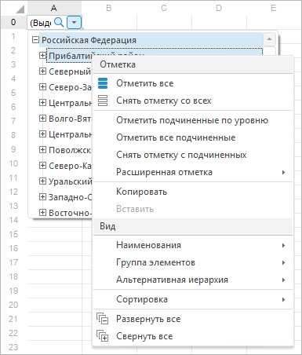
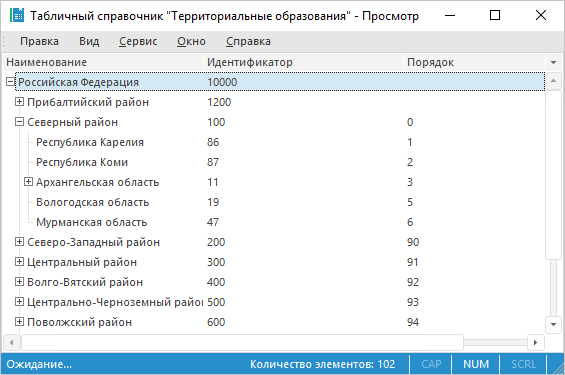
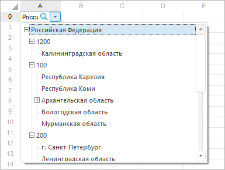

# DimCombo: Редактор значений

DimCombo: Редактор значений
-

# Редактор значения DimCombo

Для настройки редактора значений через строку связи доступны следующие
 параметры:

		 Наименование

параметра
		 Тип
		 Описание
		 Обязателен

		 ID
		 Строка
		 Идентификатор или ключ справочника.
		 Да

		 ATTRIBUTEVALUE
		 Строка
		 Атрибут справочника, из значений которого будет формироваться
		 значение ячейки.

Если в строке связи не задан параметр ATTRIBUTEVALUE,
		 то значение будет формироваться по значениям атрибута справочника
		 с назначением «Идентификатор».
		 Нет

		 LEVELATTR
		 Строка
		 Атрибут, значения которого будут выступать в качестве наименований
		 элементов всех или отдельных уровней. Для каждого уровня справочника
		 можно определить свой атрибут. В качестве значения для параметра
		 указывается строка следующего вида: 0{X1*Y1,X2*Y2,...,Xn*Yn},
		 где: X1-Xn - ключ уровня справочника, для которого необходимо
		 выбрать атрибут; Y1-Yn - ключ атрибута справочника, значения которого
		 будут отображаться в качестве наименований элементов на заданном
		 уровне. Пример: "0{1*2,2*1}".

Для указания атрибута для всех уровней укажите
		 в качестве ключа уровня значение -2. Пример: "0{-2*3}".

		Примечание.
		 Параметр LEVELATTR не может быть использован одновременно с параметром
		 DISPLAYUSERLISTATTR.

		 Нет

		 DISPLAYUSERLISTATTR
		 Строка
		 Пользовательский шаблон, в соответствии с которым будут формироваться
		 наименования элементов всех уровней в раскрытом редакторе. Значение
		 параметра представляет собой строку, которая может содержать любой
		 текст и подстановки атрибутов. Подстановка атрибута имеет вид:
		 %Идентификатор атрибута%. Для использования доступны те атрибуты,
		 у которых не установлен признак скрытости.

Пример: "Наименование: %NAME% (Дата: %USER_DATE_ATTR%)".

		Примечание.
		 Параметр DISPLAYUSERLISTATTR не может быть использован одновременно
		 с параметром LEVELATTR.

		 Нет

		 RANGECALENDARMODE
		 Логический
		 Возможность подключения календаря с настраиваемым диапазоном
		 дат. В качестве значения данного параметра могут указываться следующие
		 значения:

			- true. Календарь
			 подключен;

			- false. Значение
			 по умолчанию. Календарь неподключен.

		 Нет

		 SELECTIONMODE
		 Строка
		 Определяет режим отметки элементов справочника в элементе управления.
		 В качестве значения данного параметра могут указываться следующие
		 значения:

			- SingleSelect -
			 одиночная отметка элементов. Всегда выделен сфокусированный
			 элемент;

			- SingleSelectNullable
			 - одиночная отметка элементов. Для сфокусированного элемента
			 может отсутствовать отметка. При переходе по элементам осуществляется
			 выделение сфокусированного элемента. При вызове контекстного
			 меню в области элемента, элемент фокусируется, но не выделяется;

			- MultiSelect -
			 расширенный режим множественной отметки. Множественная отметка
			 осуществляется при выборе элемента, переход по элементам не
			 вызывает сброс отметки. При зажатой клавише CTRL осуществляется
			 добавление в отметку всех дочерних элементов. При вызове контекстного
			 меню в области элемента, элемент фокусируется но не выделяется;

			- MultiSelectStandard
			 - стандартный режим множественной отметки. Множественная отметка
			 осуществляется при зажатой клавише SHIFT или CTRL, переход
			 по элементам вызывает сброс отметки и выделение сфокусированного
			 элемента.

		 Нет

		 GROUP
		 Строка
		 Идентификатор группы элементов.
		 Нет

		 SCHEMA
		 Строка
		 Идентификатор схемы отметки.
		 Нет

		 NAME
		 Строка
		 Ключ атрибута справочника, который определяет тип отображения
		 наименования уровня в раскрывающемся списке. Используется, если
		 в справочнике один уровень.
		 Нет

		 NAMESPACE
		 Строка
		 Путь до справочника, элементы которого будут отображаться в
		 редакторе значений. В качестве значения указывается последовательность
		 вложенных объектов до справочника в формате: <идентификатор
		 контейнера_1>.<идентификатор
		 контейнера_2>. ... .<идентификатор
		 контейнера_n>.
		 Нет

		 MULTISELECT
		 Логический
		 Возможность множественной отметки.
		 Нет

		 PARAMVALUEх

PARAMID_[ident]

		 Позволяют задать значения входных параметров, в случае если
		 в качестве раскрывающегося списка используется параметрический
		 справочник. Установить значение соответствующего параметра можно
		 двумя способами:

1) В строку связи добавляются параметры вида
		 PARAMVALUEх, где х - номер параметра в списке параметров справочника
		 (1,2 и т.д.), например, PARAMVALUE1 = "10".

2) В строку связи добавляются параметры вида
		 PARAMID_[ident], где [ident] - идентификатор параметра в списке
		 параметров справочника, например, PARAMID_Item = "10".

Для указания типа данных, который имеет передаваемое
		 значение, перед самим значением может быть добавлено одно из значений
		 перечисления [ForeVariantType](../../../Enums/ForeVariantType.htm).
		 Тип данных и само значение разделяются двоеточием.

Пример:

			- PARAMVALUE1 = "4:10". Значение «10» будет передаваться
			 как вещественное число;

			- PARAMID_Item = "2:True". Значение «True» будет
			 передаваться как строка;

		В виду имеющихся особенностей реализации для обозначения массива
		 используйте значение 8204, например, для передачи массива 32-разрядных
		 целых чисел укажите PARAMID_Item = "8204:[3:1,3:5,3:8,3:9]".

		 Нет

		 DISPLAYATTRIBUTEVALUE
		 Строка
		 Определяет, по какому атрибуту справочника элементы выводятся
		 в колонтитул/заголовок.
		 Нет

		 DISPLAYUSERTEXTATTR
		 Строка
		 Пользовательский шаблон, в соответствии с которым будут формироваться
		 наименования элементов для отображаемого значения. Отображаемое
		 значение доступно после отметки элементов справочника и закрытия
		 редактора. Значение параметра представляет собой строку, которая
		 может содержать любой текст и подстановки атрибутов. Подстановка
		 атрибута имеет вид: %Идентификатор атрибута%. Для использования
		 доступны те атрибуты, у которых не установлен признак скрытости.

Пример: "Наименование: %NAME% (Дата: %USER_DATE_ATTR%)".
		 Нет

		 DS_KEY
		 Целый
		 Ключ источника данных регламентного отчета, для которого созданы
		 вычисляемые точки.
		 Нет

		 DIM_KEY
		 Целый
		 Ключ измерения, для которого создается редактор значения.
		 Нет

		 PT_KEY
		 Целый
		 Ключ вычисляемой точки, созданной для источника данных.
		 Нет

		 CUSTOMMULTISELECTTEXT
		 Строка
		 Шаблон, в соответствии с которым будет формироваться текст
		 редактора при множественной отметке. Для формирования шаблона
		 может использоваться любой текст и следующие подстановки:

			- %First. Наименование
			 первого выделенного элемента;

			- %Last. Наименование
			 последнего выделенного элемента;

			- %Count. Количество
			 выделенных элементов;

			- %TotalCount. Количество
			 вершин в дереве.

		 Нет

		 SORTDIRECTION
		 Строка
		 Параметры сортировки. Допустимые значения:

			- ASC. По возрастанию;

			- DESC. По убыванию.

		Сортировка осуществляется по наименованиям элементов. По умолчанию
		 параметр отсутствует, при этом элементы отображаются в том порядке,
		 в каком они созданы в справочнике.

		 Нет

Логические значения задаются в виде символьной строки вида «ON/OFF»,
 либо «True/False».

## Особенности применения

В ячейке отображаются наименования элементов. Значение, которое содержит
 ячейка, является значением атрибута, указанного в параметре ATTRIBUTEVALUE.
 Если отмечены несколько элементов, то значением ячейки является массив
 значений указанного атрибута справочника.

Примечание.
 При переводе ячейки в режим редактирования для корректного восстановления
 отметки справочника, используемого в элементе управления DimCombo, необходимо,
 чтобы тип значения в ячейке совпадал с типом атрибута справочника, из
 значений которого формируется значение ячейки - ATTRIBUTEVALUE.
 Также в справочнике по атрибуту
 ATTRIBUTEVALUE должен быть создан
 уникальный индекс.

Примеры строки связи:

	- По идентификатору справочника:

UI="DimCombo"
 ID="CALENDAR" ATTRIBUTEVALUE="NAME" LEVELATTR="0{4*4}"
 MULTISELECT="True" PARAMID_YEAR_START="2000" PARAMID_YEAR_FINISH="2020"

	- По ключу справочника:

UI="DimCombo"
 ID="@1033" ATTRIBUTEVALUE="NAME"

Контекстное меню для элемента DimCombo
 выглядит следующим образом:

Примечание.
 Пункты контекстного меню «Отметить группу»
 и «Отобразить группу» присутствуют,
 если не стоит ограничение на видимые элементы справочника из группы отметки
 справочника, т.е. не задан параметр GROUP.

## Пример

Для выполнения примера предполагается наличие формы, расположенной на
 ней кнопки с наименованием Button1, компонент TabSheetBox с наименованием
 TabSheetBox1 и компонент UiTabSheet с наименованием UiTabSheet1. UiTabSheet1
 установлен в качестве источника для TabSheetBox1. В репозитории предполагается
 наличие справочника с идентификатором D_TO. В структуре справочника содержится
 несколько уровней, а также имеется группа элементов и схема отметки. Пример
 является обработчиком события OnClick для компонента Button1.

	Sub Button1OnClick(Sender: Object; Args: IMouseEventArgs);

	Var

	    MB: IMetabase;

	    DimDesc: IMetabaseObjectDescriptor;

	    BM: IBindingManager;

	    DimChildren: IMetabaseObjectDescriptors;

	    DimModel: IDimensionModel;

	    DimInst: IDimInstance;

	    Selection: IDimSelection;

	    Group: IDimElementGroup;

	    Schema: IDimSelectionSchema;

	    LvlKey, AttrKey: Integer;

	    DimComboBinding: IBindingDimCombo;

	Begin

	    MB := MetabaseClass.Active;

	    DimDesc := MB.ItemById("D_TO");

	    BM := New BindingManager.Create;

	    DimModel := DimDesc.Bind As IDimensionModel;

	    DimChildren := DimDesc.Children;

	    //Настройка параметров

	    DimComboBinding := BM.CreateByUi("DimCombo") As IBindingDimCombo;

	    //Проверка наличия группы элементов и схемы отметки

	    //Предполагается, что первый дочерний объект - группа элементов,

	    //второй - схема отметки

	    If DimChildren.Count >= 2 Then

	        Group := DimChildren.Item(0).Bind As IDimElementGroup;

	        Schema := DimChildren.Item(1).Bind As IDimSelectionSchema;

	        DimComboBinding.Group := (Group As IMetabaseObject).Id;

	        DimComboBinding.Schema := (Schema As IMetabaseObject).Id;

	        //Формирование значений из наименований

	        DimInst := DimDesc.Open(Null) As IDimInstance;

	        Selection := DimInst.CreateSelection;

	        Schema.ProcessInplace(Selection, Group);

	        DimComboBinding.ValueAttribute := "NAME";

	        DimComboBinding.ValueDefined := True;

	        DimComboBinding.Value := Selection.ToString;

	    End If;

	    //Идентификаторы в качестве наименования элементов уровня, если уровень существует

	    If DimModel.Levels.Count >= 1 Then

	        LvlKey := DimModel.Levels.Item(1).Key;

	        AttrKey := DimModel.Attributes.Id.Key;

	        DimComboBinding.LevelAttribute := "0{" + LvlKey.ToString + "*" + AttrKey.ToString + "}";

	    End If;

	    DimComboBinding.Object := DimDesc.Id;

	    //Множественная отметка

	    DimComboBinding.SelectionMode := SelectionModeEnum.MultiSelect;

	    UiTabSheet1.TabSheet.Cell(0, 0).Style.Binding := DimComboBinding.AsString;

	End Sub Button1OnClick;

При нажатии на кнопку будет задан редактор значения для ячейки «А0»
 таблицы. При редактировании ячейки будет отображаться раскрывающийся список
 справочника. Список элементов будет состоять из элементов, входящих в
 группу элементов справочника, при первом открытии будут отмечены элементы,
 входящие в схему отметки справочника. В качестве значения элементов первого
 уровня будут отображаться идентификаторы, возможность множественной отметки
 - включена. После установки отметки, значение ячейки будет формироваться
 из наименований выделенных элементов.

[Назад](../IBindingManager.CreateByUi.htm)

		Справочная
		 система на версию 10.9
		 от 18/08/2025,
		 © ООО «ФОРСАЙТ»,
