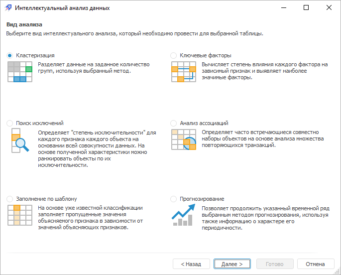
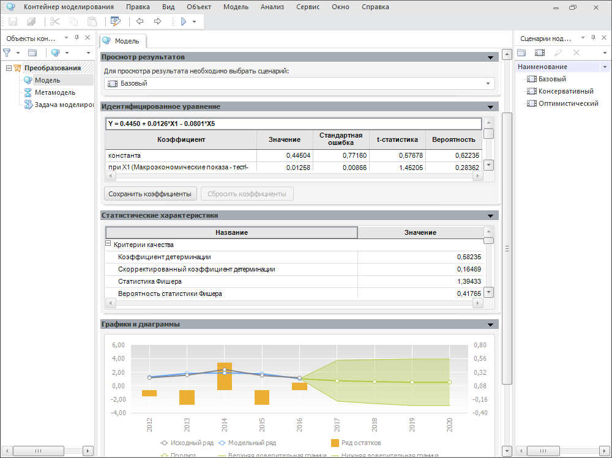
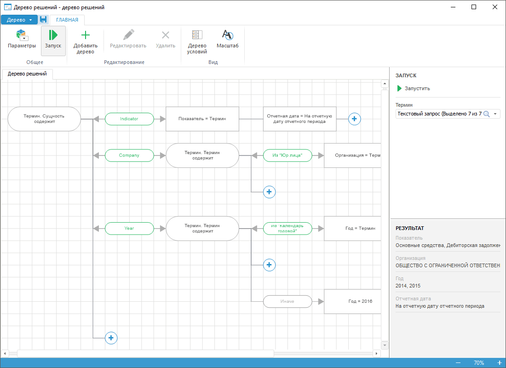

# Расширенная аналитика

Расширенная аналитика
-

# Расширенная аналитика

В продукте «Форсайт. Аналитическая платформа»
 расширенная аналитика выполняется с помощью различных инструментов, которые
 позволяют конструировать модели и расчёты.

## Интеллектуальный анализ данных

Инструмент «[Интеллектуальный анализ данных](DataMining.chm::/datamining_title.htm)» предназначен для обработки и
 содержательной интерпретации больших массивов данных.

## Моделирование и прогнозирование

Инструмент «[Моделирование и
 прогнозирование](UiModelling.chm::/UiModelling_TitlePage.htm)» предназначен для подготовленного
 пользователя и позволяет использовать без ограничений все методы продукта
 «Форсайт. Аналитическая платформа».

## Дерево решений

Расширение «[Дерево
 решений](DecisionTree.chm::/DecisionTree_Purpose.htm)» предназначено для принятия последовательных
 решений с помощью автоматического анализа данных и выбора альтернативных
 вариантов при заданных условиях.

См. также:

[Веб-приложение
 и настольное приложение](../Desktop_and_web_application.htm)

		Справочная
		 система на версию 10.9
		 от 18/08/2025,
		 © ООО «ФОРСАЙТ»,
