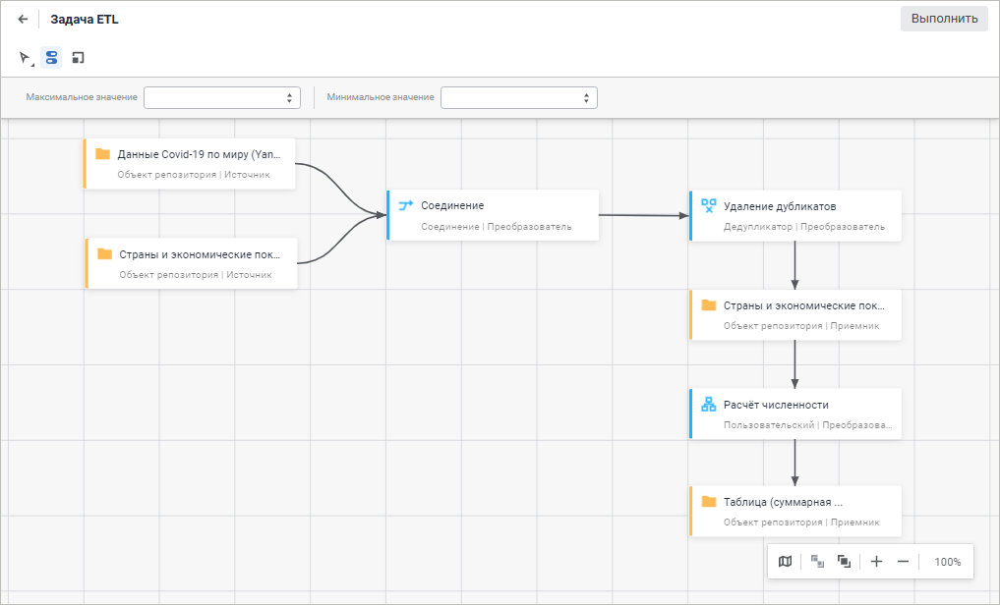
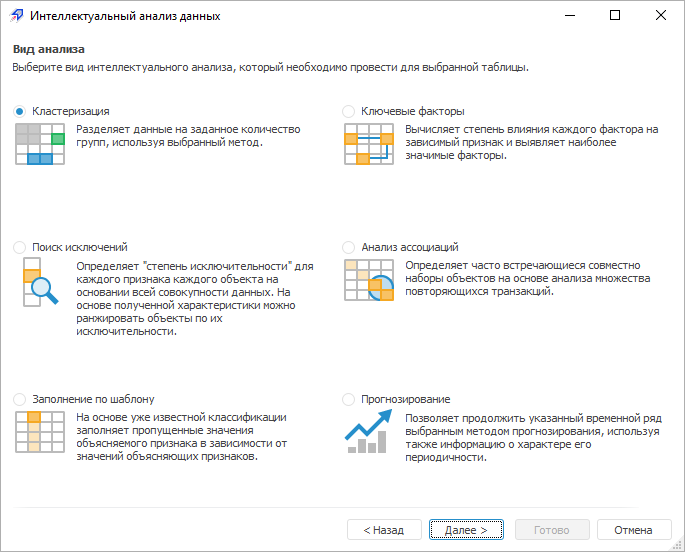
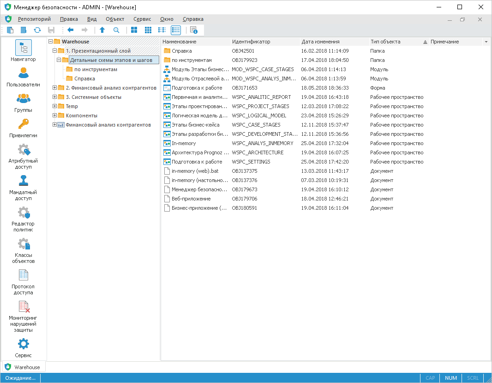
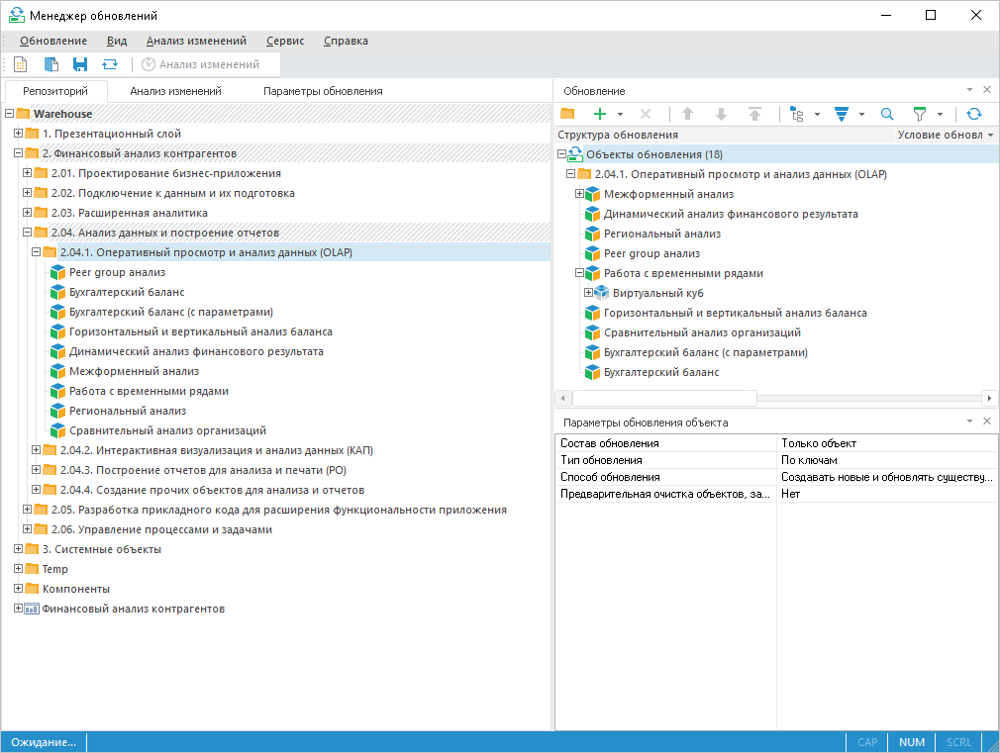
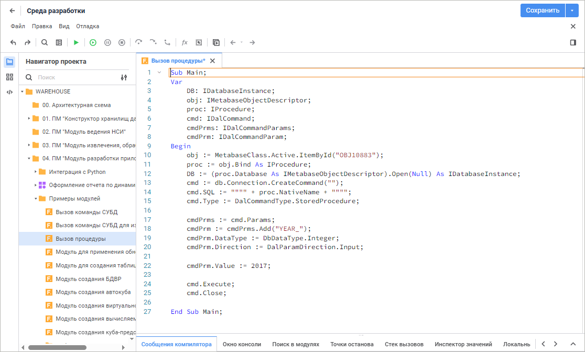

# Веб-приложение и настольное приложение

Веб-приложение и настольное приложение
-

# Веб-приложение и настольное приложение

Продукт «Форсайт. Аналитическая платформа»
 поддерживает работу в веб-приложении и настольном приложении. Работа
 с инструментами в приложениях идентична, существующие различия в справке
 приводятся в примечаниях.

## Начало работы

Раздел «[Начало работы](GetStarted/Get_Started.htm)» содержит
 описание запуска продукта «Форсайт. Аналитическая платформа».

## Подключение к данным и их подготовка

Раздел «[Подключение
 к данным и их подготовка](UiNavObj.chm::/DataWarehousing.htm)»
 содержит описание организации хранилища данных любой сложности и архитектуры
 или настройки на уже существующее хранилище.

## Анализ данных и построение отчётов

Раздел «[Анализ
 данных и построение отчётов](DataAnalysis.chm::/DataAnalysis_Title.htm)» содержит описание работы с инструментами,
 предназначенными для анализа данных и построения отчётов. В результате
 анализа формируется набор различных отчётов, в том числе и интерактивных,
 которые предназначены для передачи конечным пользователям: руководителям,
 менеджерам, аналитикам и т.п.

## Расширенная аналитика

Раздел «[Расширенная
 аналитика](AdvancedAnalytics/AdvancedAnalytics.htm)» содержит описание работы с инструментами, предназначенными
 для глубокого анализа данных.

## Управление процессами и задачами

Раздел «[Управление
 процессами и задачами](GetStarted/Managing_processes_and_tasks.htm)» содержит описание работы с инструментами, предназначенными
 для управления процессами и задачами.

## Визуальное конструирование бизнес-приложений

Раздел «[Визуальное
 конструирование бизнес-приложений](Constructor.chm::/intro/designer_business_applications.htm)» содержит описание
 визуального конструирования прикладных систем класса BI и BPM на базе
 «Форсайт. Аналитическая платформа».

## Администрирование и контроль доступа

Раздел «[Администрирование
 и контроль доступа](Admin.chm::/admin_title.htm)»
 содержит описание менеджера безопасности продукта «Форсайт. Аналитическая платформа».

## Перенос объектов между репозиториями и их обновление

Раздел «[Перенос
 объектов между репозиториями и их обновление](UpdManager.chm::/admin_updatetitle.htm)» содержит описание менеджера
 обновлений продукта «Форсайт. Аналитическая платформа».

## Разработка приложений и расширение функциональности приложения

Раздел «[Разработка
 приложений и расширение функциональности приложения](Developer.chm::/developer_intro.htm)» содержит описание работы
 с инструментами, предназначенными для разработки прикладных систем. Прикладная
 система может быть выполнена в виде настольного приложения, веб-приложения,
 или в виде сочетания нескольких систем, например, связка веб-приложения
 и веб-портала.

## Дополнительные справочные материалы

Раздел «[Дополнительные
 справочные материалы](UiNav.chm::/gui/general_principles.htm)» содержит описание основных принципов работы
 с «Форсайт. Аналитическая платформа».

»
 содержит описание решения проблем при установке и обновлении; запуске,
 входе и проверке пользователя; проверке лицензии и при работе с «Форсайт. Аналитическая платформа».

		Справочная
		 система на версию 10.9
		 от 18/08/2025,
		 © ООО «ФОРСАЙТ»,
