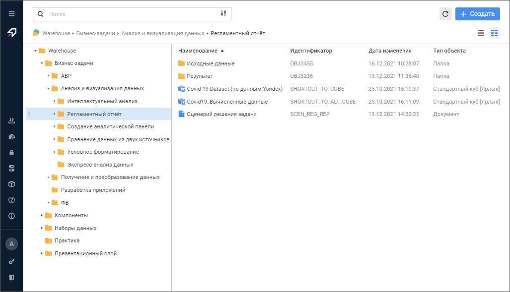
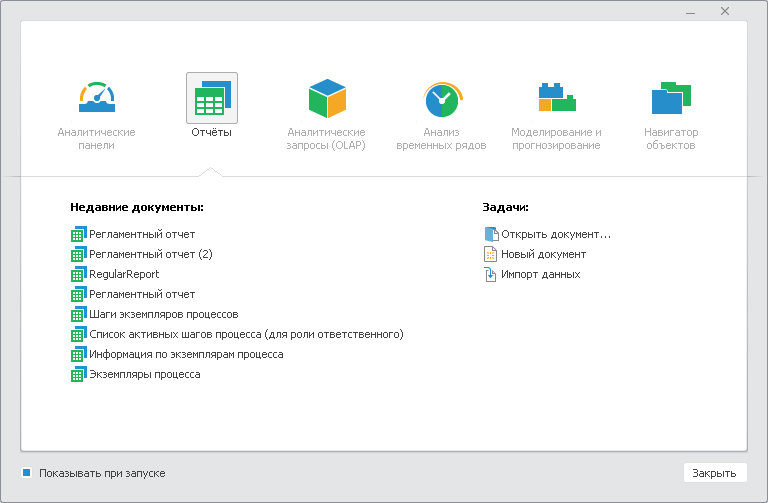

# Начало работы с веб-приложением и настольным приложением

Начало работы с веб-приложением и настольным приложением
-

# Начало работы с веб-приложением
 и настольным приложением

Для начала работы запустите «Форсайт. Аналитическая платформа»:

	- в веб-приложении откройте [поддерживаемый](Setup.chm::/03_DB_Server_Config/Setup_DB_ServerSysReq.htm#client)
	 браузер и в строке подключения укажите [адрес
	 веб-приложения](Setup.chm::/UiWebSetup/03_Setup_Web/opening_web_application.htm);

	- в настольном приложении:

		- выполните команду «Форсайт. Аналитическая платформа
		 10.9
		 > Форсайт. Аналитическая платформа
		 10.9 (x64)»,
		 расположенную в меню Windows;

		- укажите [соответствующую
		 команду](Setup.chm::/07_AK_Run_Additional/UsingCommandLine.htm) в командной строке.

Примечание.
 Для запуска и работы «Форсайт. Аналитическая платформа»
 достаточно прав пользователя.

Запуск и работа с «Форсайт. Аналитическая платформа»
 в изолированном контуре доступна при отсутствии доступа к сети Интернет.

В результате при успешном соединении с сервером
 откроется окно регистрации:

	Веб-приложение Настольное приложение

		

		

Вид окна регистрации зависит от выбранного [типа аутентификации](setup.chm::/UiWebSetup/Authentication/Authentication.htm)
 в [настройках
 репозитория](Setup.chm::/06_AK_Client_Config/UiNav_RepoConfig_repo1.htm). По умолчанию в веб-приложении скрыта кнопка
 «Настройка» для [формирования
 списка репозиториев](setup.chm::/06_AK_Client_Config/UiNav_RepoConfig.htm#params). Для отображения кнопки обратитесь
 к разделу «[Управление
 отображением кнопки «Настройка» в окне регистрации](setup.chm::/06_AK_Client_Config/Setup_SysReq_Client.htm)».
 Также доступно [изменение](Setup.chm::/06_ak_client_config/setup_clientconfig.htm)
 других элементов интерфейса окна регистрации.

Примечание.
 Для корректного запуска настольного приложения продукта «Форсайт. Аналитическая платформа»
 или его отдельных модулей с сетевого ресурса требуется наличие [пререквизитов](Setup.chm::/01_SysReq/ISSetupPrerequisites.htm)
 на рабочей станции. Запуск с сетевого ресурса возможен только для [Reg-free](setup.chm::/02_AK_Install/DistributionKit.htm#regfree)
 версий платформы.

Для входа в систему:

	- Измените язык интерфейса продукта «Форсайт. Аналитическая платформа»
	 при необходимости:

		- в веб-приложении набор доступных языков настраивается в
		 файле [config.json](Setup.chm::/UiWebSetup/03_setup_web/PP_config_Java.htm#config_json)
		 в поле [locales](Setup.chm::/UiWebSetup/03_Setup_Web/PP_config_Java.htm#locales)
		 и отображается при регистрации;

		- в настольном приложении изменение языка интерфейса осуществляется
		 с помощью диалога «[Параметры](../Interface/Intro_Language.htm#options)» или приложения
		 «[Языковые параметры](../Interface/Intro_Language.htm#lang_settings)».

	- Выберите [репозиторий](Repository.htm) в раскрывающемся
	 списке «Репозиторий». В веб-приложении
	 для быстрого поиска репозитория начните вводить его наименование частично
	 или целиком. Если необходимый репозиторий в списке отсутствует, то
	 нажмите кнопку «Настройка».
	 После чего будет открыт [мастер
	 настройки репозитория](Setup.chm::/06_AK_Client_Config/UiNav_RepoConfig.htm) в веб-приложении или окно
	 «[Параметры](Setup.chm::/06_AK_Client_Config/UiNav_RepoConfig.htm)»
	 в настольном приложении. Задайте настройки подключения к требуемому
	 репозиторию.

Примечание.
 При необходимости в настольном приложении можно скрыть кнопку «Настройка».
 Для получения подробной информации обратитесь к разделу «[Скрытие
 кнопки «Настройка» в окне регистрации](setup.chm::/06_AK_Client_Config/Setup_SysReq_Client.htm)».

В веб-приложении список доступных репозиториев
 формируется в зависимости от настроек [BI-сервера](Setup.chm::/UiWebSetup/UiWebSetup_TitlePage.htm).
 Путь к BI-серверу задается в файле [PP.xml](Setup.chm::/UiWebSetup/03_Setup_Web/PP_config_Java.htm)
 в разделе [<service>](Setup.chm::/UiWebSetup/03_Setup_Web/PP_config_Java.htm#service)
 или [<proxy>](Setup.chm::/UiWebSetup/03_Setup_Web/PP_config_Java.htm#proxy).
 По умолчанию выполняется подключение к указанному репозиторию в файле
 [PP.xml](Setup.chm::/UiWebSetup/03_Setup_Web/PP_config_Java.htm)
 в разделе [<metabase>](Setup.chm::/UiWebSetup/03_Setup_Web/PP_config_Java.htm#metabase).

Для получения подробной информации о настройках
 BI-сервера для формирования списка доступных репозиториев в ОС Windows
 и Linux обратитесь к разделам «[Настройка
 списка репозиториев](Setup.chm::/06_AK_Client_Config/Configuring_repository_list_in_the_system_registry.htm)», «[Конфигурация
 и настройка](Setup.chm::/UiWebSetup/03_Setup_Web/config_and_setting.htm)».

	- Введите имя пользователя и пароль в соответствующие поля. При
	 использовании [интегрированной
	 доменной аутентификации](setup.chm::/UiWebSetup/Authentication/Authentication.htm#integrated_domain) будут отсутствовать поля
	 «Имя пользователя»
	 и «Пароль». При использовании
	 [доменной
	 аутентификации](setup.chm::/UiWebSetup/Authentication/Authentication.htm#domain)
	 поле «Имя пользователя»
	 будет заменено на поле «Доменное
	 имя пользователя» для указания домена и имени пользователя
	 в формате «Домен\имя» или
	 «имя@домен».

	- Нажмите кнопку «Войти»
	 в веб-приложении или «ОК»
	 в настольном приложении.

Примечание.
 В веб-приложении и [конструкторе
 бизнес-приложений](Constructor.chm::/Intro/Designer_business_applications.htm) возможна авторизация под учётной
 записью сервиса, поддерживающего протокол OAuth 2.0 или OpenID Connect.
 Для настройки входа через внешние сервисы обратитесь к разделу «[Настройка
 аутентификации через внешние сервисы](Setup.chm::/UiWebSetup/Authentication/login_settings_using_external_services.htm)».

После регистрации будет открыт [навигатор
 объектов](../Interface/Interface_Navigator.htm) в веб-приложении или окно приветствия в настольном приложении:

	 Веб-приложение
	  Настольное приложение

		

		

В окне приветствия выберите нужный инструмент или откройте один из последних
 документов, который использовался:

	- для открытия документа щёлкните по его названию;

	- для открытия самого инструмента перейдите на вкладку, соответствующую
	 ему, и дважды щёлкните по его названию.

После выполнения одного из действий будет открыт [интерфейс](../Interface/Interface_Description.htm)
 выбранного инструмента «Форсайт. Аналитическая платформа»
 или [навигатора объектов](../Interface/Interface_Navigator.htm).

Примечание.
 В окне приветствия отображаются пиктограммы тех инструментов, на которые
 присутствуют [единицы
 лицензирования](Setup.chm::/08_Licensing/AboutFeatures.htm).

[Особенности
 отображения окна приветствия в настольном приложении](javascript:TextPopup(this))

	Если используется пробная лицензия, то внизу окна будет отображено
	 время действия лицензии, кнопки для приобретения и [активации приложения](Setup.chm::/08_Licensing/Admin_Licensing.htm).

	Для отключения отображения окна приветствия снимите флажок «Показывать при запуске». В этом
	 случае сразу после авторизации откроется [навигатор
	 объектов](../Interface/Interface_Navigator.htm).

	Для обратного отображения окна приветствия используйте параметры
	 интерфейса репозитория:

		- Выполните команду главного меню «Сервис
		 > Параметры».

		- В открывшемся окне «Параметры»
		 перейдите на вкладку «Интерфейс».

		- Установите флажок «Показывать
		 окно приветствия при входе».

		- Нажмите кнопку «ОК».

При возникновении проблем изучите раздел «[Решение возможных проблем с «Форсайт. Аналитическая платформа»](FAQ.chm::/FAQ_title.htm)».

См. также:

[Веб-приложение
 и настольное приложение](../Desktop_and_web_application.htm)

		Справочная
		 система на версию 10.9
		 от 18/08/2025,
		 © ООО «ФОРСАЙТ»,
